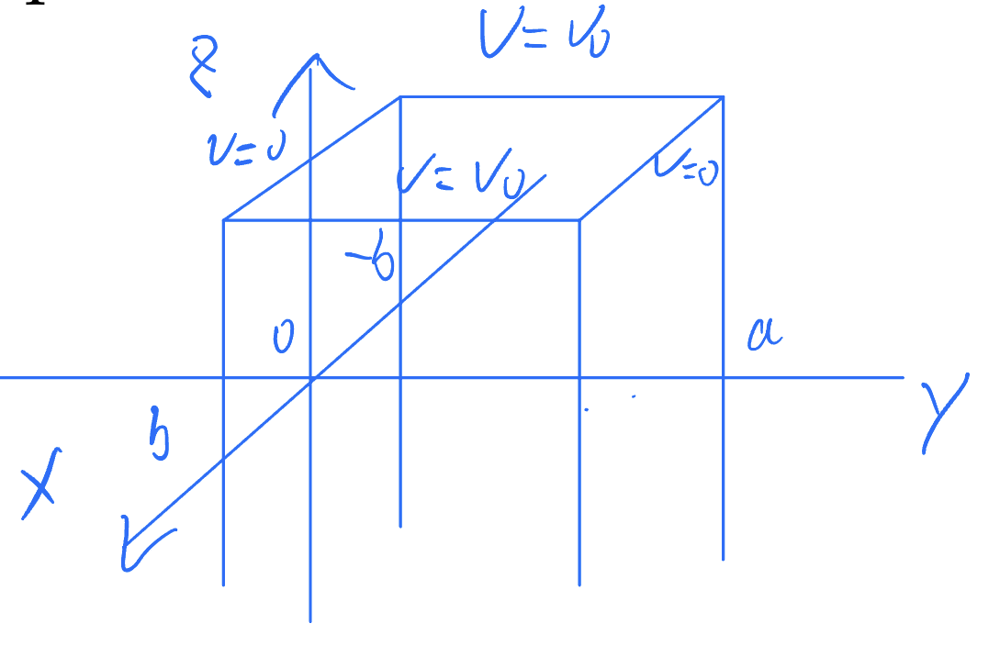
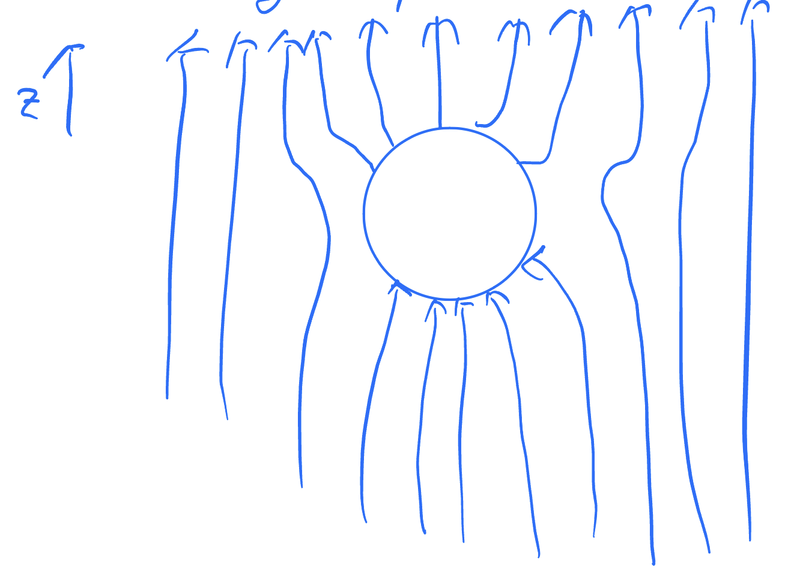

# Potential
## 01 拉普拉斯方程和他在笛卡尔坐标系下的解

### 拉普拉斯方程其人

开局先写一个假设什么东西都不动的麦克斯韦方程组

$\nabla E = \frac{\rho}{\epsilon_0}$

$\nabla B = 0$

$\nabla \times E = 0$

$\nabla \times B = \mu_0 J$

我们知道$E = -\nabla V$，把这个带入第一个式子就可以得到著名的泊松equation

$\nabla^2V = -\frac{\rho}{\epsilon_0}$

而如果在一个范围内没有任何电荷出现的话 那就可以得到另一个叫做Laplace's equation的东西

$\nabla^2 V = 0$

还挺*优雅*的 不是嘛

### 来解方程吧！用一个具体的例子！

这篇文章主要就是要在笛卡尔坐标系下解这个方程，在大二第一学期我们主要使用separation of variable来解，也就是说我们要假设这个V他是等于$X(x)Y(y)Z(z)$的。我们可以举一个具体的例子来熟悉这种方法

在x = $\pm$b时，$V = V_0$；然后y=0和a的那两个面是接地的。这也就是说Z(z)这一项没有什么用 不妨把他设成1.所以我们现在有

$V = X(x)Y(y)$

把他带入拉普拉斯方程中

$0=\frac{\partial^2V}{\partial x^2}+\frac{\partial^2V}{\partial y^2}$

就可以得到

$Y\frac{\partial^2 X}{\partial x^2}+X\frac{\partial^2 Y}{\partial y^2}=0$

两边同时除V

$\frac{1}{X}\frac{\partial^2 X}{\partial x^2}+\frac{1}{Y}\frac{\partial^2 Y}{\partial y^2}=0$

因为第一项只和x有关，第二项只和另一个有关，所以只有这俩都是常数的情况，而且偏微分可以写成全微分

先尝试**首项是负数**的情况

$\frac{1}{X}\frac{d^2 X}{d x^2}=-\frac{1}{Y}\frac{d^2 Y}{d y^2}=-k^2$

这个方程的解为$X(x) = A_1\cos (kx)+A_2\sin (kx)$和$Y(y)=B_1e^{ky}+B_2e^{-ky}$。我们有边界条件$Y(0)=Y(a)=0$，也就是说$B_1+B_2=B_1e^{ka}+B_2e^{-ka}=0$，也就是说$B_1(e^{ka}-e^{-ka})=0$，所以说$2B_1\sinh(ka)=0$，也就是说$B_1=B_2=0$ 这就是说所有地方的V都是0，这显然不是个解，也就是说我们要尝试一下**首项是正数的情况**

$\frac{1}{X}\frac{d^2 X}{d x^2}=-\frac{1}{Y}\frac{d^2 Y}{d y^2}=k^2$

解是$Y(y) = A_1\cos (ky)+A_2\sin (ky)$和$X(x)=B_1e^{kx}+B_2e^{-kx}$（没错我就换了一下xy，甚至连顺序都懒得换）我们有

$Y(0)=0$

也就是说$A_1=0$，所以$Y(a)=A_2 \sin(ka)=0$，$A_2$肯定不能等于0了，所以只能让$\sin(ka)=0$，所以说$ka=n\pi$，而$A_2$是随机常数。所以最终我们的解为

$V(x,y)=\overset{n}{\underset{n=0}{\sum}}C_n\cosh(\frac{n\pi x}{a})\sin(\frac{n\pi y}{a})$

好家伙 那$C_n$怎么搞？答案是用X(x)的边界条件

$V(b,y)=\overset{n}{\underset{i=0}{\sum}}C_n\cosh(\frac{n\pi x}{a})\sin(\frac{n\pi y}{a})=V_0$

我们把左右两边各乘一个$\sin(\frac{m\pi y}{a})$，再对y从0到a积分，可以得到

$V(b,y)=\overset{n}{\underset{i=0}{\sum}}C_n\cosh(\frac{n\pi x}{a})\overset{a}{\underset{0}{\int}}\sin(\frac{n\pi y}{a})\sin (\frac{m\pi y}{a})dy=V_0\overset{a}{\underset{0}{\int}}sin (\frac{m\pi y}{a})dy$

其中

$\sin \frac{n\pi y}{a}\sin \frac{m\pi y}{a}=\frac{1}{2}\left[\cos\frac{(n-m)\pi y}{a}-\cos\frac{(n+m)\pi y}{a}\right]$

所以我们知道只有在n=m时才不是0，其他的时候这个积分等于$\frac{a}{2}$。所以说我们可以得到再m是偶数时，$C_m=0$，其余时间$C_m=\frac{4V_0}{m\pi \cosh\left(\frac{m\pi b}{a}\right)}$

最终 我们的解就是一个特别恐怖的式子

$V(x,y)=\frac{4V_0}{\pi}\overset{n}{\underset{i=0}{\sum}}\frac{\cosh \frac{(2i+1)\pi x}{a}}{\cosh \frac{(2i+1)\pi b}{a}}{a}\sin(\frac{i\pi y}{a})$

结束！

## 02 拉普拉斯方程在球坐标下的解

我们上次介绍了非常*优雅*的拉普拉斯方程$\nabla^2V=0$并且算了算他在笛卡尔坐标系下的一个例子，这次来试一试球坐标

### 球坐标下的拉普拉斯方程

通过一些矢量微积分，我们可以知道

$\nabla^2V = \frac{1}{r^2}\frac{\partial}{\partial r}\left(r^2 \frac{\partial V}{\partial r}\right) + \frac{1}{r^2 \sin\theta}\frac{\partial}{\partial \theta}\left(\sin\theta \frac{\partial V}{\partial \theta}\right) + \frac{1}{r^2 \sin^2\theta}\frac{\partial^2 V}{\partial \phi^2} = 0$

> 嗯。。。以我现在的知识还是看不出来这有什么优雅的

### 解方程！

> 一杯茶，一包烟，一道积分算一天！（虽然我不抽烟）

还是分离变量，假设$\nabla^2=R(r)\Theta(\theta)\Phi(\phi)$

两边同时乘$\frac{r^2}{R\Theta\Phi}$，可以得到

$\frac{1}{R}\frac{\partial}{\partial r}\left(r^2 \frac{\partial R}{\partial r}\right) + \frac{1}{\Theta \sin\theta}\frac{\partial}{\partial \theta}\left(\sin\theta \frac{\partial \Theta}{\partial \theta}\right) + \frac{1}{\Phi \sin^2\theta}\frac{\partial^2 \Phi}{\partial \phi^2} = 0$

左右两边再同时乘一个$\sin^2\theta$的话，上面这个式子他的左边两项就会只和R和$\theta$有关，而最后一项就会只和$\phi$有关。所以我们可以说最后一个项乘个$\sin^2 \theta$是一个常数：

$\frac{1}{\Phi}\frac{d^2\Phi}{d^2\phi}=K$

如果说K>0的话，这个方程的解就是$e^{\pm\sqrt{K}\phi}$的线性叠加了，我们在这里其实还是想要一个周期性的解，毕竟$\phi$代表的是角度嘛，不能说$\phi=\phi_0+2n\pi$里面对于任何一个n$\phi$的解都不一样。所以我们不如去把K设成一个负数，把它叫做$-m^2$。这样子的话我们就可以得到

$\Phi(\phi)=Ce^{im\phi}$

其中的$\phi$可以是正数也可以是负数 但必须要是整数。求个导的话就是

$\frac{d^2\Phi}{d\phi^2}=-m^2\Phi$

整个的式子就变成了这样子

$\frac{1}{R}\frac{\partial}{\partial r}\left(r^2 \frac{\partial R}{\partial r}\right) + \frac{1}{\Theta \sin\theta}\frac{\partial}{\partial \theta}\left(\sin\theta \frac{\partial \Theta}{\partial \theta}\right) - \frac{m^2}{\sin^2\theta} = 0$

再找找有没有什么只和一个变量相关的东西？

（没错！）

（是第一项！）

（嘿嘿！）

那我们就可以把第一项设成常数了！

$\frac{1}{R}\frac{\partial}{\partial r}\left(r^2 \frac{\partial R}{\partial r}\right) =l(l+1)$

$\frac{1}{\Theta \sin\theta}\frac{\partial}{\partial \theta}\left(\sin\theta \frac{\partial \Theta}{\partial \theta}\right) - \frac{m^2}{\sin^2\theta} = l(l+1)$

至于为什么把常数设计得这么怪，你之后就知道啦

我们可以把$\cos\theta$设为x，那么下面的式子就变成了

$\frac{d}{dx}\left[(1-x^2)\frac{d\Theta(x)}{dx}\right]+\left[l(l+1)-\frac{m^2}{1-x^2}\right]\Theta(\theta)=0$

**苍天啊 大地啊 我都干什么啊！这玩意怎么越写越长啊**

别怕，这个方程在之后的数学物理方法中就可以学到 其实叫做Legendre equation。他的解叫做**associated Legendre polynomials**，可以写成这种形式

$\Theta(x)=P^m_l(x)$

其中的$l$是正整数，不然的话这个方程就又不是周期性的了，而且m也只能是从-l到+l

> 现在知道为啥把常数设成l(l+1)了吧

$\Theta$和$\Phi$的积还有一个名字，叫做球谐（**spherical harmonic**），用$Y^m_l$表示

$Y_l^m=CP_l^m(\cos\theta)e^{im\phi}$

然后就是这个式子了

$\frac{1}{R}\frac{\partial}{\partial r}\left(r^2 \frac{\partial R}{\partial r}\right) =l(l+1)$

求一下导

$l(l+1)=2\frac{r}{R}\frac{dR}{dr}+\frac{r^2}{R}\frac{d^2R}{dr^2}$

试一下$R=Cr^x$，也就是说

$l(l+1)=\frac{2}{Cr^{x-1}}Cxr^{x-1}+\frac{1}{Cr^{x-2}}Cx(x-1)r^{x-2}$

$l(l+1)=2x+x(x-1)$

$l(l+1)=x(x+1)$

所以说x等于$l$或者$-l-1$

所以说R就出来了

$R(r)=\alpha r^l+\frac{\beta}{r^{l+1}}$

把三个东西乘起来 就可以得到

$V(r,\theta,\phi)=\overset{\infty}{\underset{l=0}{\sum}}\overset{l}{\underset{m=-l}{\sum}}\left(\alpha r^l+\frac{\beta}{r^{l+1}}\right)Y^m_l(\theta,\phi)$

#### Legendre多项式的一个特点

P有一个很有用的特点，就是他们是正交的，也就是说我们有

$\int^1_{-1}P_n(x)P_m(x)dx=\frac{2}{2n+1}\delta_{m,n}$

这个东西可以让我们更简单地计算$\alpha$和$\beta$

### 一个对称的情况

> 例子 我喜欢例子 现在就让我算例子！！

通常情况下，我们做的题都和$\phi$没有关系，所以说我们可以把球谐给写成单独一个关于$\cos\theta$的Legendre多项式，也就是说整个的V可以写成

$V(r,\theta)=\overset{\infty}{\underset{l=0}{\sum}}\left(\alpha r^l+\frac{\beta}{r^{l+1}}\right)P_l(\cos \theta)$

我们可以举一个例子：在一个三维空间里面，存在着一个空心导体球在原点，他的半径是a。同时还存在一个沿着z轴向上的匀强电场E，求电势

首先啊，这是一个球，所以我们肯定会用球坐标来解这个方程

其次 我们看一下示意图

这个电势貌似和$\phi$没有什么关系！那我们就可以用那个简化版的拉普拉斯方程的解

$V(r,\theta)=\overset{\infty}{\underset{l=0}{\sum}}\left(\alpha r^l+\frac{\beta}{r^{l+1}}\right)P_l(\cos \theta)$

我们首先可以看一看他的end behavior，也就是当r趋近于无穷大时，V应当等于$-E\cos\theta$。我们看一下Legendre多项式的前几个方程：

$P_0(x)=1，P_1(x)=x，P_2(x)=\frac{1}{2}(3x^2-1)，P_3(x)=\frac{1}{2}(5x^3-3x)\cdots$

从中我们可以大概看出来，满足上面的end behavior的情况应该是只有l=1时$\alpha$和$\beta$才不等于0

所以说就可以得到

$V(r,\theta)=\left(-E r+\frac{\beta_1}{r^{2}}\right)\cos \theta$

还是一样的end behavior

就快要算出来了！

对于$\beta_1$，我们还有另外一个边界条件没有用，也就是r=a的情况:

$V(a,\theta)=(-Ea+\frac{\beta_1}{a^2})\cos\theta=0$

所以说$\beta_1=a^3E$

综上所述，我们能算出来

$V(r,\theta)=-Er\cos \theta+\frac{a^3E\cos\theta}{r^2}$

可以看出来 其中第一项对应的是电场对应的电势，而后面哪一项就是磁场对应的电势了

***<u>完事收工！</u>***

## Formal solution to Poisson's equation

Poisson's equation:

$${\nabla}^2V=-\frac{\rho}{\epsilon_0}$$
Has solution
$$V(\overrightarrow{r})=\frac{1}{4\pi\epsilon_0}\int\frac{\rho({\overrightarrow{r'}})}{|\overrightarrow{r'}-\overrightarrow{r}|}d\tau'$$

where $\tau'$ is the volume

This also happens in Magnetism, $\overrightarrow{B} = \overrightarrow{\nabla} \times \overrightarrow{A}$, and A is called *magnetic vector potential*

This is valid because the divergence of B is 0

$$\overrightarrow{\nabla}\times(\overrightarrow{\nabla}\times A)=\mu_0\overrightarrow{J}$$

$$\overrightarrow{\nabla}(\overrightarrow{\nabla}\cdot A)-\overrightarrow{\nabla}^2\overrightarrow{A}$$

it has gauge freedom that we can choose taht it is divergence free
choose $\overrightarrow{\nabla}\cdot A=0$

$$\Rightarrow{\nabla^2}\overrightarrow{A} = -\mu_0\overrightarrow{J}$$

it looks like three independent Poisson equations

$$\Rightarrow \overrightarrow{A}(\overrightarrow{r})=\frac{\mu_0}{4\pi}\int\frac{\overrightarrow{J}(\overrightarrow{r'})}{|\overrightarrow{r'}-\overrightarrow{r}|}d\tau'$$

**Example**: If we have a one dimentional current i.e. wire, this current will produce 

$$\overrightarrow{A}(\overrightarrow{r}) = \frac{\mu_0I}{4\pi}\int\frac{\overrightarrow{dl'}}{|\overrightarrow{r'}-\overrightarrow{r}|}$$
$$\overrightarrow{B}(\overrightarrow{r})=\overrightarrow{\nabla}\times\overrightarrow{A}=\frac{\mu_0}{4\pi}\int\frac{\overrightarrow{dl'}\times(\overrightarrow{r'}-\overrightarrow{r})}{|\overrightarrow{r'}-\overrightarrow{r}|^3}$$
Which is Biot-Savart law!

## Multipole expansion

Laplace with azimuthal symmetry:

$$V(r,\theta)=\sum_{l=0}^\infty[A_lr^l+\frac{B_l}{r^{l+1}}]P_l(cos\theta)$$

where $P_l$ is Legendre polynomial

Apply to a point charge at $\overrightarrow{r'}$

$$V(\overrightarrow{r})=\frac{1}{4\pi\epsilon_0}\frac{q}{|\overrightarrow{r}-\overrightarrow{r'}|}$$

(unit charge)

This has azimuthal symmetry, so we can use the above equation

If $\gamma$ is zero, then $cos\theta=1$, then $P_l(cos\theta)=1$, then 

$$V(r,\theta)=\frac{1}{4\pi\epsilon_0}\frac{q}{|\overrightarrow{r'}-\overrightarrow{r}|}=\sum^\infty_{l=0}A_lr^l+\frac{B_l}{r^{l+1}}$$

Because $P_l$(1)=1

The expansion would be 

$$\frac{1}{|\overrightarrow{r'}-\overrightarrow{r}|}=\left\{
    \begin{matrix}
    \frac{1}{r}\sum^\infty_{l=0}(\frac{r'}{r})^l & r>r'\\
    \\
    \frac{1}{r'}\sum^\infty_{l=0}(\frac{r}{r'})^l & r<r'
    \end{matrix}
    \right.$$

Choose the case $r'<r$

The general solutiuon would be 

$$V = \frac{1}{4\pi\epsilon_0}\frac{q}{r}\sum^\infty_{l=0}(\frac{r'}{r})^lP_l(cos\theta)$$

Thus the general solution for $\overrightarrow{r}$ outside a charge distribution is

$$V(\overrightarrow{r})=\frac{1}{4\pi\epsilon_0}\int_{l=0}^\infty(r')^lP_l(\cos(\gamma))\times\rho(\overrightarrow r')d\tau'$$

The leading term is the *monopole term* (l=0)

$$V(\overrightarrow{r})=\frac{1}{4\pi\epsilon_0}\int\rho(r')d\tau'=\frac{1}{4\pi\epsilon_0}\frac{Q}{r}$$

Which is proportional to $\frac{1}{r}$

Next is the *dipole term* (l=1)

$$V_1(\overrightarrow{r})=\frac{1}{4\pi\epsilon_0}\int(r')\cos(\gamma)\rho(r')d\tau'$$
$$=\frac{\overrightarrow p\cdot\overrightarrow r}{4\pi\epsilon_0r^3}$$

Which is proportional to $\frac{1}{r^2}$

Where $\overrightarrow p$ is the dipole moment $=\int\overrightarrow r'\rho(r')d\tau'$

and $\frac{\overrightarrow r\cdot\overrightarrow r'}{rr'}=\cos(\gamma)$

Then the *quadrupole term* (l=2)

$$V_2(\overrightarrow{r})=\frac{1}{4\pi\epsilon_0}\int(r')^2\frac{3\cos^2(\gamma)-1}{2}\rho(r')d\tau'$$

Now we can have a nice way of looking at field outside the charges using multipole expansion. 