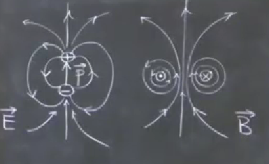
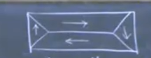
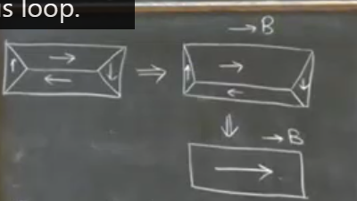

# 3 Magnetization

## 3.1 Current Loop

From the handout, we have the following vector identity:

$$\oint \mathbf{\hat{r}\cdot r'}d\mathbf{l'} = \left(\int d\mathbf{S'}\right )\times \mathbf{\hat{r}}$$

Start from Poisson's equation:

$$\nabla^2 A = \frac{-\mu_0}{4\pi} \int \left(\frac{\mathbf{J}(\mathbf{r'})}{|\mathbf{r}-\mathbf{r'}|}\right)d\mathbf{\tau'}$$

Current loop:

$$A(r) = \frac{\mu_0I}{4\pi} \oint \frac{1}{|\mathbf{r}-\mathbf{r'}|}d\mathbf{l'}$$

recall the expansion

$$\frac{1}{|\mathbf{r}-\mathbf{r'}|} = \frac{1}{r}\sum_{l=0}^{\infty}\left(\frac{r'}{r}\right)^l P_l(\cos\theta)$$

$$\Rightarrow A(r) = \frac{\mu_0I}{4\pi r}\sum_{l=0}^{\infty}\left(\frac{r'}{r}\right)^l \oint P_l(\cos\theta)d\mathbf{l'}$$

l = 0 term is zero

$$A_0(r) = \frac{\mu_0I}{4\pi r}\oint d\mathbf{l'} = 0$$

n = 1 term is the next most important term

$$A_1(r) = \frac{\mu_0I}{4\pi r}\left(\frac{1}{r}\right)\oint r' \cos\theta d\mathbf{l'}$$

and $r' \cos\theta = \mathbf r'\cdot\mathbf{\hat r}$
hence 

$$A_1(r) = \frac{\mu_0I}{4\pi r^2}\oint \mathbf r'\cdot\mathbf{\hat r} d\mathbf{l'}=\frac{\mu_0I}{4\pi r^2}\mathbf m\times\mathbf{\hat{r}}$$
    
where 
$$\begin{align*}\mathbf m &= I\int_sd\mathbf{S'} \\
 &= I\mathbf{S'}\end{align*}$$

 Is the magnetic dipole moment of the current loop.

 Lets stop the expansion before we get too complex  stuff. 

 And that looks like a dipole right?

 Put $\mathbf{m}\parallel z$ in spherical coordinates:

 $$\mathbf A_1(\mathbf r) = \frac{\mu_0}{4\pi r^2}  m\sin(\theta)\hat{\mathbf \phi}$$

$$\mathbf B(\mathbf r) = \nabla\times\mathbf A = \frac{\mu_0}{4\pi r^3}  m\sin(\theta)\hat{\mathbf r}-\frac{\mu_0}{4\pi r^2}  m\cos(\theta)\hat{\mathbf \theta}$$

which is same as electric dipole with $\frac{P}{4\pi\epsilon_0}\rightarrow\frac{\mu_0m}{4\pi}$

Field patterns look the same at large r, but at small r, the magnetic field is not singular.

## 3.2 Magnetic Properties

> In a field $\mathbf B$,a magnetic material will acquire a <u>magnetization</u> $\mathbf{M} = n\mathbf m$ where n is the number of magnetic dipole and $\mathbf m$ is the magnewtic moment of one atom

There are three main effects:
1. diamagnetism $\rightarrow \mathbf{M} ∝ -\mathbf B $ and that effect is very weak
> All materials exihibits it!

2. Paramagnetism $\rightarrow \mathbf{M} ∝ +\mathbf B$ and it's stronger
> That is often shown in materials with unpaired "spins"
> 
> ($\mathbf{M} ∝ \mathbf B$ but only at small B)
> Example: $CuSO_4\cdot5H_2O$

3. Ferromagnetism
> Very strong QM effect 
> E.g. Fe, Co, Ni
> It is a non-linear effect of M(B)

Recap to lecture 7:
>Current loop $A(\mathbf r) = \frac{\mu_0}{4\pi r^2}  \mathbf m\times\hat{\mathbf \phi}$
Magnet moment $\mathbf m = I\mathbf{S'}$ where S is the vector area of the loop
Magnetization $\mathbf M = n\mathbf m$ where n is the number of magnetic dipole and $\mathbf m$ is the magnewtic moment of one atom

## 3.3 Field due to a box of magnetic dipoles

When doing this, we start with some vector identities:

start with Divergence theorem:

$$\int_V \nabla\cdot\mathbf{u}d\tau = \oint_S \mathbf{u}\cdot d\mathbf{\tau}$$
set $\mathbf{u} = \mathbf v\times\mathbf c$ where $\mathbf c$ is a constant vector

LHS: $\int_s \mathbf v\times\mathbf c\cdot d\mathbf S = \mathbf c\cdot\int_s \mathbf v\times d\mathbf S = 0$ because $\mathbf v\times d\mathbf S$ is a vector perpendicular to $\mathbf c$

RHS: $\int_\tau\mathbf\nabla\cdot(\mathbf v\times\mathbf c)d\tau = \int_\tau\mathbf c\cdot(\nabla\times\mathbf v)d\tau - \int_\tau\mathbf v\cdot(\underbrace{\nabla\times\mathbf c}_0)d\tau$ 

Therefore, for any $\mathbf c$, 
$$\Rightarrow \int_S\mathbf v \times d \mathbf S = -\int_\tau\nabla\times\mathbf vd\tau$$

Assume there is a box of magnetic dipoles, and there is one dipole at position $\mathbf r'$

$$\mathbf A(\mathbf r) = \frac{\mu_0}{4\pi}\int \frac{\mathbf{M(r)}\times(\mathbf{r-r'})}{|\mathbf r-\mathbf r'|^3}d\tau'$$

which equals

$$\frac{mu_0}{4\pi}\int \mathbf{M(r)}\times\nabla\frac{1}{|r-r'|}d\tau'$$

We have 

$$\nabla'\times\left(\mathbf{\frac{M}{r-r'}}\right)=\left(\frac{1}{|r-r'|}\mathbf\nabla'\times\mathbf M - \mathbf M \times \mathbf \nabla'\frac{1}{|r-r'|}\right)$$

Hence

$$A(\mathbf r) = \frac{\mu_0}{4\pi}\int\frac{\nabla'\times\mathbf{M(r)}}{|\mathbf{r-r'}|}-\frac{\nabla'\times\mathbf{M(r)}}{|\mathbf{r-r'}|}d\tau'$$

The last term can be transformed into a surface integral:

$$\mathbf{A(r)} = \frac{\mu_0}{4\pi}\int\frac{\nabla'\times\mathbf{M(r)}}{|\mathbf{r-r'}|}d\tau' + \frac{\mu_0}{4\pi}\oint\frac{\mathbf{M(r)}\times d\mathbf{S'}}{|\mathbf{r-r'}|}$$

This looks like 
$$\frac{\mu_0}{4\pi}\int_\tau\frac{\mathbf{J(r)}}{|r-r'|}d\tau+\frac{\mu_0}{4\pi}\int_s\frac{\mathbf K_b(\mathbf r')}{|r-r'|}dS'$$

Where $\mathbf J = \nabla\times\mathbf M$ is the bulk bound current density and $\mathbf K_b = \mathbf M\times\mathbf{\hat n}$ is the surface bound current density.
> Remember to drop the prime! 

Having done this, we can fix up Amperes law:

Amperes law: $\nabla\times\mathbf B = \mu_0(\mathbf J_f+\mathbf J_b)$

Where $\mathbf J_f$ is the free current density where you can connect or do sth like that; and $\mathbf J_b$ is the bound current density, it can be written as the curl of M

Hence the expression for free current would be
$$\mathbf J_f = \nabla\times(\mathbf{\frac{B}{\mu_0}}-\mathbf M)$$

Stuff in the bracket is defined as the magnetic field H and hence the free current density has a simpler form

$$\mathbf J_f = \nabla\times\mathbf H$$

Its integral form is

$$\oint\mathbf H\cdot d\mathbf l = I_{f}$$

However, $\nabla\cdot B = 0$ becomes 
$$\nabla\cdot H = -\nabla\cdot M$$

The equtions to remember would be 

$$\mathbf D = \epsilon_0\mathbf E + \mathbf P$$
$$ B = \mu_0(\mathbf{H+M})$$

### Linear materials
M is proportional to B
$$\mathbf M = \chi_m\mathbf H$$
where $\chi_m$ is the magnetic susceptibility

$$\mathbf B = \mu_0(\mathbf H+\mathbf M) = \mu_0\underbrace{(1+\chi_m)}_{\mu_r}\mathbf H = \mu_0\mu_r\mathbf H$$

where $\mu_r = 1+\chi_m$ is the relative permeability

If willing to be strict, H would be called magnetic field strength and B would be called magnetic flux density

## 3.4 Boundary conditions

one is not changed:

$$\nabla\cdot\mathbf B = 0 \Rightarrow B_1^{\perp} = B_2^{\perp}$$

Making this cylinder flater and flater, we can see that the B field is continuous

However, $H_1^{\perp} = H_2^{\perp}$ is not true because the $\nabla \cdot H = -\nabla \cdot M$ 

$\nabla\times \mathbf H = \mathbf J_f \Rightarrow H_1^{\parallel} - H_2^{\parallel}$ (Assuming there is no surface free currents)

But $B^\parallel$ is not continuous because you can have bound surfce currents at interface and $\nabla\times\mathbf B = \mu_0(\mathbf J_f+\mathbf J_b)$

$$\Rightarrow E^\parallel, D^\perp,H^\parallel, B^\perp are continuous$$

Assuming there is no surface free charges/currents

## 3.5 Magnetic scalar potential

If $\mathbf J_f = 0$ everywhere, then 

$$\nabla\times\mathbf H = 0 \Rightarrow \mathbf H = -\nabla\phi_m$$

where $\phi_m$ is the magnetic scalar potential

If, we are dealing wit linear material, 

$$\mathbf B = -\mu_0\mu_r\mathbf \nabla\phi_m$$

If, in addition, $\nabla\cdot H = 0$

Then we can use the Laplace equation to solve for $\phi_m$

## 3.6 Ferromagnetism

> One way to define  magnitization is  = $\lim_{\delta v\rightarrow 0}\frac{\sum_{i\in \delta v} m_i}{\delta v}$
> Microscopally, ferromaget has M $\ne$ 0, even in B = 0
> The reason for ferromagnetism is the (what will be learnt next term), the *exchange interaction*
> Only in certain materials:
> Fe, Co, Ni, Gd

There is an energy cost due to the stray field of the magnetic dipoles. 

From the picture having stray field, it can be seen that on the tip and bottom of the field, there is a divergence of magnitization, leading to divergence in H. Meaning that field spreads out whenever you have magnetic moment going into the surface and not flowing out.  

The energy cost would be 

$$\int\frac{B^2}{2\mu_0}d\tau$$
$\Rightarrow$ It is energetic flavorable to form domains

This will cost low energy since there is no stray field and hence no divergence in H. (Average over the surface, M is zero)

When applying a B field, the correlated domain is expanded and finally they are all aligned.

So, the magnetization process involves moving domain walls.

$\Rightarrow$ The process is highly non-linear
$\Rightarrow$ hysterisis loop

States that is interesting
1. Saturation (right up)
2. Remanence (middle up)
3. Coercivity (left middle)
Better picture is in handout

The field which is positive but M is zero is called coersive field.

We can modle this as

$ M = (\mu_r-1)H$ only if $\mu_r = \mu_r(H)$

and $\mu_r(H)$ is a multivalued function (because it depends on histroy)

### Hard materials
$H_c$, $M_r$ are large
 - difficult to move domain walls
 - So it is hard to magnitize and demagnitize
 - so it is used for permanent magnets

### Soft materials
$H_c$, $M_r$ are small
 - easy to move domain walls
 - so it is used for transformers, motors, etc.

Example: Magnitization of a ring 
Iron ring, radius r, and current I with N terms used to magnitize the ring

Have a Amperian loop around the ring, then use
$$\oint\mathbf H\cdot d\mathbf l = NI$$
Since H only depends on the free current, it is favorable for us to use it.

Continue the calculation

$$\begin{align*} H\cdot 2\pi r&= NI\\
H &= \frac{NI}{2\pi r}\end{align*}$$

Hence B = $\mu_0\mu_rH = \mu_0\mu_r\frac{NI}{2\pi r}$

Now lets put a gap in the ring

The cutout, x, would much less than r

Lets use the same trick, ampere's law

$$\oint\mathbf H\cdot d\mathbf l = NI$$

$$H_{core}(2\pi r-x) + H_{gap}x = NI$$

$B_{\perp}$ Is continuous, $\Rightarrow$ $B_{core} = B_{gap}$
Substitute in the function
$$\frac{B_{core}}{\mu_0\mu_r}(2\pi r-x) + \frac{B_{gap}}{\mu_0}(x) = NI$$

Rearrange that
$$B_{gap} = \frac{\mu_0\mu_rNI}{(2\pi r - x)+\mu_r x}$$

If $\mu_r >> \frac{2\pi r}{x}$, then $B_{gap}$ becomes about $\frac{\mu_0NI}{x}$

Is could be very large if x is small. But for that condition to work, you need $mu_rNI$ to be very large.