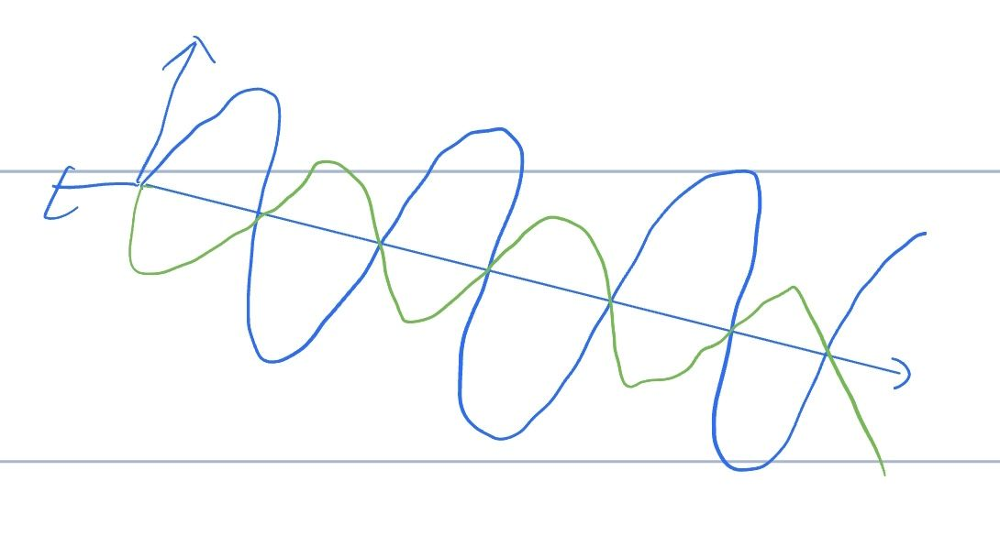
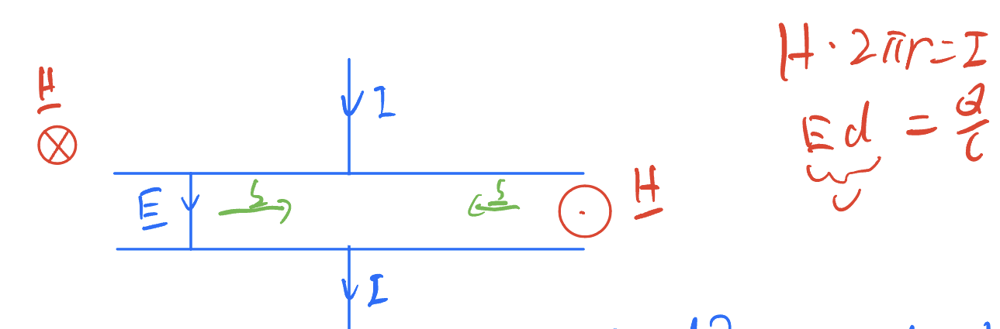
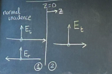
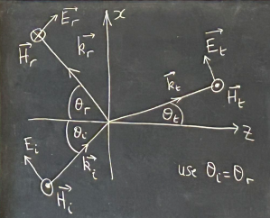
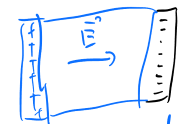
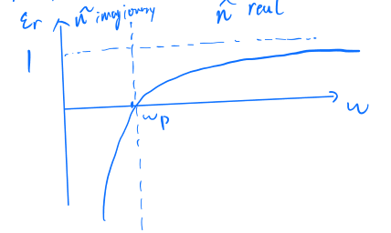
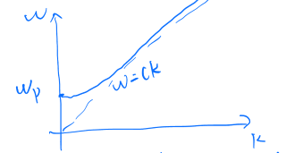
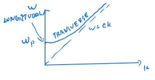

# 4 Electromagnetic waves in material

> Let's let everything move!

## 4.1 Displacement current

Conservation of charge

$$
\mathbf{\nabla\cdot J_s} = -\frac{\partial \rho_f}{\partial t}
$$

However, this is incompatible with

$$
\mathbf{\nabla\times H} = \mathbf J_f
$$

Lets take the divergence for both sides, we get

$$
\mathbf{\nabla\cdot(\nabla\times H)}=0= \mathbf{\nabla\cdot J}+\frac{\partial}{\partial t}\mathbf{\underbrace{\nabla\cdot D}_{\rho_f}}
$$

$\Rightarrow$ add an additional term to the current density $\mathbf{J_f} = \mathbf{\nabla\times H}$

$$
\Rightarrow \mathbf{\nabla\times H} = \mathbf{J_f}+\underbrace{\frac{\partial \mathbf{D}}{\partial t}}_{\text{displacement current}}
$$

LHS: $\mathbf{\nabla\times \left(\frac{B}{\mu_0}-M\right)}=\frac{1}{\mu_0}\mathbf{\nabla\times B-\underbrace{\nabla\times M}_{J_b}}$

Where $\mathbf{J_b}$ is the bound current density.

RHS $=\mathbf{J_s}+\frac{\partial \mathbf{D}}{\partial t}=\mathbf{J_s}+\frac{\partial \mathbf{P}}{\partial t}+\epsilon_0\frac{\partial \mathbf{E}}{\partial t}$

$\Rightarrow$ we could write $\mathbf{\nabla\times B}=\mu_0\left(\mathbf{J_f+J_b+J_p}\right)+\mu_0\epsilon_0\frac{\partial\mathbf E}{\partial t}$

where $J_p$ is the polarization current density. which equals $\frac{\partial\mathbf P}{\partial t}$

Note that $\mathbf{\nabla\cdot J_p} = -\frac{\partial \rho_p}{\partial t}$ from conservation of charge.

Thus the polarization current responds to changes to bound charge, and hence in $\mathbf P$

## 4.2 Maxwell's equations in insulating linear dielectrics

Since it is insulating linear dielectrics, we have $\mathbf J_f = 0$ and $\mathbf J_b = 0$

Hence, we could get Maxwell's equation

$$
\begin{matrix}
\mathbf{\nabla\cdot D} = 0 && \mathbf{\nabla\times E} = -\frac{\partial\mathbf B}{\partial t}\\
\\
\mathbf{\nabla\cdot B} = 0 && \mathbf{\nabla\times H} = \frac{\partial\mathbf D}{\partial t}
\end{matrix}
$$

remember, $\mathbf D = \epsilon_0\epsilon_r\mathbf E+\mathbf P$ and $\mathbf B = \mu_0\mu_r\mathbf H$

which gives

$$
\begin{matrix}
\mathbf{\nabla\cdot E} = 0 && \mathbf{\nabla\times E} = -\frac{\partial\mathbf B}{\partial t}\\
\\
\mathbf{\nabla\cdot B} = 0 && \mathbf{\nabla\times B} = \mu_0\mu_r\epsilon_0\epsilon_r\frac{\partial\mathbf E}{\partial t}
\end{matrix}
$$

Consider

$$
\mathbf{\nabla\times(\nabla\times E) = \mathbf{\nabla(\nabla\cdot E)-\nabla^2E}}=-\frac{\partial}{\partial t}\mathbf{\nabla\times B}
$$

$$
\Rightarrow \mathbf{\nabla^2E}=\underbrace{\mu_0\mu_r\epsilon_0\epsilon_r}_{\frac{1}{v^2}}\frac{\partial^2\mathbf E}{\partial t^2}
$$

which is wave equation.

$\Rightarrow v = \frac{c}{n}$ where c = $\frac{1}{\sqrt{\epsilon_0\mu_0}}$ and n = $\sqrt{\epsilon_r\mu_r}$ where n is also called *refractive index*

### Plane waves solutions

Lets choose propagation parallel to z, and hence
$$\mathbf{\frac{\partial \Psi}{\partial x}} = \mathbf{\frac{\partial \Psi}{\partial y}} = 0$$

remember that $\mathbf{\nabla\cdot E}=0\Rightarrow \frac{\partial E_z}{\partial z} = 0$
similarly, $\mathbf{\nabla \cdot B}=0\Rightarrow\frac{\partial B_z}{\partial z} = 0$

we also have $\mathbf{\nabla\times E} = -\frac{\partial \mathbf B}{\partial t}\Rightarrow \frac{\partial B_z}{\partial t} = 0$

And $\mathbf{\nabla\times B} = \mu_0\mu_r\epsilon_0\epsilon_r\frac{\partial \mathbf E}{\partial t}\Rightarrow \frac{\partial E_z}{\partial t} = 0$

Hence, $E_z$ and $B_z$ are constant in z and t, they are not part of wave motion

now analyze the x,y components of curl:

$$
-\frac{\partial E_y}{\partial z} = -\frac{\partial B_x}{\partial t}, -\frac{\partial B_y}{\partial z} = \frac{1}{v^2}\frac{\partial E_x}{\partial t}
$$

$\Rightarrow E_x, B_y$ are solutions

Lets then take

$$
\frac{\partial^2 E_x}{\partial t^2} = \frac{1}{v^2}\frac{\partial^2E_x}{\partial t^2}
$$

$$
\Rightarrow E_x(z,t) = E_{x0}e^{i(\pm kz -\omega t)}\mathbf{\hat x}
$$

Then, we could have

$$
\Rightarrow B(z,t) = B_0e^{i(\pm kz-\omega t)}\mathbf{\hat y}
$$

And then we could get the wave travelling in $\pm \mathbf z$ direction

$$
\begin{align*}\Rightarrow \mp kE_0 &= -\omega B_0 \\
\text{and }\pm kB_0 &= \frac{\omega}{v^2}E_0 \\
\Rightarrow \frac{E_0}{B_0} &= \pm \frac{\omega}{k} = \pm v
\end{align*}
$$

Define Impedance Z as

$$
Z = \left|\frac{E_0}{H_0}\right| = \sqrt{\frac{\mu_0\mu_r}{\epsilon_0\epsilon_r}}
$$

remember that $H_0 = \frac{B_0}{\mu_0\mu_r}$

The motivation of doing so is that $v = -\int \mathbf E \cdot d\mathbf l$ and $I = \oint \mathbf H \cdot d\mathbf l$

So dimension would work

For free space, then, $\epsilon_r = \mu_r = 1$ and $Z = \sqrt{\frac{\mu_0}{\epsilon_0}} = 377\Omega$

Remember that $\mathbf{\nabla\times E = -\dot B}$, and use E, B $\propto e^{i(\mathbf{k\cdot r}-\omega t)}$, we could get

$$
\begin{align*}i\mathbf{k\times E} &= -(-i\omega)\mathbf B\\
&= i\omega\mu_0\mu_r\mathbf H\\
\Rightarrow Z &= \left|\frac{\mathbf E}{\mathbf H}\right| = \sqrt{\frac{\mu_0\mu_r\omega}{k}}
\end{align*}
$$

Which gives the same answer because $v = \frac{c}{n} = \frac{\omega}{k} = \frac{1}{\sqrt{\epsilon_0\epsilon_r\mu_0\mu_r}}$

which is this wave

## 4.3 conductors

> Remember that
> $$\begin{align*}\mathbf{\nabla\cdot J_f} &= -\frac{\partial \rho_f}{\partial t}\\
> \mathbf{\nabla\cdot J_p} &= -\frac{\partial \rho_p}{\partial t}\\
> \mathbf{\nabla\cdot J_b} &= 0\end{align*}$$
> The last one is 0 because $\mathbf{\nabla\cdot(\nabla\times M)} = 0$

For conductors, we have

$\rho_f = 0$ since there are no free charges in equilibrium
$\mathbf J_f = \sigma \mathbf E$ from Ohm's law where $\sigma$ is the conductivity
$\mathbf D = \epsilon_0\epsilon_r\mathbf E$ and $\mathbf B = \mu_0\mu_r\mathbf H$ from linearity

Then we could get Maxwell's equation in conductors

$$\begin{matrix}
\mathbf{\nabla\cdot E} = 0 && \mathbf{\nabla\times E} = -\frac{\partial\mathbf B}{\partial t}\\
\mathbf{\nabla\cdot B} = 0 &&\textcolor{brown}{\mathbf{\nabla\times B} =  \underbrace{\mu_0\mu_r\sigma\mathbf{E}}_{\text{conduction } \mathbf J} + \underbrace{\mu_0\mu_r\sigma_0\sigma_r\frac{\partial \mathbf E}{\partial t}}_{\text{dispalcement }\mathbf J}}
\end{matrix}$$

Free charge will decay to zero in a short time $\tau$, and it is easy to prove (said Blundell)

$$ \mathbf\nabla\cdot\mathbf J = \frac{\partial \rho}{\partial t}$$

Where $ \mathbf\nabla\cdot\mathbf J$ is equal to $\sigma\cdot\mathbf{\nabla\cdot E}$ from Ohm's law

and $\mathbf{\nabla\cdot E}$ is equal to $\frac{\rho}{\epsilon_0\epsilon_r}$ from Gauss's law

$$\Rightarrow \rho(f) = \rho(0)e^{-\frac{t}{\tau}}$$

Where $\tau = \frac{\epsilon_0\epsilon_r}{\sigma}$

If the metal has great conductivity, then $\tau$ is very small, and hence $\rho(f)$ is very small.

Let's consider the electromagnetic wave having frequency $\omega$, so we would like to compare $\frac{1}{\omega}$ with $\tau$:

| Condition | Conductor Type | Charge Response  | Conductivity |
|-----------|----------------|----------------|--------------|
| $\omega\tau\ll 1$ | Good conductor | Charges respond very quickly |  $\sigma\gg \epsilon_0\epsilon_r\omega$ Conduction current dominates|
| $\omega\tau\gg 1$ | Bad conductor | Charges respond very slowly |  $\sigma\ll \epsilon_0\epsilon_r\omega$ Displacement current dominates |

Take real life examples

||$\sigma(\Omega m)$|$\epsilon_r$|$\frac{\sigma}{\epsilon_0\epsilon_r} (S^{-1})$|
|---|---|---|---|
|metal| $10^7$ | 1 |$10^{19}$ |
|Silicon| $4\cdot 10^{-4}$ | 11.7 |$10^{7}$ |
|Glass| $10^{-10}$ | 5 |$10$ |

Note that visible light would have frequency ~ $5\cdot 10^{14}$ Hz

Let's now do some electromagnetism

$$\begin{align*}\mathbf{\nabla\times(\nabla\times E)} &= \underbrace{\mathbf{\nabla(\nabla\cdot E)}}_{0} - \nabla^2\mathbf E\\
& = -\frac{\partial}{\partial t}\mathbf{\nabla\times B}\\
\nabla^2 \mathbf E &= \mu_0\mu_r\sigma\frac{\partial \mathbf E}{\partial t} + \mu_0\mu_r\sigma_0\sigma_r\frac{\partial^2 \mathbf E}{\partial t^2}
\end{align*}$$

Again, this would yield transverse plane waves with $\mathbf{E,B}\perp$ to each others

$$\Rightarrow \mathbf E = \mathbf E_0\hat{\mathbf{x}}e^{i(\mathbf{\widetilde k\cdot z}-\omega t)}$$

with $\mathbf{\widetilde k = k}+i{\mathbf\kappa}$

$$\Rightarrow \widetilde k^2 = i\underbrace{\mu_0\mu_r\sigma\omega}_\mu + \underbrace{\mu_0\mu_r}_\mu\underbrace{\epsilon_0\epsilon_r}_{\epsilon}\omega^2$$

$$\begin{align*}
(k+i\kappa)^2 &= k^2-\kappa^2+2ik\kappa\\
k^2-\kappa^2 &= \mu_0\epsilon_0\omega^2\\
2k\kappa &= \mu\sigma\omega\Rightarrow k = \frac{\mu\sigma\omega}{2\kappa}\\
0 &= \left(\frac{\mu\sigma\omega}{2}\right)^2\frac{1}{\kappa^2} - \kappa^2 - \mu\epsilon_0\omega^2\\
0 &= (\kappa^2)^2 + \mu\epsilon\omega^2(\kappa^2)-\left(\frac{\mu\sigma\omega}{2}\right)^2\\
\kappa^2 &= -\frac{\mu\epsilon\omega^2}{2}\pm\sqrt{\left(\frac{\mu\epsilon\omega^2}{2}\right)^2+\left(\frac{\mu\sigma\omega}{2}\right)^2}\\
\kappa^2 &= \frac{\mu\epsilon\omega^2}{2}\left[\pm\sqrt{1+\left(\frac{\sigma}{\epsilon\omega}\right)^2}-1\right]
\end{align*}$$

Taking the positive root
$$\Rightarrow \kappa = \sqrt{\frac{\mu\epsilon}{2}}\omega\sqrt{\sqrt{1+\left(\frac{\sigma}{\epsilon\omega}\right)^2}-1}$$

Sub into original equation

$$k = \frac{\mu\sigma\omega}{2\kappa} = \sqrt{\frac{\mu\epsilon}{2}}\omega\sqrt{\sqrt{1+\left(\frac{\sigma}{\epsilon\omega}\right)^2}+1}$$
$$\Rightarrow \mathbf E = \mathbf E_0\hat{\mathbf{x}}\underbrace{e^{-\kappa z}}_{e^{-\frac{z}{\delta}}}e^{i(\mathbf{k\cdot r}-\omega t)}$$

Where $\delta = \frac{1}{\kappa}$ is the *skin depth*

*Reminder*: Good conductors have $\sigma \gg \epsilon\omega$

$$k = \kappa = \sqrt{\frac{\mu\epsilon}{2}}\omega\sqrt{\frac{\sigma}{\epsilon\omega}} = \sqrt{\frac{\mu\omega\sigma}{2}}$$

We could therefore have

$$\nabla^2\mathbf E = \mu\sigma\frac{\partial \mathbf E}{\partial t} + \mu\epsilon\frac{\partial^2 \mathbf E}{\partial t^2}$$

We could also neglect the last term, since $\frac{\partial^2 \mathbf E}{\partial t^2} \ll \frac{\partial \mathbf E}{\partial t}$

$$\begin{align*}&\Rightarrow\widetilde k^2 = i\mu\sigma\omega\\
&\Rightarrow \widetilde k = \frac{1+i}{\sqrt{2}}\sqrt{\mu\sigma\omega}\\
&\Rightarrow \widetilde k = \kappa = \sqrt{\frac{\mu\sigma\omega}{2}}\\
\end{align*}$$

Hence, we could have

$$\delta = \frac{1}{k} = \sqrt{\frac{2}{\mu\sigma\omega}}$$

For a typical metal, $\delta$ is

$$\left\{\begin{matrix}
\text{few nm - visible light} \\
\text{few} \mu m\text{ - microwave} \\
\text{few mm - radio waves}
    \end{matrix}\right.$$

Lets go to poor conductors

Poor conductors has $\sigma \ll \epsilon\omega$, hence

$$k \approx \sqrt{\frac{\mu\epsilon}{2}}\omega\sqrt{2} = \sqrt{\mu\epsilon}\omega$$
$$\kappa = \sqrt{\frac{\mu\epsilon}{2}}\omega\left(1+\frac{1}{2}\left(\frac{\sigma}{\epsilon\omega}\right)^2+\cdots-1\right)^{\frac{1}{2}}$$

which equals to $\frac{\sigma}{2}\sqrt{\frac{\mu}{\epsilon}}$ which is independent to $\omega$

In an insulating dielectric, $\sigma = 0$, hence $\kappa = 0$, and hence $k = \frac{\omega}{v}$ as expected.

Lets return to previous equation

Lets consider the curl equation in the conductor

$$\begin{align*}\frac{\partial\mathbf E_x}{\partial z} &= \frac{\partial B_y}{\partial t}\\
i(k+k)\mathbf E_0 &= i\omega\mathbf B_0\\
z = \frac{\mu E_0}{B_0} = \frac{\mu\omega}{k+i\kappa}\\
\widetilde k = \frac{\mu\omega}{\sqrt{k^2+\kappa^2}}e^{i\phi}\end{align*}$$

If we expand, $\phi$ would be

$$\phi = \tan^{-1}\left(\frac{\sqrt{1+(Q/\epsilon\omega)^2}-1}{\sqrt{1+(Q/\epsilon\omega)^2}+1}\right)^{\frac{1}{2}}$$

For a good conductor, $\sigma \gg \epsilon\omega$, hence $\phi \rightarrow \tan^{-1} 1 = \frac{\pi}{4}$

So this means that B lags behind E in a metal

## 4.4 Poynting vectors

Work done on charge

$$\delta q = \rho=\delta \tau$$

$$\begin{align*}\mathbf\delta F &= \delta q(\mathbf{E +v\times B})\\
\mathbf{\delta F\cdot d l} &= \delta q(\mathbf{E+v\times B})\cdot \mathbf v\delta t\\
&= \mathbf{E\cdot J_f}\delta\tau\delta t\end{align*}$$

where $\mathbf J_f$ eaquals to $\rho\mathbf v$

Rate of work on charges
$$\begin{align*}\mathbf F &= \frac{dw}{dt} \\
&= \mathbf{E\cdot J_f}d\tau\\
&= \frac{d}{d t}\int \underbrace{u_{mech}}_{\text{Energy density}}d\tau\end{align*}$$

From Maxwell's equation:
$$\mathbf J_f = \mathbf{\nabla\times H} - \frac{\partial \mathbf D}{\partial t}$$
We have

$$\mathbf{E\cdot J_f} = \mathbf{E\cdot\nabla\times H} - \mathbf{E\cdot\frac{\partial D}{\partial t}}$$

By dotting everything, and then

$$\mathbf{\nabla\cdot(E\times H)} = \mathbf{H\cdot\nabla\times E} - \mathbf{E\cdot\nabla\times H}$$
$$\mathbf{E\cdot J_f = H\cdot\underbrace{\nabla\times E}_{-\frac{\partial \mathbf B}{\partial t}} - E\cdot}\frac{\partial\mathbf D}{\partial t} - \mathbf{\nabla\cdot(E\times H)}$$

Where we call $\mathbf{H\cdot\underbrace{\nabla\times E}_{-\frac{\partial \mathbf B}{\partial t}} - E\cdot}\frac{\partial\mathbf D}{\partial t}$ "$\frac{\partial}{\partial t}u_{EM}$" (remember that $u_{EM} = \frac{1}{2}(\mathbf{B\cdot H+E\cdot D})$ which equals to energy stored in EM field per unit volume) and $\mathbf{\nabla\cdot(E\times H)}$ as "$\mathbf{S = E\times H}$" or Poynting vector.

> How is this working?

Assume that we are using a linear media:
$$\begin{align*}
\mathbf E\cdot\frac{\partial \mathbf D}{\partial t} &= \frac{1}{2}\cdot\frac{\partial (\mathbf{E\cdot D})}{\partial t}\\
\mathbf H\cdot\frac{\partial \mathbf B}{\partial t} &= \frac{1}{2}\cdot\frac{\partial (\mathbf{B\cdot H})}{\partial t}\\
\end{align*}$$
Remember that
$$\left.\begin{align*} \frac{1}{2}\epsilon_0E^2 &= \frac{1}{2}DE \\
\frac{B^2}{2\mu_0} &= \frac{1}{2}BH\end{align*}\right\}\text{In free space}$$

Bringing everything together, we could get
$$\Rightarrow \frac{d}{dt}(u_{\text{mech}}+u_{\text{EM}}) + \mathbf{\nabla\cdot S} = 0$$

Where $\mathbf S$ is the poyting vector, or equiviantly,

$$\frac{d}{dt}\int(u_{\text{mech}}+u_{\text{EM}})d\tau + \oint \mathbf S\cdot d\mathbf a = 0$$

We could say that, therefore $\mathbf S$ is the energy flux density, or the rate of flow of energy per unit area in the direction of S.

Example: a capacitor

The stored energy increase at rate

$$\dot{U} = \frac{Q}{C}\frac{dQ}{dt} \quad U = \frac{Q^2}{2C}$$

also:

Hence, we have

$$\dot{U} = S\cdot 2\pi r d = \frac{Q}{c}\frac{dQ}{dt}$$

where $S = EH = \frac{Q}{dc}\frac{\frac{dQ}{dt}}{2\pi r}$

There is another example

$$\begin{align*}H \cdot S\pi a &= I\\
E &= \frac{V}{l}\\
\Rightarrow S &= \frac{V}{l}\frac{I}{2\pi a}\\
\int\mathbf{S\cdot da} &= -IV = -I^2R\end{align*}$$

## 4.5 Radiation pressure

EM waves are made up of photons, and hecne they have momentum

$$ E = pc$$

$\Rightarrow$ Transport of energy is appoinated by transport of momentum

$$P_{rad} = \frac{<S>}{c}$$

For a perfect absorber, where $P_{rad}$ is the radiation pressure

**Example** For a plane EM wave in free space, we have

$$\begin{align*}U &= \frac{1}{2}\epsilon_0E^2+\frac{1}{2}\frac{B^2}{\mu_0}\\
\text{but } E &= cB\\
\Rightarrow U &= \epsilon_0E^2\\
\mathbf E &= \frac{1}{2}E_0\cos(kz-\omega t)\mathbf{\hat{x}}\\
&= E_0\cos^2(kz-\omega t)\\
\langle E^2\rangle &= \frac{1}{2}E_0^2\\
\Rightarrow \langle u\rangle&=\frac{1}{2}\epsilon_0E_0^2\\
\langle S\rangle &= \frac{1}{2}\epsilon_0E_0^2c = I\end{align*}$$
Where I is the intensity of wave
$$\Rightarrow P_{rad} = \left\{
\begin{matrix}\frac{1}{2}\epsilon_0E_0^2&& \text{perfect absorber}\\
\epsilon_0E_0^2 &&\text{perfect reflector}\end{matrix}
\right.$$

Sunlight: I~$1kWm^{-2}$
$\Rightarrow P_{rad} = 10^{-5}Pa$
FYI, $P_{atm} = 10^5Pa$

**Example** Consider a star which is growing by accretion

i.e. matter is falling onto it uniformly  in all directions

The star has luminosity L (e.g. $L_{sun} = 4\times 10^{26}$w)

Energy flux = $\frac{L}{4\pi R^2}[Wm^{-2}]$

Radiation pressure: $\frac{L}{4\pi R^2C}$

Outward:

Force/unit mass = $k\frac{L}{4\pi R^2 C}$ where k is the opacity, which is area/unit mass, which is a constant

Inward: Force due to gravity/unit mass = $\frac{GM}{R^2}$

Since they balance, we have

$$\Rightarrow L = \frac{4\pi CGM}{k}$$

which is called Eddington Limit (Upper limit of luminosity of stars that accrete (isotopically))

## 4.6 EM waves - reflection and refraction

Left:
$$E_ie^{i(k_1z - \omega t)}+ E_re^{i(-k_1z-\omega t)}$$

Right:
$$E_te^{i(k_2z-\omega t)}$$

Using electromagnetic boundary conditions, we could get

$E^\parallel$ is continuous
$$E^\parallel_i + E^\parallel_r = E^\parallel_t$$

$H^\parallel$ is continuous
$$\frac{E_i}{Z_1} - \frac{E_r}{Z_1} = \frac{E_t}{Z_2}$$

Putting two equations together

$$\frac{E_r}{E_i} = \frac{Z_2-Z_1}{Z_2+Z_1}\quad \frac{E_t}{E_i} = \frac{2Z_2}{Z_2+Z_1}$$

Where $Z = \sqrt{\frac{\mu}{\epsilon}}$

|Poyting vector| $= S = |\mathbf{E\times H}| = \frac{E^2}{Z}$

We expect $S_\text{incident} = S_\text{reflected} + S_\text{transmitted}$

Where they equal to

$\frac{E_i^2}{Z_1}+\frac{E_r^2}{Z_1}=\frac{E_t^2}{Z_2}$

separately

Lets now have angles
$\mathbf E_re^{i(\mathbf{k_r\cdot r}-\omega t)}$

$$\mathbf{E_i}e^{i(\mathbf{k_i\cdot r}-\omega t)}$$

$$\mathbf E_te^{i(\mathbf{k_t\cdot r}-\omega t)}$$

Choose $\mathbf k_i$ in x-z plane

At z = 0, $E_\parallel$ is continuous and this holds for all x y and t
$\Rightarrow$ $\omega$ must be the same

$\Rightarrow \mathbf{k_i\cdot r = k_r\cdot r = k_t\cdot r}$ for all x, y at z=0

Take $\mathbf r = (0,y,0)$

$\Rightarrow \mathbf{k_i, k_r}$ and $\mathbf k_t$ all lie in the xz plane (*the plane of incidence*)

Take $\mathbf r = (x,0,0)$ so $\mathbf{k_i\cdot r} = k\sin \theta_x$

$$\begin{align*}|\mathbf{k_i|=|k_r|}&=k_1\\
|\mathbf{k_t}| &= k_2\\
\Rightarrow \underbrace{k_1\sin\theta_i = k_1\sin\theta_r}_{\theta_i = \theta_r\text{, law of reflection}} &= k_2\sin\theta_t\end{align*}$$

Remember that $\frac{\omega}{k}=\frac{c}{n}$, And the last two would lead to

$$\frac{\sin\theta_t}{\sin\theta_i} = \frac{k_1}{k_2} = \frac{n_2}{n_1}\quad\text{law of refraction, or snell's law}$$

Where $n = \sqrt{\epsilon_r\mu_r}$

**Fresnel equations**

Worring about polarization directions

We work in those steps

1. $\mathbf E$ **in the plane of incidence**
> "parallel-like" = parallel

Remind that $\mathbf{E,H}$ and $\mathbf k$ form a right-handed system

|  | incident | reflected  | transmitted |
|-----------|----------------|----------------|--------------|
| $E_x$ | $E_i\cos\theta_i$ | $E_r\cos\theta_r$ | $E_t\cos\theta_t$ |
| $E_z$ | $-E_i\sin\theta_i$ | $E_r\cos\theta_r$ | $-E_t\sin\theta_t$ |
| $H_y$ | $\frac{E_i}{Z_1}$ | $-\frac{E_r}{Z_1}$ | $\frac{E_t}{Z_2}$ |

$E_\parallel$ continuous $\Rightarrow E_x$ continuous $\Rightarrow E_i\cos\theta_i + E_r\cos\theta_i = E_t\cos\theta_t$

$$\begin{align*}\frac{E_r}{E_i} &= \frac{Z_2\cos\theta_i-Z_1\cos\theta_i}{Z_2\cos\theta_1 + Z_1\cos\theta_i}\\
\frac{E_t}{E_i} &= \frac{2Z_2\cos\theta_i}{Z_2\cos\theta_i + Z_1\cos\theta_i}\end{align*}$$

Now look for Fresnel equations for p-polarizations

2. $\mathbf E$ **perpendicular to the plane of incidence**
> "s-like" s = senkrecht = perpendicular

|  | incident | reflected  | transmitted |
|-----------|----------------|----------------|--------------|
|$E_y$|$E_i$|$E_r$|$E_t$|
|$H_x$|$-\frac{E_i}{Z_1}\cos\theta_i$|$\frac{E_r}{Z_1}\cos\theta_r$|$-\frac{E_t}{Z_2}\cos\theta_t$|
|$H_z$|$\frac{E_i}{Z_1}\sin\theta_i$|$\frac{E_r}{Z_1}\sin\theta_r$|$\frac{E_t}{Z_2}\sin\theta_t$|

$E_\parallel$ continuous
$$\Rightarrow E_y\text{continuous} \quad E_i+E_r = E_t$$
$H_\parallel$ continuous
$$\Rightarrow H_x \text{continuous} \quad -\frac{E_i}{Z_1}\cos\theta_i + \frac{E_r}{Z_1}\cos\theta_r = -\frac{E_t}{Z_2}\cos\theta_t$$

Remember that

$$Z = \sqrt{\frac{\mu_r\mu_0}{\epsilon_r\epsilon_0}} = \frac{Z_0}{n}\quad n = \sqrt{\epsilon_r}\text{while } \mu_r = 1$$

Let's set $\mu_r = 1$
Then, $Z = \sqrt{\frac{\mu_r\mu_0}{\epsilon_r\epsilon_0}} = \frac{Z_0}{n}\quad n = \sqrt{\epsilon_r}$

So we can replace $Z_i$ with $\frac{1}{n_i}$ in expressions involving ratios of Z's.

**e.g. Fresnel equations for p-polarization**

$$r = \frac{E_r}{E_i} = \frac{\frac{1}{n_2}\cos\theta_t - \frac{1}{n_1}\cos\theta_i}{\frac{1}{n_2}\cos\theta_t+\frac{1}{n_1}\cos\theta_i}$$
$$ = \frac{n_1\cos\theta_t-n_2\cos_theta_i}{n_1\cos\theta_t+n_2\cos\theta_i}$$

Use Snell's law
$$n_1\sin\theta_i = n_2\sin\theta_t$$
$$\begin{align*}
\Rightarrow r = \frac{\sin 2\theta_t - \sin 2\theta_i}{\sin 2\theta_t + \sin 2\theta_i} \\
t = \frac{4\sin_theta_t\cos\theta_i}{\sin 2\theta_t + \sin 2\theta_i} \end{align*}$$

For s-polarization, we have

$$\begin{align*}
r = \frac{\sin(\theta_t-\theta_i)}{\sin(\theta_t+\theta_i)}\\
t = \frac{2\sin\theta_t\cos\theta_i}{\sin(\theta_t+\theta_i)}
\end{align*}$$

We also have

$$\begin{align*}n_1\sin\theta_i &= n_2\sin\theta_t\\
\sin\theta_t &= \frac{n_1}{n_2}\sin\theta_i\\
\cos\theta_t &= \sqrt{1-\sin^2\theta_t} = \sqrt{1-\frac{n_1^2}{n_2^2}\sin^2\theta_i}\\
\end{align*}$$

Fresnel equations:

 $n_1\cos\theta_i$ on top and bottom

$$\begin{align*}\alpha &=\frac{\cos\theta_t}{\cos\theta_i} = \frac{1}{\cos\theta_i}\sqrt{1-(\frac{n_1}{n_2}\sin\theta_i)^2}\\
\beta&=\frac{n_2}{n_1}
\end{align*}$$

||$E^\parallel$(p)| $E^\perp$(s)|
|---|---|---|
| $r$ | $\frac{\alpha-\beta}{\alpha+\beta}$ | $\frac{1-\alpha\beta}{1+\alpha\beta}$ |
| $t$ | $\frac{2\alpha}{\alpha+\beta}$ | $\frac{2}{1+\alpha\beta}$ |

Remember, EM waves have an energy flux given by

$$S = |\mathbf{E\times H}| = \frac{E^2}{Z}$$

Intensity coefficients

$$R = \frac{I_r}{I_i} = |r|^2 = \left\{\begin{matrix}
(\frac{\alpha-\beta}{\alpha+\beta})^2 \quad (p)\\
(\frac{1-\alpha\beta}{1+\alpha\beta})^2 \quad (s)
\end{matrix}\right.$$

$$T = \frac{I_t}{I_i} = |t|^2\frac{n_2}{n_1}\frac{\cos\theta_t}{cos\theta_i}$$

where $\frac{n_2}{n_1}$ is due to waves at ifferent speeds. And $\frac{\cos\theta_t}{\cos\theta_i}$ is due to the wavesfronts at different angles.

$$T = |t|^2\alpha\beta = \left\{\begin{matrix}
\alpha\beta(\frac{2}{\alpha+\beta})^2 \quad (p)\\
\alpha\beta(\frac{2}{1+\alpha\beta})^2 \quad (s)
\end{matrix}\right.$$

Lets check in certain cases

- $\theta_i = 0 \Rightarrow \alpha = 1$

$$\begin{align*}r_s = r_p = \frac{1-\beta}{1+\beta} = \frac{n_1-n_2}{n_1+n_2}\\
t_s = t_p = \frac{2}{1+\beta} = \frac{2n_1}{n_1+n_2}\\
R_s = R_p = (\frac{n_1-n_2}{n_1+n_2})^2\\
T_s = T_p - \frac{n_2}{n_1}\frac{4n_1^2}{(n_1+n_2)^2} = \frac{4n_1n_2}{(n_1+n_2)^2}\end{align*}$$

**Example: air/glass interface**

$$\begin{align*}n_1 = 1\quad n_2 &= 1.5\\
r_s = r_p &= -0.2\\
T_s = T_p &= 0.8\\
R_s = R_p &= 0.04\\
T_s = T_p &= 0.96\end{align*}$$
$\Rightarrow$ 4% of light is reflected, 96% is transmitted

[If $n_2$, for example,  = 1.75, $R_s = R_p = 0.074$, which is sa problem]

Lets take another go at differnet angle

- $\theta_i = 90^\circ$, and set $\beta >1$

 $\sin\theta_i = 1\quad \cos\theta_i = 0$
 $\Rightarrow \alpha \rightarrow \infty$
$$\begin{align*}r_p &= 1\quad r_s = -1\\
t_p &= 0 \quad t_s = 0\end{align*}$$

- now consider $\beta<1$, we cna have total interal reflection for $\theta_i>\theta_c$ where $\theta_c$ is the critical angle = $\beta = \frac{n_2}{n_1}$

 At $\theta_c = \sin^{-1}\beta$, $\alpha = \frac{1}{\cos\theta_c}\sqrt{1-(\frac{\sin\theta_c}{\beta})^2} = 0$

 Hence, we have
$r_p = -1\quad r_s = 1$
$t_p = \frac{2}{\beta}\quad t_s = 2$

$$\sin\theta_c = \beta$$

$r_p$ vanishes at the certain angle called **"Brewster's angle"** $\theta_B$
$r_p = \frac{\alpha-\beta}{\alpha+\beta} = 0$ when $\alpha=\beta = \frac{n_2}{n_1}$
$$\begin{align*}
\frac{1}{cos\theta_B}\sqrt{1-(\frac{\sin\theta_B}{\beta})^2} &= \beta\\
\text{square both sides:}\\
\sec^2\theta_B - \frac{1}{\beta^2}\tan^2\theta_B &= \beta^2\\
(1-\frac{1}{\beta^2})\tan^2\theta_B &= \beta^2-1\\
\frac{(\beta^2-1)}{\beta^2}\tan^2\theta_B &= (\beta^2-1)\\
\Rightarrow \tan\theta_B &= \beta\end{align*}$$

**Method of producing polarized light**

Reflectted light polarized with $\mathbf E$ perpendicular to the plane of incidence

Polarizing sunglasses with transmission axis vertical reduce glare because reflected light is mainly horizontally polarized.

**Total internal reflection**

$$\begin{align*}
n_1\sin\theta_i = n_2\sin\theta_t\\
\sin\theta_t = \frac{\sin\theta_i}{n_2/n_1}\\
\end{align*}$$

Since $n_2<n_1$, there will be total internal reflection when $\sin\theta_t>1$

For transmitted wave, its like
- $e^{i(\mathbf{k\cdot r}-\omega t)}$ in medium
   = $e^{i(k_2[x\sin\theta_t+z\cos\theta_t]-\omega t)}$
   since $z\cos\theta t = 1-\sin^2 \theta_t$ = $\underbrace{e^{i(k_2x\sin\theta_t-\omega_t)}}_{wave}\underbrace{e^{-(\sin^2\theta_t-1)^{\frac{1}{2}}k_2z}}_{e^{-z/\delta}}$ where $\delta = \frac{\lambda_2}{2\pi}\frac{1}{(\sin^2\theta_t-1)^{\frac{1}{2}}}$
    This is called an *evanescent wave*

Lets now consider the **Plane travelling wave**
$$\begin{align*}E_x &= E_0e^{i(kz-\omega t)}\\
\mathbf{\nabla\times E} &= -\mathbf{\dot{B}} = i\omega B\\
\mathbf B &= \frac{1}{i\omega}\left|\begin{matrix}\mathbf{\hat{i}}&&\mathbf{\hat{j}}&&\mathbf{\hat{k}}\\
\partial x&&\partial y&&\partial z\\
E_x &&0&&0\end{matrix}\right|\\
&=\frac{1}{i\omega}\left(\begin{matrix}0\\\partial_z E_x\\-\partial_yE_x\end{matrix}\right)\\
&= \frac{1}{i\omega}\left(\begin{matrix}0\\ikE_x\\0\end{matrix}\right)\\
&= \frac{E_x}{\omega/k}\mathbf{\hat{y}}\\
&= \frac{E_x}{c}\mathbf{\hat{y}}\end{align*}$$

For s-polarization, $\theta_i>\theta_c$, we have

$$\begin{align*}
\sin\theta_t = \frac{\sin\theta_i}{n_2/n_1}>1\\
\cos\theta_t = i\sqrt{\sin^2\theta_t-1}\\
r_s = \frac{n_1\cos\theta_i-n_2\cos\theta_t}{n_1\cos\theta_i+n_2\cos\theta_t}\\
 = \frac{A - iB}{A+iB}\\
 \Rightarrow R_s = |r_s|^2 = \frac{A^2+B^2}{A^2+B^2} = 1\\
t_s = \frac{2n_1\cos\theta_i}{n_1\cos\theta_i+n_2\cos\theta_t} = \frac{2A}{A+iB}\end{align*}$$

So is complex
$$\Rightarrow \mathbf E_t = \mathbf{\hat{y}}t_sE_ie^{i(k_2[x\sin\theta_t-\omega t])}e^{-z/\delta}$$

where $\delta = \frac{\lambda_2}{2\pi}\frac{1}{(\sin^2\theta_t-1)^{\frac{1}{2}}}$
$$\begin{align*}\mathbf{\nabla\times E} &= -\dot{\mathbf{B}} = i\omega\mathbf B\\
\mathbf B &= \frac{1}{i\omega}\left|\begin{matrix}\mathbf{\hat{i}}&&\mathbf{\hat{j}}&&\mathbf{\hat{k}}\\\partial_x&&\partial_y&&\partial_z\\0&&E_t&&0\end{matrix}\right|\\
&=\frac{1}{i\omega}\left(\begin{matrix}-\partial_zE_t\\ 0 \\ \partial_xE_t\end{matrix}\right)\\
&=\left(\begin{matrix}\frac{iE_t}{\omega\delta}\\0\\k_2\sin\theta_tE_t/\omega\end{matrix}\right)\end{align*}$$

$\Rightarrow B_z$ is in phase with $E_y$
    $\Rightarrow$ transport of energy along x
    $B_x$ is out of phase with $E_y$
    $\Rightarrow$ no transport of energy along z
    $$<\mathbf S> = <\mathbf{E\times H^*}>$$
    $\mathbf H^*$ is the complex conjugate of H

**Reminder on conductors**
$$\begin{align*}\mathbf{\nabla\times(\nabla\times E) = \nabla(\nabla\cdot E)-\nabla^2E} - \frac{\partial}{\partial t}\mathbf{\nabla\times B}\\
\mu_0\mu_r\sigma\mathbf E + \mu_0\mu_r\sigma_0\sigma_r\frac{\partial \mathbf E}{\partial t} = 0\quad\text{if good conductor}\\
\nabla^2\mathbf E = \mu_0\sigma\frac{\partial \mathbf E}{\partial t}\\
-\tilde k^{2} = i\omega\mu_0\sigma\\
\Rightarrow \tilde k = k+i\kappa\quad k = \kappa = \sqrt{\frac{\mu_0\sigma\omega}{2}}\\
\mathbf{\nabla\times E = -\mathbf{\dot{B}}}\\
-\frac{\partial B_y}{\partial t} = (\mathbf{\nabla\times E})_y =\frac{\partial E_x}{\partial z}\\
i\omega B_0= = i(k+i\kappa)E_0\\
Z = \frac{E_0}{H_0} = \frac{E_0}{B_0/\mu_0} = \frac{\mu_0\omega}{k+i\kappa}\\
 = \sqrt{\frac{2\mu_0\omega}{\sigma}}\frac{1}{1+i}\\
\Rightarrow Z = \sqrt{\frac{\mu_0\omega}{2\sigma}}(1-i)\end{align*}$$

**Reflection from a meatal surface**

|air|metal|
|---|---|
|$Z_1 = \sqrt{\frac{\mu_0}{\epsilon_0}}$|$Z_2 = \sqrt{\frac{\mu_0\omega}{2\sigma}}(1-i)$|

$|z_2|\ll |Z_1|$ for a good conductor because $\sigma \gg \epsilon_0\epsilon_r\omega$

write $\alpha = \frac{\sqrt{\frac{\mu_0\omega}{2\sigma}}}{\sqrt{\frac{\mu_0}{\epsilon_0}}} = \sqrt{\frac{\omega\epsilon_0}{2\sigma}}\ll1$

$$\begin{align*}
r &= \frac{E_r}{E_i}\quad\text{normal incidence}\\
&=\frac{Z_2-Z_1}{Z_2+Z_1} \\
&= \frac{Z_2/Z_1-1}{Z_2/Z-1+1}\\
&= \frac{\alpha(1-i)-1}{\alpha(1-i)+1}\\
&\approx \frac{1-2\alpha + \cdot\cdot\cdot}{1+2\alpha+\cdot\cdot\cdot}\\
&= 1-4\alpha+O(\alpha^2)\\
&= 1-\frac{2\omega\delta}{c}+O(\alpha^2)\\
&= 1-\frac{4\pi\delta}{\lambda}+O(\alpha^2)\end{align*}$$

where $\delta =  \sqrt{\frac{2}{\omega\mu_0\sigma}}$ is the skin depth
$\Rightarrow$ most of the EM wave intensity is reflected
$\Rightarrow$ metals are shiny!

## 4.7 Plasmas

Plasmas are neutral gas of charged particles, such as ions and free electrons (like metals)

**Examples: where you can find plasma**

- metal
- ionosphere
- stars
- fusion reactor
- interstellar gas /intergalactic medium
- supernova remnants
- radio galaxies / quasars
- lightening
- aurorae
- fire
- plasma displays

Its density varies from $10^2 - 10^{35}kg/m^3$, temperature is $10^0-10^{13}k$

we would only focus on cold plasma

Lets consider a slab of plasma

having number density n

the positive ions are fixed in place, and now lets move electrons by distance $\xi$

$\rightarrow$ E field: $E = \frac{\sigma}{\epsilon_0}$ and $\sigma = ne\xi$

$$\begin{align*}m\ddot{\xi}& = -eE\quad\text{where} E = \frac{ne\xi}{\epsilon_0}\\
\Rightarrow \ddot{\xi}+\omega_p^2\xi&=0\quad\text{which is SHM}\\
\text{where } \omega_p^2&=\frac{ne^2}{\epsilon_0m}\end{align*}$$

This is the SHM at the <u>plasma frequency $\omega_p$</u>

Now, lets drive charges with EM wave $\mathbf Ee^{-i\omega t}$ (we could ignore B if $v\ll c$)

Hence, we could get $\mathbf\xi = \mathbf\xi_0e^{-i\omega t}$

$-m\omega^2\mathbf \xi_0 = -e\mathbf E$
$$\begin{align*}\mathbf P &= -ne\mathbf\xi_0=-\frac{ne^2}{m\omega^2}\mathbf E\\
&= (\epsilon_r-1)\epsilon_0\mathbf E\\
\Rightarrow \underbrace{\epsilon_r}_{\tilde n^2} &= 1-\frac{\omega_p^2}{\omega^2}\end{align*}$$

where $\tilde n^2$ is the refractive index, and that can be imaginary

we could plot the relation between $\omega$ and $\epsilon_r$

at $\omega>\omega_p$, $\tilde n$ is real, hence EM waves can propagate

at $\omega<\omega_p$, $\tilde n$ is imaginary, hence EM waves cant propagate

For example, metals are shiny, but only at optical frequencies. They will transport if it is going to much shorter wavelengths.

e.g. ionosphere

AM radios would be refracted + reflected (~ 1 MHz)

FM radio and TV radios would escape (~100MHz)

Lets look at the dispersion relation again

$$\frac{\omega}{k} = \frac{c}{n}$$

we could get

$$\begin{align*}\tilde n&= 1-\frac{\omega_p^2}{\omega^2} = \frac{c^2k^2}{\omega^2}\\
\Rightarrow \omega&=c^2k^2+\omega_p^2\end{align*}$$

The dispersion relationship would be like

Hence, we could conclude that

- waves are dispersive in plasma
- there are no propagating waves for $\omega<\omega_p$
- waves with $\omega\approx \omega_p$ are slow
    $v_g = \frac{d\omega}{dk}\rightarrow0$ as $\omega\rightarrow \omega_p$

We have $2\omega d\omega = 2c^2kdk$

$\Rightarrow \frac{d\omega}{dk} = \frac{c^2k}{\omega} = c\sqrt{1-\frac{\omega_p^2}{\omega^2}}$

We could have end behaviors:

$$\begin{align*}v_g\rightarrow0\quad\text{as}\quad\omega\rightarrow\omega_p\\
v_g\rightarrow c \quad\text{as}\quad\omega\rightarrow \infty\end{align*}$$

Let's then take

$$\mathbf E = \mathbf E_0e^{i(\mathbf{k\cdot r}-\omega t)}$$

Choose $\mathbf k$ to be $(0,0,k)$, we have

$$\mathbf P = \frac{-ne^2}{m\epsilon_0\omega^2}(\epsilon_0\mathbf E) = -\left(\frac{\omega_p}{\omega}\right)^2\epsilon_0\mathbf E$$

We could hence get Maxwell's equation

$$\begin{align*}\mathbf{\nabla\times H} &= \frac{\partial\mathbf{\dot{D}}}{\partial t}\quad \mathbf{\nabla\times E} =-\frac{\partial \mathbf B}{\partial t} = -\mu_0\frac{\partial \mathbf H}{\partial t}\\
\mathbf{\nabla\times(\nabla\times E)} &= -\mu_0\frac{\partial}{\partial t}\mathbf{\nabla\times H}\\
&= 0\mu_0\frac{\partial^2}{\partial t^2}\mathbf D\\
\textcolor{brown}{\text{LHS} = \mathbf{\nabla(\nabla\cdot E) - \nabla^2 E}}&= -\mu_0\frac{\partial ^2}{\partial t^2}(\epsilon_0\mathbf{E+P})\end{align*}$$

For the wave, we have

$\mathbf{\nabla\rightarrow}i\mathbf k$
$\frac{\partial }{\partial t}\rightarrow -\omega^2\mathbf E$
$\Rightarrow k^2\mathbf E -\underbrace{\mathbf{k(k\cdot E)}}_{k^2E_z\mathbf{\hat{z}}} = \frac{\omega^2-\omega_p^2}{c^2}\mathbf{E}$

Transverse solutions:$\left(\begin{matrix}1\\0\\0\end{matrix}\right)$ $\left(\begin{matrix}0\\1\\0\end{matrix}\right)$ we have $\omega^2=\omega_p^2+c^2k^2$

As for longitudinal solutions, we have $\left(\begin{matrix}0\\0\\1\end{matrix}\right)$, we have, hence, $\omega^2=\omega_p^2$

We can therefore classify waves in the $\omega$ k graph

## 4.8 Dispersion
> Refractive index changes with frequency

- classical theory of dispersion:

model electrons as a classical damped oscillator
$$m\ddot{x} + m\gamma\dot{x}+ m\omega_0^2x = qE_0e^{-i\omega t}$$

Assume that $x = x_0e^{-i\omega t}$
$$\begin{align*}(-\omega^2-i\omega\gamma+\omega_0^2)x_0 &= \frac{qE_0}{m}\\
P &= nqx_0 = \frac{nq^2}{m}E_0\frac{1}{\omega_0^2-\omega^2-i\omega\gamma}\\
&= \epsilon_0(\tilde \epsilon_r-1)E_0\\
\tilde{\epsilon_r}&= 1+\frac{nq^2E_0}{\epsilon_0m}\frac{1}{\omega_0^2-\omega-i\omega\gamma}\\
\tilde n^2&=\tilde\epsilon_r\\
\text{For a gas, } \tilde{\epsilon} &= 1+ \text{small quantity}\\
\tilde\epsilon^{\frac{1}{2}}&=1+\frac{1}{2}\text{small quantities}+\cdots\\
Re(\tilde n)&=1+\frac{nq^2}{2\epsilon_0m}\frac{\omega_0^2-\omega^2}{(\omega_0^2-\omega^2)^2+\omega^2\gamma^2}\\
Im(\tilde n)&=\frac{nq^2}{2\epsilon_0m}\frac{\gamma\omega}{(\omega_0^2-\omega^2)^2+\omega^2\gamma^2}\end{align*}$$

As $\omega\rightarrow 0$, $Re(\tilde n)\rightarrow 1+\frac{nq^2}{2q_0\omega_0^2}$, $Im(\tilde n)\rightarrow 0$
As $\omega\rightarrow \infty$, $Re(\tilde n)\rightarrow 1$, we could get a better illustration, therefore, for the real part and imaginary part of $\tilde n$

We can also conclude that $Im(\tilde n)$ corresponds to the absorption of light, and $Re(\tilde n)$ corresponds to the refraction of light and generally increases with frequency

The sharp drop in the real part of $\tilde n$ in the real part of $\tilde n$ near $\omega_0$ is called <u>anomalous dispersion</u>
