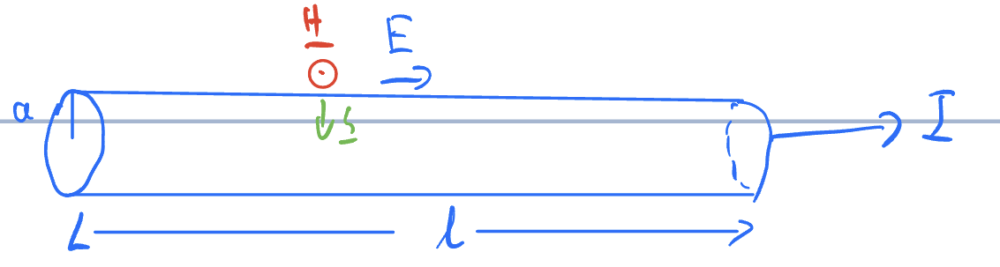

# 4 Electromagnetic waves in material

> Let's let everything move!

## 4.1 Displacement current

Conservation of charge

$$
\mathbf{\nabla*J_s} = -\frac{\partial \rho_f}{\partial t}
$$

However, this is incompatible with

$$
\mathbf{\nabla\times H} = \mathbf J_f
$$

Lets take the divergence for both sides, we get

$$
\mathbf{\nabla\cdot(\nabla\times H)}=0= \mathbf{\nabla\cdot J}+\frac{\partial}{\partial t}\mathbf{\underbrace{\nabla\cdot D}_{\rho_f}}
$$

$\Rightarrow$ add an additional term to the current density $\mathbf{J_f} = \mathbf{\nabla\times H}$

$$
\Rightarrow \mathbf{\nabla\times H} = \mathbf{J_f}+\underbrace{\frac{\partial \mathbf{D}}{\partial t}}_{\text{displacement current}}
$$

LHS: $\mathbf{\nabla\times \left(\frac{B}{\mu_0}-M\right)}=\frac{1}{\mu_0}\mathbf{\nabla\times B-\underbrace{\nabla\times M}_{J_b}}$

Where $\mathbf{J_b}$ is the bound current density.

RHS $=\mathbf{J_s}+\frac{\partial \mathbf{D}}{\partial t}=\mathbf{J_s}+\frac{\partial \mathbf{P}}{\partial t}+\epsilon_0\frac{\partial \mathbf{E}}{\partial t}$

$\Rightarrow$ we could write $\mathbf{\nabla\times B}=\mu_0\left(\mathbf{J_f+J_b+J_p}\right)+\mu_0\epsilon_0\frac{\partial\mathbf E}{\partial t}$

where $J_p$ is the polarization current density. which equals $\frac{\partial\mathbf P}{\partial t}$

Note that $\mathbf{\nabla\cdot J_p} = -\frac{\partial \rho_p}{\partial t}$ from conservation of charge.

Thus the polarization current responds to changes to bound charge, and hence in $\mathbf P$

## 4.2 Maxwell's equations in insulating linear dielectrics

Since it is insulating linear dielectrics, we have $\mathbf J_f = 0$ and $\mathbf J_b = 0$

Hence, we could get Maxwell's equation

$$
\begin{matrix}
\mathbf{\nabla\cdot D} = 0 && \mathbf{\nabla\times E} = -\frac{\partial\mathbf B}{\partial t}\\
\\
\mathbf{\nabla\cdot B} = 0 && \mathbf{\nabla\times H} = \frac{\partial\mathbf D}{\partial t}
\end{matrix}
$$

remember, $\mathbf D = \epsilon_0\epsilon_r\mathbf E+\mathbf P$ and $\mathbf B = \mu_0\mu_r\mathbf H$

which gives

$$
\begin{matrix}
\mathbf{\nabla\cdot E} = 0 && \mathbf{\nabla\times E} = -\frac{\partial\mathbf B}{\partial t}\\
\\
\mathbf{\nabla\cdot B} = 0 && \mathbf{\nabla\times B} = \mu_0\mu_r\epsilon_0\epsilon_r\frac{\partial\mathbf E}{\partial t}
\end{matrix}
$$

Consider

$$
\mathbf{\nabla\times(\nabla\times E) = \mathbf{\nabla(\nabla\cdot E)-\nabla^2E}}=-\frac{\partial}{\partial t}\mathbf{\nabla\times B}
$$

$$
\Rightarrow \mathbf{\nabla^2E}=\underbrace{\mu_0\mu_r\epsilon_0\epsilon_r}_{\frac{1}{v^2}}\frac{\partial^2\mathbf E}{\partial t^2}
$$

which is wave equation.

$\Rightarrow v = \frac{c}{n}$ where c = $\frac{1}{\sqrt{\epsilon_0\mu_0}}$ and n = $\sqrt{\epsilon_r\mu_r}$ where n is also called *refractive index*

### Plane waves solutions

Lets choose propagation parallel to z, and hence 
$$\mathbf{\frac{\partial \Psi}{\partial x}} = \mathbf{\frac{\partial \Psi}{\partial y}} = 0$$

remember that $\mathbf{\nabla\cdot E}=0\Rightarrow \frac{\partial E_z}{\partial z} = 0$
similarly, $\mathbf{\nabla \cdot B}=0\Rightarrow\frac{\partial B_z}{\partial z} = 0$

we also have $\mathbf{\nabla\times E} = -\frac{\partial \mathbf B}{\partial t}\Rightarrow \frac{\partial B_z}{\partial t} = 0$

And $\mathbf{\nabla\times B} = \mu_0\mu_r\epsilon_0\epsilon_r\frac{\partial \mathbf E}{\partial t}\Rightarrow \frac{\partial E_z}{\partial t} = 0$

Hence, $E_z$ and $B_z$ are constant in z and t, they are not part of wave motion

now analyze the x,y components of curl:

$$
-\frac{\partial E_y}{\partial z} = -\frac{\partial B_x}{\partial t}, -\frac{\partial B_y}{\partial z} = \frac{1}{v^2}\frac{\partial E_x}{\partial t}
$$

$\Rightarrow E_x, B_y$ are solutions

Lets then take

$$
\frac{\partial^2 E_x}{\partial t^2} = \frac{1}{v^2}\frac{\partial^2E_x}{\partial t^2}
$$

$$
\Rightarrow E_x(z,t) = E_{x0}e^{i(\pm kz -\omega t)}\mathbf{\hat x}
$$

Then, we could have

$$
\Rightarrow B(z,t) = B_0e^{i(\pm kz-\omega t)}\mathbf{\hat y}
$$

And then we could get the wave travelling in $\pm \mathbf z$ direction

$$
\begin{align*}\Rightarrow \mp kE_0 &= -\omega B_0 \\
\text{and }\pm kB_0 &= \frac{\omega}{v^2}E_0 \\
\Rightarrow \frac{E_0}{B_0} &= \pm \frac{\omega}{k} = \pm v
\end{align*}
$$

Define Impedance Z as

$$
Z = \left|\frac{E_0}{H_0}\right| = \sqrt{\frac{\mu_0\mu_r}{\epsilon_0\epsilon_r}}
$$

remember that $H_0 = \frac{B_0}{\mu_0\mu_r}$

The motivation of doing so is that $v = -\int \mathbf E \cdot d\mathbf l$ and $I = \oint \mathbf H \cdot d\mathbf l$

So dimension would work

For free space, then, $\epsilon_r = \mu_r = 1$ and $Z = \sqrt{\frac{\mu_0}{\epsilon_0}} = 377\Omega$

Remember that $\mathbf{\nabla\times E = -\dot B}$, and use E, B $\propto e^{i(\mathbf{k\cdot r}-\omega t)}$, we could get

$$
\begin{align*}i\mathbf{k\times E} &= -(-i\omega)\mathbf B\\
&= i\omega\mu_0\mu_r\mathbf H\\
\Rightarrow z &= \left|\frac{\mathbf E}{\mathbf H}\right| = \sqrt{\frac{\mu_0\mu_r\omega}{k}} 
\end{align*}
$$

Which gives the same answer because $v = \frac{c}{n} = \frac{\omega}{k} = \frac{1}{\sqrt{\epsilon_0\epsilon_r\mu_0\mu_r}}$

which is this wave

## 4.3 conductors

> Remember that
> $$\begin{align*}\mathbf{\nabla\cdot J_f} &= -\frac{\partial \rho_f}{\partial t}\\
> \mathbf{\nabla\cdot J_p} &= -\frac{\partial \rho_p}{\partial t}\\
> \mathbf{\nabla\cdot J_b} &= 0\end{align*}$$
> The last one is 0 because $\mathbf{\nabla\cdot(\nabla\times M)} = 0$

For conductors, we have

$\rho_f = 0$ since there are no free charges in equilibrium
$\mathbf J_f = \sigma \mathbf E$ from Ohm's law where $\sigma$ is the conductivity
$\mathbf D = \epsilon_0\epsilon_r\mathbf E$ and $\mathbf B = \mu_0\mu_r\mathbf H$ from linearity

Then we could get Maxwell's equation in conductors

$$\begin{matrix}
\mathbf{\nabla\cdot E} = 0 && \mathbf{\nabla\times E} = -\frac{\partial\mathbf B}{\partial t}\\
\mathbf{\nabla\cdot B} = 0 &&\textcolor{brown}{\mathbf{\nabla\times B} =  \underbrace{\mu_0\mu_r\sigma\mathbf{E}}_{\text{conduction } \mathbf J} + \underbrace{\mu_0\mu_r\sigma_0\sigma_r\frac{\partial \mathbf E}{\partial t}}_{\text{dispalcement }\mathbf J}}
\end{matrix}$$

Free charge will decay to zero in a short time $\tau$, and it is easy to prove (said Blundell)

$$ \mathbf\nabla\cdot\mathbf J = \frac{\partial \rho}{\partial t}$$

Where $ \mathbf\nabla\cdot\mathbf J$ is equal to $\sigma\cdot\mathbf{\nabla\cdot E}$ from Ohm's law

and $\mathbf{\nabla\cdot E}$ is equal to $\frac{\rho}{\epsilon_0\epsilon_r}$ from Gauss's law

$$\Rightarrow \rho(f) = \rho(0)e^{-\frac{t}{\tau}}$$

Where $\tau = \frac{\epsilon_0\epsilon_r}{\sigma}$

If the metal has great conductivity, then $\tau$ is very small, and hence $\rho(f)$ is very small.

Let's consider the electromagnetic wave having frequency $\omega$, so we would like to compare $\frac{1}{\omega}$ with $\tau$:

| Condition | Conductor Type | Charge Response  | Conductivity |
|-----------|----------------|----------------|--------------|
| $\omega\tau\ll 1$ | Good conductor | Charges respond very quickly |  $\sigma\gg \epsilon_0\epsilon_r\omega$ Conduction current dominates|
| $\omega\tau\gg 1$ | Bad conductor | Charges respond very slowly |  $\sigma\ll \epsilon_0\epsilon_r\omega$ Displacement current dominates |

Take real life examples

||$\sigma(\Omega m)$|$\epsilon_r$|$\frac{\sigma}{\epsilon_0\epsilon_r} (S^{-1})$|
|---|---|---|---|
|metal| $10^7$ | 1 |$10^{19}$ |
|Silicon| $4\cdot 10^{-4}$ | 11.7 |$10^{7}$ |
|Glass| $10^{-10}$ | 5 |$10$ |

Note that visible light would have frequency ~ $5\cdot 10^{14}$ Hz

Let's now do some electromagnetism

$$\begin{align*}\mathbf{\nabla\times(\nabla\times E)} &= \underbrace{\mathbf{\nabla(\nabla\cdot E)}}_{0} - \nabla^2\mathbf E\\
& = -\frac{\partial}{\partial t}\mathbf{\nabla\times B}\\
\nabla^2 \mathbf E &= \mu_0\mu_r\sigma\frac{\partial \mathbf E}{\partial t} + \mu_0\mu_r\sigma_0\sigma_r\frac{\partial^2 \mathbf E}{\partial t^2}
\end{align*}$$

Again, this would yield transverse plane waves with $\mathbf{E,B}\perp$ to each others

$$\Rightarrow \mathbf E = \mathbf E_0\hat{\mathbf{x}}e^{i(\mathbf{\widetilde k\cdot z}-\omega t)}$$

with $\mathbf{\widetilde k = k}+i{\mathbf\kappa}$

$$\Rightarrow \widetilde k^2 = i\underbrace{\mu_0\mu_r\sigma\omega}_\mu + \underbrace{\mu_0\mu_r}_\mu\underbrace{\epsilon_0\epsilon_r}_{\epsilon}\omega^2$$

$$\begin{align*}
(k+i\kappa)^2 &= k^2-\kappa^2+2ik\kappa\\
k^2-\kappa^2 &= \mu_0\epsilon_0\omega^2\\
2k\kappa &= \mu\sigma\omega\Rightarrow k = \frac{\mu\sigma\omega}{2\kappa}\\
0 &= \left(\frac{\mu\sigma\omega}{2}\right)^2\frac{1}{k^2} - k^2 - \mu\epsilon_0\omega^2\\
0 &= (k^2)^2 + \mu\epsilon\omega^2(k^2)-\left(\frac{\mu\sigma\omega}{2}\right)^2\\
\kappa^2 &= -\frac{\mu\epsilon\omega^2}{2}\pm\sqrt{\left(\frac{\mu\epsilon\omega^2}{2}\right)^2+\left(\frac{\mu\sigma\omega}{2}\right)^2}\\
\kappa^2 &= \frac{\mu\epsilon\omega^2}{2}\left[\pm\sqrt{1+\left(\frac{\sigma}{\epsilon\omega}\right)^2}-1\right]
\end{align*}$$

Taking the positive root
$$\Rightarrow \kappa = \sqrt{\frac{\mu\epsilon}{2}}\omega\sqrt{\sqrt{1+\left(\frac{\sigma}{\epsilon\omega}\right)^2}-1}$$

Sub into origional equation

$$k = \frac{\mu\sigma\omega}{2\kappa} = \sqrt{\frac{\mu\epsilon}{2}}\omega\sqrt{\sqrt{1+\left(\frac{\sigma}{\epsilon\omega}\right)}+1}$$
$$\Rightarrow \mathbf E = \mathbf E_0\hat{\mathbf{x}}\underbrace{e^{-\kappa z}}_{e^{-\frac{z}{\delta}}}e^{i(\mathbf{k\cdot r}-\omega t)}$$

Where $\delta = \frac{1}{\kappa}$ is the *skin depth* 

*Reminder*: Good conductors have $\sigma \gg \epsilon\omega$

$$k = \kappa = \sqrt{\frac{\mu\epsilon}{2}}\omega\sqrt{\frac{\sigma}{\epsilon\omega}} = \sqrt{\frac{\mu\omega\sigma}{2}}$$

We could therefore have 

$$\nabla^2\mathbf E = \mu\sigma\frac{\partial \mathbf E}{\partial t} + \mu\epsilon\frac{\partial^2 \mathbf E}{\partial t^2}$$

We could also neglect the last term, since $\frac{\partial^2 \mathbf E}{\partial t^2} \ll \frac{\partial \mathbf E}{\partial t}$

$$\begin{align*}\Rightarrow\widetilde k^2 = i\mu\sigma\omega\\
\Rightarrow \widetilde k = \frac{1+i}{\sqrt{2}}sqrt{\mu\sigma\omega}\\
\Rightarrow \widetilde k = \kappa = \sqrt{\frac{\mu\sigma\omega}{2}}\\
\end{align*}$$

Hence, we could have

$$\delta = \frac{1}{k} = \sqrt{\frac{2}{\mu\sigma\omega}}$$

For a typical metal, $\delta$ is

$$\left\{\begin{matrix}
\text{few nm - visible light} \\
\text{few} \mu m\text{ - microwave} \\
\text{few mm - radio waves}
    \end{matrix}\right.$$

Lets go to poor conductors

Poor conductors has $\sigma \ll \epsilon\omega$, hence

$$k \approx \sqrt{\frac{\mu\epsilon}{2}}\omega\sqrt{2} = \sqrt{\mu\epsilon}\omega$$
$$\kappa = \sqrt{\frac{\mu\epsilon}{2}}\omega\left(1+\frac{1}{2}\left(\frac{\sigma}{\epsilon\omega}\right)^2+\cdots-1\right)^{\frac{1}{2}}$$

which equals to $\frac{\sigma}{2}\sqrt{\frac{\mu}{\epsilon}}$ which is independent to $\omega$

In an insulating dielectric, $\sigma = 0$, hence $\kappa = 0$, and hence $k = \frac{\omega}{v}$ as expected.

Lets return to previous equation

Lets consider the curl equation in the conductor

$$\begin{align*}\frac{\partial\mathbf E_x}{\partial z} &= \frac{\partial B_y}{\partial t}\\
i(k+k)\mathbf E_0 &= i\omega\mathbf B_0\\
z = \frac{\mu E_0}{B_0} = \frac{\mu\omega}{k+i\kappa}\\
\widetilde k = \frac{\mu\omega}{\sqrt{k^2+\kappa^2}}e^{i\phi}\end{align*}$$

If we expand, $\phi$ would be

$$\phi = \tan^{-1}\left(\frac{\sqrt{1+(Q/\epsilon\omega)^2}-1}{\sqrt{1+(Q/\epsilon\omega)^2}+1}\right)^{\frac{1}{2}}$$

For a good conductor, $\sigma \gg \epsilon\omega$, hence $\phi \rightarrow \tan^{-1} 1 = \frac{\pi}{4}$

So this means that B lags behind E in a metal

## Poyting vectors

Work done on charge

$$\delta q = \rho=delta \tau$$

$$\begin{align*}\mathbf\delta F &= \delta q(\mathbf{E +V\times B})\\
\mathbf{\delta F\cdot d l} &= \delta q(\mathbf{E+V\times B})\cdot \mathbf v\delta t\\
&= \mathbf{E\cdot J_f}\delta\tau\delta t\end{align*}$$

where $\mathbf J_f$ eaquals to $\rho\mathbf v$

Rate of work on charges 
$$\begin{align*}\mathbf F &= \frac{dw}{dt} \\
&= \mathbf{E\cdot J_f}d\tau\\
&= \frac{d}{d t}\int \underbrace{u_{mech}}_{\text{Energy density}}d\tau\end{align*}$$

From Maxwell's equation:
$$\mathbf J_f = \mathbf{\nabla\times H} - \frac{\partial \mathbf D}{\partial t}$$
We have

$$\mathbf{E\cdot J_f} = \mathbf{E\cdot\nabla\times H} - \mathbf{E\cdot\frac{\partial D}{\partial t}}$$

By dotting everything, and then

$$\mathbf{\nabla\cdot(E\times H)} = \mathbf{H\cdot\nabla\times E} - \mathbf{E\cdot\nabla\times H}$$
$$\mathbf{E\cdot J_f = H\cdot\underbrace{\nabla\times E}_{-\frac{\partial \mathbf B}{\partial t}} - E\cdot}\frac{\partial\mathbf D}{\partial t} - \mathbf{\nabla\cdot(E\times H)}$$

Where we call $\mathbf{H\cdot\underbrace{\nabla\times E}_{-\frac{\partial \mathbf B}{\partial t}} - E\cdot}\frac{\partial\mathbf D}{\partial t}$ "$\frac{\partial}{\partial t}u_{EM}$" (remember that $u_{EM} = \frac{1}{2}(\mathbf{B\cdot H+E\cdot D})$ whcih equals to Energy stored in EM field per unit volume) and $\mathbf{\nabla\cdot(E\times H)}$ as "$\mathbf{S = E\times H}$" or poyting vector. 

> How is this working?

Assume that we are using a linear media:
$$\begin{align*}
\mathbf E\cdot\frac{\partial \mathbf D}{\partial t} &= \frac{1}{2}\mathbf E\cdot\frac{\partial (\mathbf{E\cdot D})}{\partial t}\\
\mathbf H\cdot\frac{\partial \mathbf B}{\partial t} &= \frac{1}{2}\mathbf H\cdot\frac{\partial (\mathbf{B\cdot H})}{\partial t}\\
\end{align*}$$
Remember that
$$\left.\begin{align*} \frac{1}{2}\epsilon_0E^2 &= \frac{1}{2}DE \\
\frac{B^2}{2\mu_0} &= \frac{1}{2}BH\end{align*}\right\}\text{In free space}$$

Brining everything together, we could get
$$\Rightarrow \frac{d}{dt}(u_{\text{mech}}+u_{\text{EM}}) + \mathbf{\nabla\cdot S} = 0$$

Where $\mathbf S$ is the poyting vector, or equiviantly,

$$\frac{d}{dt}\int(u_{\text{mech}}+u_{\text{EM}})d\tau + \oint \mathbf S\cdot d\mathbf a = 0$$

We could say that, therefore $\mathbf S$ is the energy flux density, or the rate of flow of energty per unit area in the direction of S.

Example: a capacitor

The stored energy increase at rate 

$$\dot{U} = \frac{Q}{C}\frac{dQ}{dt} \quad U = \frac{Q^2}{2C}$$

also:

Hence, we have 

$$\dot{U} = S\cdot 2\pi r d = \frac{Q}{c}\frac{dQ}{dt}$$

where $S = EH = \frac{Q}{dc}\frac{\frac{dQ}{dt}}{2\pi r}$

There is another example

$$\begin{align*}H \cdot S\pi a &= I\\
E &= \frac{V}{l}\\
\Rightarrow S &= \frac{V}{l}\frac{I}{2\pi a}\\
\int\mathbf{S\cdot da} &= -IV = -I^2R\end{align*}$$

## 4.5 Radiation pressure

EM waves are made up of photons, and hecne they have momentum

$$ E = pc$$

$\Rightarrow$ Transport of energy is appoinated by transport of momentum

$$P_{rad} = \frac{<S>}{c}$$

For a perfect absorber, where $P_{rad}$ is the radiation pressure

**Example** For a plane EM wave in free space, we have 

$$\begin{align*}U &= \frac{1}{2}\epsilon_0E^2+frac{1}{2}\frac{B^2}{\mu_0}\\
\text{but } E &= cB\\
\Rightarrow U &= \epsilon_0E^2\\
\mathbf E &= \frac{1}{2}E_0\cos(kz-\omega t)\mathbf{\hat{x}}\\
&= E_0\cos^2(kz-\omega t)\\
<E^2> &= \frac{1}{2}E_0^2\\
\Rightarrow <u>&=\frac{1}{2}\epsilon_0E_0^2\\
<S> &= \frac{1}{2}\epsilon_0E_0^2c = I\end{align*}$$
Where I is the intensity of wave
$$\Rightarrow P_rad = \left\{
\begin{matrix}\frac{1}{2}\epsilon_0E_0^2&& \text{perfect absorber}\\
\epsilon_0E_0^2 &&\text{perfect reflector}\end{matrix}
\right.$$

Sunlight: I~$1kWm^{-2}$
$\Rightarrow P_{rad} = 10^{-5}Pa$
FYI, $P_{atm} = 10^5Pa$

**Example** Consider a star which is growing by accretion

i.e. matter is falling onto it uniformly  in all directions

The star has luminosity L 

## 4.6 EM waves - reflection and refraction 

Left: 
$$E_ie^{i(k_1x-\omega t)}+ E_re^{i(-k_1-\omega t)}$$

Right: 
$$E_te^{i(k_2x-\omega t)}$$

Using electrom boundery conditions, we could get

$E^\parallel$ is continuous
$$E^\parallel_i + E^\parallel_r = E^\parallel_t$$

$H^\parallel$ is continuous
$$\frac{E_i}{Z^1} - \frac{E_r}{Z_1} = \frac{E_f}{Z_2}$$

Putting two equations together

$$\frac{E_r}{E_i} = \frac{Z_2-Z_1}{Z_2+Z_1}\quad \frac{E_t}{E_i} = \frac{2Z_2}{Z_2+Z_1}$$

Where $Z = \sqrt{\frac{\mu}{\epsilon}}$

|Poyting vector| $= S = |\mathbf{E\times H}| = \frac{E^2}{Z}$

We expect $S_{incident} = S_{reflected} + S_{transmitted}$

Where they equal to 

$\frac{E_i^2}{Z_1}+\frac{E_r^2}{Z_1}=\frac{E_t^2}{Z_2}$

separately

Lets now have angles
$E_re^{i(\mathbf{k_r\cdot r}-\omega t)}$

$$\mathbf{E_i}e^{i(\mathbf{k_i\cdot r}\omega t)}$$

$$E_te^{i(\mathbf{k_t\cdot r}-\omega t)}$$

Choose $\mathbf k_i$ in x-z plane

At z = 0, $E_\parallel$ is cointinuous and this holds for all x y and t
$\Rightarrow$ $\omega$ must be the same

$\Rightarrow \mathbf{k_i\cdot r = k_r\cdot r = k_t\cdot r}$ for all x, y at z=0

Take $\mathbf r = (0,y,0)$

$\Rightarrow \mathbf{k_i, k_r}$ and $\mathbf k_t$ all lie iin the xz plane
(*the plane of incidence*)

Take $\mathbf r = (x,0,0)$ so $\mathbf{k_i\cdot r} = k\sin \theta_x$

$$\begin{align*}|\mathbf{k_i|=k_r|}&=k_1\\
|\mathbf{k_t}| &= k_2\\
\Rightarrow \underbrace{k_1\sin\theta_i = k_1\sin\theta_r}_{\theta_i = \theta_r\text{, law of reflection}} &= k_2\sin\theta_t\end{align*}$$

Remember that $\frac{\omega}{k}=\frac{c}{n}$, And the last two would lead to 

$$\frac{\sin\theta_t}{\sin\theta_i} = \frac{k_1}{k_2} = \frac{n_2}{n_1}\text{-law of refraction, or snell's law}$$

Where $n = \sqrt{\epsilon_r\mu_r}$

**Fresnel equations**

Worring about polarization directions

We work in those steps

1. $\mathbf E$ **in the plane of incidence**
> "parallel-like" = parallel

Remid that $\mathbf{E,H}$ and $\mathbf k$ form a right-handed system

|  | incident | reflected  | transmitted |
|-----------|----------------|----------------|--------------|
| $E_x$ | $E_i\cos\theta_i$ | $E_r\cos\theta_r$ | $E_t\cos\theta_t$ |
| $E_z$ | $-E_i\sin\theta_i$ | $E_r\cos\theta_r$ | $-E_t\sin\theta_t$ |
| $H_y$ | $\frac{E_i}{Z_1}$ | $-\frac{E_r}{Z_1}$ | $\frac{E_t}{Z_2}$ |

$E_\parallel$ continuous $\Rightarrow E_x$ continuous $\Rightarrow E_i\cos\theta_i + E_r\cos\theta_i = E_t\cos\theta_t$

$$\begin{align*}\frac{E_r}{E_i} &= \frac{Z_2\cos_theta_i-Z_1\cos\theta_i}{Z_2\cos\theta_1 + Z_1\cos\theta_i}\\
\frac{E_t}{E_i} &= \frac{2Z_2\cos\theta_i}{Z_2\cos\theta_i + Z_1\cos\theta_i}\end{align*}$$

Now look for Fresned equations for p-polarizations

2. $\mathbf E$ **perpendicular to the plane of incidence**
> "s-like" s = senkrecht = perpendicular

|  | incident | reflected  | transmitted |
|-----------|----------------|----------------|--------------|
|$E_y$|$E_i$|$E_r$|$E_t$|
|$H_x$|$-\frac{E_i}{Z_1}\cos\theta_i$|$\frac{E_r}{Z_1}\cos\theta_r$|$-\frac{E_t}{Z_2}\cos\theta_t$|
|$H_z$|$\frac{E_i}{Z_1}\sin\theta_i$|$\frac{E_r}{Z_1}\sin\theta_r$|$\frac{E_t}{Z_2}\sin\theta_t$|

$E_\parallel$ continuous
$$\Rightarrow E_y\text{continuous} \quad E_i+E_r = E_t$$
$H_\parallel$ continuous
$$\Rightarrow H_x continuous \quad -\frac{E_i}{Z_1}\cos\theta_i + \frac{E_r}{Z_1}\cos\theta_r = -\frac{E_t}{Z_2}\cos\theta_t$$

Remember that 

$$Z = \sqrt{\frac{\mu_r\mu_0}{\epsilon_r\epsilon_0}} = \frac{Z_0}{n}\quad n = \sqrt{\epsilon_r}\text{while } \mu_r = 1$$

