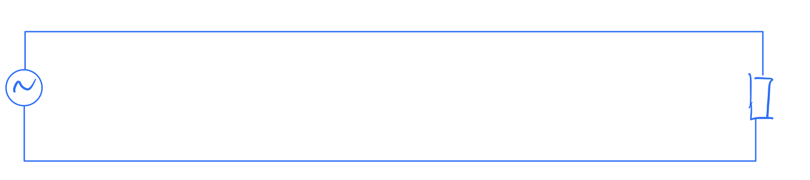
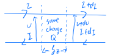

# 5. Confined EM waves

## 5.1 Transmission lines

> An example of guided wave

Lets think in a super long circuit

If the time for signal to transverse the circuit is not $\ll\frac{1}{\omega}$, we need to consider the wave behavior of the signal.

We could have 

> Remember: we are defining capacitance as C ==per unit length==, and inductance L ==per unit length==

$$\begin{align*}
Q &= (C\delta z)v\\
\frac{dQ}{dt}&= C\delta z\frac{\partial v}{\partial t}\\
&=I(z,t)-I(z+dz,t)\\
&=\delta z\left(\frac{-\partial I}{\partial z}\right)\\
\Rightarrow\frac{\partial I}{\partial z}&=-C\frac{\partial v}{\partial t}\quad\text{ equation 1}\\
\Phi&=(L\delta z)I\\
\frac{d\Phi}{dt}&=L\delta z\frac{\partial I}{\partial t}\\
&=V(z,t)-V(z+\delta z,t)\\
&=\delta z\left(-\frac{\partial V}{\partial z}\right)\\
\Rightarrow \frac{\partial V}{\partial z}&=-L\frac{\partial I}{\partial t}\quad\text{equation 2}
\end{align*}$$

If we plug equation 1 into equation 2, we get

$$\frac{\partial^2 V}{\partial t^2}=\frac{1}{LC}\frac{\partial^2 V}{\partial z^2}$$

For wavelike situations, we have 

$$V(z,t) = f(z-vt)+g(z+vt)$$

where $f$ and $g$ are arbitrary functions, and $v$ is the wave velocity which is $\frac{1}{\sqrt{LC}}$.

> Note: the wave velocity is not the speed of light, but the speed of the wave in the circuit.

From equation 1, wee could have 
$$\frac{d V}{d I} = \frac{1}{C\frac{d z}{d t}} = \frac{1}{C\frac{1}{\sqrt{LC}}} = \frac{1}{\sqrt{\frac{L}{C}}}$$
The impedance would be, then $Z = \pm\sqrt{\frac{L}{C}}$ where thr $\pm$ is the direction of the wave.

Instantaneous power

$$\begin{align*} &= V\underbrace{(\frac{1}{2}LI^2+\frac{1}{2}CV^2)}_{\text{energy stored/length}}\\
&= \frac{1}{2}I^2z+\frac{1}{2}\frac{V^2}{z} = I^2z = \frac{LC}{z} = IV\end{align*}$$

<u>Example</u>

We have coaxial transmission line, which has 

$$C = \frac{Q}{V}$$
> Remember: $C$ is per unit length

We would have 

$$E\cdot 2\pi rl = \frac{Q}{\epsilon_r\epsilon_0}$$

Hence, we have

$$\begin{align*}
V &= -\int_b^a\frac{Q}{2\pi\epsilon_0\epsilon_r}dr = \frac{Q}{2\pi\epsilon_0\epsilon_r}\ln\frac{b}{a}\\
\Rightarrow C &= \frac{2\pi\epsilon_r\epsilon_0}{\ln\frac{b}{a}}\\
B\cdot2\pi r&=\mu_r\mu_0I\\
\Phi &= frac{\Phi}{I} = \frac{\mu_r\mu_0}{2\pi}\ln\frac{b}{a}\\
\end{align*}$$

Where, remember, $\Phi$ is the flux per unit length

$$\begin{align*}\Rightarrow \sigma &= \frac{1}{\sqrt{LC}} = \underbrace{\frac{1}{\sqrt{\mu_r\mu_0\epsilon_r\epsilon_0}}}_{\text{Speed of light in dielectric}}\\
Z&=\sqrt{\frac{L}{C}} = \sqrt{\frac{\mu_r\mu_0}{\epsilon_0\epsilon_r}}\frac{\ln\frac{b}{a}}{2\pi}\end{align*}$$

Then, a common type of transmission line:

<u>Example</u>: Strip transmission line

$a\gg d$ so we could ignore edge effect

