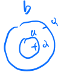

# 5. Confined EM waves

## 5.1 Transmission lines

> An example of guided wave

Lets think in a super long circuit

If the time for signal to transverse the circuit is not $\ll\frac{1}{\omega}$, we need to consider the wave behavior of the signal.

We could have 

> Remember: we are defining capacitance as C ==per unit length==, and inductance L ==per unit length==

$$\begin{align*}
Q &= (C\delta z)v\\
\frac{dQ}{dt}&= C\delta z\frac{\partial v}{\partial t}\\
&=I(z,t)-I(z+dz,t)\\
&=\delta z\left(\frac{-\partial I}{\partial z}\right)\\
\Rightarrow\frac{\partial I}{\partial z}&=-C\frac{\partial v}{\partial t}\quad\text{ equation 1}\\
\Phi&=(L\delta z)I\\
\frac{d\Phi}{dt}&=L\delta z\frac{\partial I}{\partial t}\\
&=V(z,t)-V(z+\delta z,t)\\
&=\delta z\left(-\frac{\partial V}{\partial z}\right)\\
\Rightarrow \frac{\partial V}{\partial z}&=-L\frac{\partial I}{\partial t}\quad\text{equation 2}
\end{align*}$$

If we plug equation 1 into equation 2, we get

$$\frac{\partial^2 V}{\partial t^2}=\frac{1}{LC}\frac{\partial^2 V}{\partial z^2}$$

For wavelike situations, we have 

$$V(z,t) = f(z-vt)+g(z+vt)$$

where $f$ and $g$ are arbitrary functions, and $v$ is the wave velocity which is $\frac{1}{\sqrt{LC}}$.

> Note: the wave velocity is not the speed of light, but the speed of the wave in the circuit.

From equation 1, wee could have 
$$\frac{d V}{d I} = \frac{1}{C\frac{d z}{d t}} = \frac{1}{C\frac{1}{\sqrt{LC}}} = \frac{1}{\sqrt{\frac{L}{C}}}$$
The impedance would be, then $Z = \pm\sqrt{\frac{L}{C}}$ where thr $\pm$ is the direction of the wave.

Instantaneous power

$$\begin{align*} &= V\underbrace{(\frac{1}{2}LI^2+\frac{1}{2}CV^2)}_{\text{energy stored/length}}\\
&= \frac{1}{2}I^2z+\frac{1}{2}\frac{V^2}{z} = I^2z = \frac{LC}{z} = IV\end{align*}$$

<u>Example</u>

We have coaxial transmission line, which has 

$$C = \frac{Q}{V}$$
> Remember: $C$ is per unit length

We would have 

$$E\cdot 2\pi rl = \frac{Q}{\epsilon_r\epsilon_0}$$

Hence, we have

$$\begin{align*}
V &= -\int_b^a\frac{Q}{2\pi\epsilon_0\epsilon_r}dr = \frac{Q}{2\pi\epsilon_0\epsilon_r}\ln\frac{b}{a}\\
\Rightarrow C &= \frac{2\pi\epsilon_r\epsilon_0}{\ln\frac{b}{a}}\\
B\cdot2\pi r&=\mu_r\mu_0I\\
\Phi &= frac{\Phi}{I} = \frac{\mu_r\mu_0}{2\pi}\ln\frac{b}{a}\\
\end{align*}$$

Where, remember, $\Phi$ is the flux per unit length

$$\begin{align*}\Rightarrow \sigma &= \frac{1}{\sqrt{LC}} = \underbrace{\frac{1}{\sqrt{\mu_r\mu_0\epsilon_r\epsilon_0}}}_{\text{Speed of light in dielectric}}\\
Z&=\sqrt{\frac{L}{C}} = \sqrt{\frac{\mu_r\mu_0}{\epsilon_0\epsilon_r}}\frac{\ln\frac{b}{a}}{2\pi}\end{align*}$$

Then, a common type of transmission line:

<u>Example</u>: Strip transmission line

$a\gg d$ so we could ignore edge effect

We have

$$\begin{align*}
C &= \frac{\epsilon_0\epsilon_r a}{d}\\
L &= \frac{\mu_0\mu_r d}{a}\\
\sigma &= \frac{1}{\sqrt{LC}} = \frac{1}{\sqrt{\mu_0\mu_r\epsilon_0\epsilon_r}}\quad\text{as before}\\
z &= \sqrt{\frac{L}{C}} = \sqrt{\frac{\mu_0\mu_r}{\epsilon_0\epsilon_r}}\frac{d}{a}\\
\end{align*}$$

### Boundrary between two transmission lines 

For x<0, we have

$$V_1 = V_ie^{i(\omega t-kx)}+V_re^{i(\omega t+kx)}$$

For x>0, we have

$$V_2 = V_te^{i(\omega t-k_2x)}$$

At x = 0, we need to match voltages

$$\Rightarrow V_i+V_r = V_t\quad\text{(1)}$$

Match currents, we have

$$\frac{V_i-V_r}{Z_1} = \frac{V_t}{Z_2}\quad\text{(2)}$$

From (1) and (2), we have $r = \frac{Z_2-Z_1}{Z_2+Z_1}$, $t = \frac{2Z_2}{Z_2+Z_1}$

As for power, we would have $\frac{V_i^2}{Z_1} = \frac{V_t^2}{Z_2}+\frac{V_r^2}{Z_1}$ as expected.

### Termination of load

$\frac{V_T}{I_T} = Z_T$ is the boundary condition

$$r = \frac{Z_T-Z_c}{Z_T+Z_c}\quad t = \frac{2Z_T}{Z_T+Z_c}$$

We would also like to consider special cases

||$Z_T$|$r$|$t$|$V_T$|$I_T$|
|---|---|---|---|---|---|
|Short circuit|0|-1|0|0|$2I_i$|
|Open circuit|$\infty$|1|2|$2V_i$|0|
|Matched|$Z_c$|0|1|$V_i$|$I_i$|

When $Z_T=Z_c$, we would get maximum power transfer

<u>proof</u>

Incident power $= \frac{\langle V_i^2 \rangle}{Z_c} = \frac{1}{2}\frac{V_i^2}{Z_c}$

Power on the load $= \frac{\langle V_T^2 \rangle}{Z_T} = \frac{1}{2}\frac{V_T^2}{Z_T} = \frac{1}{2}\frac{4Z_TV_T^2}{(Z_T+Z_c)^2}\quad\text{(3)}$
Hence, 
$$\begin{align*}\frac{\text{Power transmitted}}{\text{incident power}} &= \frac{\text{(3)}}{\text{(4)}}\\
&=\frac{4Z_cZ_T}{(Z_T+Z_c)^2}\end{align*}$$

$$\begin{align*}\frac{d}{dZ_T}\left[\frac{Z_T}{(Z_T-Z_c)^2}\right] &= 0\\
\frac{(Z_T+Z_c)^2\cdot 1-2(Z_T+Z_c)Z_T}{(Z_T+Z_c)^2} &=0\\
\Rightarrow (Z_T+Z_c)\cdot(Z_T+Z_c-2Z_T) &= 0\\
\Rightarrow Z_T &= Z_c\end{align*}$$

### Input impedance of short sections 

Input impedance 

$$\begin{align*}
Z_{in} &=\frac{V(-l)}{I(-l)}\\
&= \frac{V_ie^{ikl}+V_re^{-ikl}}{\frac{V_i}{Z_T}e^{ikl}-\frac{V_r}{Z_c}e^{-ikl}}\\
\text{and }V_r&=rV_i \quad\text{ where}\quad r = \frac{Z_T-Z_c}{Z_T+Z_c}\\
\Rightarrow Z_{in}&=\left(\frac{Z_T\cos(kl)+iZ_c\sin(kl)}{Z_c\cos(kl)+iZ_T\cos(kl)}\right)Z_c\\
\text{For a } &\frac{\lambda}{2}\text{ line }(kl=\pi)\\
&\Rightarrow Z_{in} = Z_T\\
\text{For a } &\frac{\lambda}{4}\text{ line }(kl=\frac{\pi}{2})\\
&\Rightarrow Z_{in} = \frac{Z_c}{Z_T}\\
\end{align*}$$

If $Z_T$ = 0 $\Rightarrow$ $Z_{in} = iZ_c\tan(kl)$
If $Z_T$ = $\infty$ $\Rightarrow$ $Z_{in} = -iZ_c\cot(kl)$

For a $\frac{\lambda}{4}$ line, we have $Z_{in} = \frac{Z^2_c}{Z_T}$

Choose $\frac{Z'^2_c}{Z_T} = Z_c$
i.e. $Z_c' = \sqrt{Z_cZ_t}$
The transmission line has been perfectly terninated and there is no reflected wave

## Waveguides

<u>Example of interfering EM waves</u>

Consider 2 EM waves with $E\parallel y$, travelling along $\mathbf k_\pm =\mathbf k_0(\pm\sin\theta,0\cos\theta)$

And we add them up

$$\begin{align*}
\mathbf E &= \frac{\mathbf E_0}{2}\left(e^{i(\mathbf k_+\cdot\mathbf r-\omega t)}-e^{i(\mathbf k_-\cdot\mathbf r-\omega t)}\right)\mathbf{\hat y}\\
&=\frac{\mathbf E_0}{2}e^{i(k_0z\cos\theta-\omega t)}\left(e^{ik_0x\sin\theta}-e^{-ik_0x\sin\theta}\right)\mathbf{\hat y}\\
&=\mathbf E_0 i\mathbf{\hat y}e^{i(k_0z\cos\theta-\omega t)}\sin(k_0x\sin\theta)\\
\end{align*}$$

And so it is zero when $k_0x\sin\theta=n\pi$
i.e. $x=na$ when a$a=\frac{\pi}{k_0\sin\theta}$

Nodal plane would be like 

We could, therefore, insert conducting sheets at places where $\mathbf E=0$

This demonstrates (at least in 1 dimension) that guided waves are possible 

When confined

$$\begin{align*}
\mathbf B &= \frac{1}{c}\frac{\mathbf E_0}{2}e^{i(k_0z\cos\theta-\omega t)}\left[e^{ik_0\sin\theta}\left(\begin{matrix}-\cos\theta\\0\\\sin\theta\end{matrix}\right)+e^{-ik_0\sin\theta}\left(\begin{matrix}-\cos\theta\\0\\-\sin\theta\end{matrix}\right)\right]\\
&=\frac{\mathbf E_0}{2c}e^{i(k_0z\cos\theta-\omega t)}\left(\begin{matrix}-i\cos\theta\sin(k_0x\sin\theta)\\0\\\sin\theta\cos(k_0x\sin\theta)\end{matrix}\right)\\
\end{align*}$$
$\Rightarrow$ only $\mathbf E$ is transverse, $\mathbf B$ is not

### Rectangular waveguide

Rectangular cross section metal walls

$\mathbf E$, $\mathbf B\propto e^{-i\omega t}$
$\mathbf E=\mathbf B =0$ inside conductor walls
$\mathbf B_\perp$ and $\mathbf E_\parallel$ are continuous
$\Rightarrow \mathbf B_\perp$ and $\mathbf E_\parallel$ are zero at the walls

Consider Maxwell's equations inside waveguide
$$\begin{align*}
\mathbf{\nabla\cdot E} &=0\quad\mathbf{\nabla\times E} = i\omega\mathbf B\\
\mathbf{\nabla\cdot B} &=0\quad\mathbf{\nabla\times B} = \frac{i\omega}{c^2}\mathbf E\\
\end{align*}$$

Hence, using our old method, we could have
$$\mathbf{\nabla\times\nabla\times E} = i\omega\mathbf{\nabla\times B} = \frac{\omega^2}{c^2}\mathbf E$$
Where the LHS would be $\mathbf{\underbrace{\nabla(\nabla\cdot E)}_{0}}-\nabla^2\mathbf E = -\nabla^2\mathbf E$, so we can have a second order differential equation

$$\nabla^2\mathbf E + \frac{\omega^2}{c^2}\mathbf E = 0$$

Which is called the Helmholtz equation

One set of solution of this equation have $\mathbf E$ transverse (called TE modes)
$\Rightarrow E_z=0$
Since $\mathbf E_\parallel$ = 0 at walls, we could get 
$$\left\{\begin{matrix}E_x=0\quad \text{at }\quad y=0,b\\
E_y=0\quad\text{at }\quad x = 0,a\end{matrix}\right.$$
And since $E(\mathbf r,t)\propto e^{i(k_gz-\omega t)}$, we would like to put it in Helmholtz equation
$$\Rightarrow \left[\frac{\partial^2}{\partial x^2}+\frac{\partial^2}{\partial y^2}+\left(\frac{\omega^2}{c^2}-k_g^2\right)\right]\mathbf E = 0$$

> Notice that $E_z$ = 0

<u>Boundary conditions</u>
$$\begin{align*}E_x&\propto\sin\frac{n\pi y}{b}\\
E_y&\propto\sin\frac{m\pi x}{a}\\
E_x &= f(x)\sin\frac{n\pi y}{b}e^{i(k_gz-\omega t)}\\
E_y &= g(y)\sin\frac{m\pi y}{a}e^{i(k_gz-\omega t)}\end{align*}$$

From $\mathbf{\nabla\cdot E} = 0$, we have $\frac{\partial E_x}{\partial x}+\frac{\partial E_y}{\partial y}+\underbrace{\frac{\partial E_z}{\partial z}}_{0} = 0$, hence we could continue

$$\begin{align*}
\frac{\partial f}{\partial x}\sin\frac{n\pi y}{b}+\frac{\partial g}{\partial y}\sin\frac{m\pi x}{a} = 0\\
\frac{\partial f}{\partial x}=-\sin\frac{m\pi x}{a}\Rightarrow f(x) = -\frac{a}{m\pi}\cos\frac{m\pi x}{a}\\
\frac{\partial g}{\partial y}=-\sin\frac{n\pi y}{b}\Rightarrow g(y) = -\frac{b}{n\pi}\cos\frac{n\pi y}{b}\\
\end{align*}$$

If m = 1, n = 0, we would call it TE10 mode

$$\begin{align*}
E_x&=E_z = 0\\
E_y&= -A\frac{\pi}{a}\sin\frac{\pi x}{a}e^{i(k_gz-\omega t)}\\
B_x&= A\frac{k_g}{\omega}\sin\frac{\pi x}{a}e^{i(k_gz-\omega t)}\\
B_z &= i\frac{A}{\omega}\left(\frac{\pi}{a}\right)^2\cos\frac{\pi x}{a}e^{i(k_gz-\omega t)}\\
\end{align*}$$

We could have Helmholtz equation for $B_z$ as well
$\Rightarrow \frac{\omega^2}{c^2}-k_g^2-\left(\frac{m\pi}{a}\right)^2-\left(\frac{n\pi}{b}\right)^2=0$
$\Rightarrow \frac{\omega^2}{c^2} = k_g^2+\underbrace{\left(\frac{m\pi}{a}\right)^2+\left(\frac{n\pi}{b}\right)^2}_{k_c^2}$
Where $k_c$ is the cutoff wave vector

There is a minumym frequency allowed allowed by the waveguide

$$\begin{align*}\frac{2\omega d\omega}{c^2} = 2k_gdk_g\\
\Rightarrow V_{\text{group}} = \frac{d\omega}{dk_g} = \frac{c^2k_g}{\omega} = \frac{ck_g}{\sqrt{k_g^2+k_c^2}}\\
v_{\text{phase}} = \frac{\omega}{k_g} = \frac{c\sqrt{k_g^2+k_c^2}}{k_g}\end{align*}$$

And $v_{\text{group}}v_{\text{phase}} = c^2$
$$\begin{align*}k_g&=k_0\cos\theta\\
k_c&=k_0\sin\theta\\
\frac{\omega}{c}&=k_0\end{align*}$$

We can, therefore, consider the $TE_{10}$ mode ad an EM wave bouncing off the walls at angle $\theta_0$ with respect to the walls

