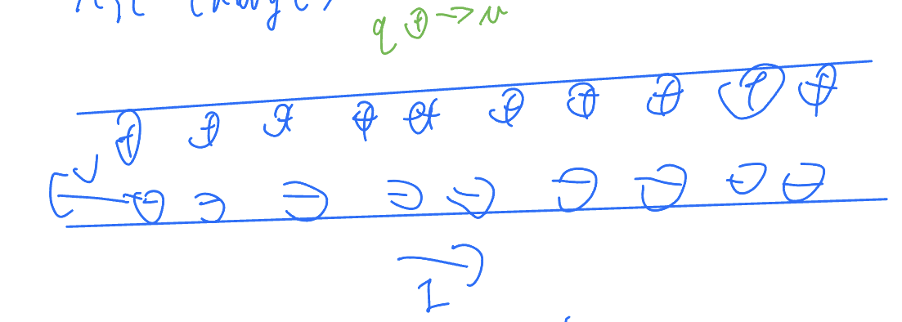

# 6. Special relativity and electromagnetism
> Just a brief introduction, no worries.

We have spacetime four vector ($ct,\mathbf{r}$), who has dot product with itself as

$$\begin{align*}x^\mu x_\mu&= c^2t^2-r^2\\
\tau^2 &=t^2\left(1-\frac{x^2+y^2+z^2}{c^2t^2}\right)\\
&=t^2\left(1-\frac{v^2}{c^2}\right)\\
\Rightarrow\tau&=\frac{t}{\gamma}\\
\gamma&=\left(1-\frac{v^2}{c^2}\right)^{-\frac{1}{2}}\\
t&=\gamma\tau\quad\text{time dilation}\end{align*}$$

We also have momentum four vector ($\frac{E}{c},\mathbf{p}$), who has dot product with itself as

$$\begin{align*}p^\mu p_\mu&= \frac{E^2}{c^2}-p^2=m^2c^2\\
\text{since} E^2&=p^2c^2+m^2c^2\quad(m=\text{rest mass})\end{align*}$$

We also have differential operator $\partial_\mu$ which is written as

$$\partial_\mu=\left(\frac{1}{c}\frac{\partial}{\partial t},\mathbf\nabla\right)$$

We would just introduce this here

Then, we could have current density four vector

$$J_\mu=(c\rho,\mathbf{J})$$

We would consider charge at rest, then

$$J^\mu=(c\rho,0)$$

This could be "boosted" to a moving frame with speed v

$$J'^\mu= (\rho'c,\mathbf J')$$

Where $\rho' = \gamma\rho_0$ due to length contraction and $\mathbf J'=-\gamma\rho_0\mathbf v$

Then, we could have continuity equation

$$\begin{align*}\frac{\partial\rho}{\partial t}+\mathbf\nabla\cdot\mathbf J&=0\\
\partial_\mu J^\mu &=0\end{align*}$$

In lab frame S, then, we could have
 - Line of charge, with density $+\lambda$ which is stationary
 - Line of charge, with density $-\lambda$ which is moving with speed $-v$
 - Test charge q moving with speed $+u$

remember that the wire itself has no net charge

$$\lambda_{\text{tot}} = +\lambda-\lambda = 0$$

In the test charge frame S', we could have 
 - Test charge is stationary
 - \+ charges move backwards at speed u$\Rightarrow \gamma_+ = \gamma_u=\frac{1}{\sqrt{1-\frac{u^2}{c^2}}}$
 - \- charges move back at $v'=\frac{v+u}{1+\frac{uv}{c^2}}\Rightarrow \gamma_- = \frac{1}{\sqrt{1-\frac{c^2(v+u)^2}{(c^2+uv)^2}}} = \frac{c^2+uv}{\sqrt{(c^2-v^2)(c^2-u^2)}}=\frac{c^2+uv}{\sqrt{(c^2-v^2)(c^2-u^2)}} = \gamma_v\partial_u(1+\cfrac{vu}{c})$

Hence $\gamma'_{\text{tot}} = \gamma_+\lambda-\gamma_-\left(-\frac{\lambda}{\gamma_v}\right)$

In the rest frame of negative charges, they have charge density of $\frac{-\lambda}{\gamma_v}$

$$\begin{align*}
\lambda'_{\text{tot}} &= \gamma_u\lambda-\lambda\gamma_u\cdot\left(1+\frac{uv}{c^2}\right)\\
&=-\lambda\gamma_u\frac{uv}{c^2}\\
E'&=\frac{\lambda'_{\text{tot}}}{2\pi\epsilon_0 r}=\frac{-\lambda uv\gamma_u}{2\pi\epsilon_0 c^2 r}\\
F'&=qE'=\frac{-\lambda uv\gamma_u q}{2\pi\epsilon_0 c^2 r}\\
F&=\frac{F'}{\gamma_u} = \frac{-(\lambda v)uq}{2\pi\epsilon_0 c^2 r}\quad\text{note that}\quad \lambda v = I\\
&=-qu\left(\frac{\mu_0I}{2\pi r}\right) \quad\text{note that}\quad \frac{\mu_0I}{2\pi r} = B\\
&=-quB\quad\text{Which is lorentz force}
\end{align*}$$

Lets remember Maxwell's equations

$$\begin{align*}
\mathbf B &= \mathbf\nabla\times\mathbf A\\
E &= -\mathbf\nabla V-\frac{\partial\mathbf A}{\partial t}\\
\text{If}\quad V&\rightarrow V-\frac{\partial\chi}{\partial t}\\
\text{and} \quad\mathbf A&\rightarrow\mathbf A+\mathbf\nabla\chi\\
\text{Where }\chi&\text{ is a scalar field}\\
A^\mu&=(\frac{V}{c},\mathbf A)\\
A_\mu&=(\frac{V}{c},-\mathbf A)\\
A_\mu &\rightarrow A_\mu-\partial_\mu\chi\quad\text{gauge transformation}\\
\end{align*}$$

We would, therefore, need a new object called the field strength tensor

$$\begin{align*}
F_{\mu\nu}&=\partial_\mu A_\nu-\partial_\nu A_\mu\\
\text{Where }\mu,\nu&\text{ are indices}\\
F_{\mu\nu}&\rightarrow F_{\mu\nu}-\partial_\mu\partial_\nu\chi+\partial_\nu\partial_\mu\chi= F_{\mu\nu}\\
F_{\mu\nu}&=\begin{pmatrix}0&\frac{E_x}{c}&\frac{E_y}{c}&\frac{E_z}{c}\\
-\frac{E_x}{c}&0&-B_z&B_y\\
-\frac{E_y}{c}&B_z&0&-B_x\\
-\frac{E_z}{c}&-B_y&B_x&0\end{pmatrix}\\
F^{\mu\nu}&=\begin{pmatrix}0&-\frac{E_x}{c}&-\frac{E_y}{c}&-\frac{E_z}{c}\\
\frac{E_x}{c}&0&-B_z&B_y\\
\frac{E_y}{c}&B_z&0&-B_x\\
\frac{E_z}{c}&-B_y&B_z&0\end{pmatrix}\\
\end{align*}$$

And the function $\partial_\mu F^{\mu\nu} = \mu_0 J^\nu$ gives us the four maxwell's equations. The first half would be simple to deduce, but the second half would be a bit more complicated so we are not going to do it here.

First two: 

$$\begin{align*}
\partial_i F^{i0}&=\mu_0J^0\\
\Rightarrow \mathbf\nabla\cdot\mathbf E&=\frac{\rho}{\epsilon_0}\\
\partial_\mu F^{\mu i}&=\mu_0J^i\\
\Rightarrow \frac{1}{c^2}\mathbf E+\mathbf{\nabla\times B}&=\mu_0\mathbf J
\end{align*}$$