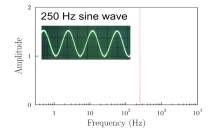

# Bonus Lecture: Signals and sampling
>
> Not in the exam

<u>Fourier transform</u> is a way to represent a signal as a sum of sinusoids. It is a continuous function of frequency.

$$\begin{align*}\tilde f(\omega) &= A\int_{-\infty}^{\infty} f(t) e^{-i\omega t} dt\\
f(t) &= B\int_{-\infty}^\infty\tilde f(\omega)\\
AB &= \frac{1}{2\pi}\\
&\Rightarrow \text{often choose }A=B=\frac{1}{\sqrt{2\pi}}\\
\text{You can}&\text{ also choose} A=1\text{, } B = \frac{1}{2\pi}\end{align*}$$

This is just a convention, and the latter would be what we use in this course or lecture.

A signal $V(t)$ has a frequency spetrum $\tilde V(\omega)$.

From tis, we could say thatthe signal is <u> band limited</u> if $\tilde V(\omega) = 0$ for $|\omega| > \omega_c$.

And we could get some examples of band limited signals from the lecture.

## Look at some examples of fourier transform.
### Delta function
$$\begin{align*}\delta(t) &= \begin{cases}0 & t\neq 0\\ \infty & t=0\end{cases}\\
\int_{-\infty}^\infty \delta(t) dt &= 1\\
\tilde\delta(\omega) &= \int_{-\infty}^\infty \delta(t) e^{-i\omega t} dt = 1\\
\end{align*}$$

That would give a unniform frequency spectrum, which is not band limited.

If you fourier transfor a delta function which is not at the origin, you would get a complex exponential.

$$\delta(t-t_0) \rightarrow e^{-i\omega t_0}$$

We will now think of something called the <u>Dirac comb</u> or <u>sampling function</u>.

$$\begin{align*}f(t) &= \sum_{n=-\infty}^\infty \delta(t-nT)\\
\end{align*}$$

The idea of the dirac comb is that we would have a fourest of delta functions, which are separated by Ts, and we would have a delta function at every integer multiple of $T$.

This is a period function with period $T$.

WE could, therefore, write its fourier transform as a sum of fourier transforms of delta functions.

$$\tilde f(t) = \sum_{n=-\infty}^\infty C_me^{\frac{2\pi i m t}{T}}$$

Where $C_m$ would be

$$C_m = \frac{1}{T}\int_{-T/2}^{T/2} f(t) e^{-\frac{2\pi i m t}{T}} dt$$

This looks difficult, but since $f(t)$ is a sum of delta functions, and only one would be nonzero in the region of integration, we would get

$$C_m = \frac{1}{T}\int_{-T/2}^{T/2}\delta(t)e^{-\frac{2\pi i m t}{T}} dt = \frac{1}{T}$$

$$\Rightarrow \tilde f(t) = \frac{1}{T}\sum_{n=-\infty}^\infty e^{\frac{2\pi i m t}{T}}$$

Now, we woule have fourier transform of the entire Dirac comb.

$$\begin{align*}\tilde f(\omega) &= \int_{-\infty}^{\infty}f(t)e^{-i\omega t} dt \\&= \sum_{n=-\infty}^\infty \int_{-\infty}^\infty \delta(t-nT)e^{-i\omega t} dt \\&= \sum_{n=-\infty}^\infty e^{-i\omega nT}\end{align*}$$

If you compare the two things we have, we would see that they are the same, and we would get

$$\tilde f(\omega) = \frac{2\pi}{T}\sum_{k=-\infty}^\infty \delta(\omega - \frac{2\pi k}{T})$$

In omega space, the delta functions are separated by $\frac{2\pi}{T}$.

We have seen that fourier transform of a delta function is a constant, and we would have a constant at every integer multiple of $\frac{2\pi}{T}$.

Go back to problem of sample a function $V(t)$, at a frequency $\frac{1}{T}$
$\Rightarrow$ Consider
$$V_s(t) = V(t)\sum_{n=-\infty}^\infty \delta(t-nT)$$

Since this is a product of two functions, we could write its fourier transform as a convolution of the fourier transforms of the two functions.

$$\tilde V_s(\omega) = \tilde V(\omega) * \tilde f(\omega)\\
$$

Maybe just look at how this work, if we take the fourier transform of $V_s$, we would get

$$\tilde V_s(\omega) = \int_{-\infty}^\infty V(t)\sum_{n=-\infty}^\infty \delta(t-nT)e^{-i\omega t} dt$$

Where $V(t)$ is a function taht can be written as

$$\frac{1}{2\pi}\int_{-\infty}^{\infty}\tilde V(\bar \omega)e^{i\bar\omega t}d\bar\omega$$

Now put everything together, we get

$$\frac{1}{2\pi}\int_{-\infty}^{\infty}\tilde V(\bar \omega)e^{i\bar\omega t}d\bar\omega\sum_{n=-\infty}^\infty \int_{-\infty}^\infty \delta(t-nT)e^{-i\omega t} dt$$

The integration of dirac comb is just the sum of the integrations of the delta functions, which can be written as

$$\frac{2\pi}{T}\sum_{k=-\infty}^\infty \delta\left(\omega-\bar\omega-\frac{2\pi k}{T}\right)$$

And hence

$$\tilde V_s(\omega) = \frac{1}{T}\sum_{k=-\infty}^\infty \tilde V(\omega-\frac{2\pi k}{T})$$

That is just the convolution theorem tho.

If we look at the fourier transform, we get lots of copies of the $\tilde V(\omega)$, and they are separated by $\frac{2\pi}{T}$.

This idea of having multiple copies of the fourier transform of the original function is important

If you think of samping a function, lets say a sine wave, you digitize it is certain points

The question is how few points do you need to digitize a signal

The idea would be $T\ll \frac{1}{\omega}$, where $\omega$ is the frequency of the signal.

You could, for example, sample from peak to trough, and you would get a good approximation of the signal, which should be the max frequency of sampling

$$\omega_{max} = \frac{\pi}{T}$$

This is known as the <u>Nyquist frequency</u>.

If we go back to the particular case of this signal, which is band limitecd

They would be nicely separated, not touching each others

**BUT** if $\omega_{max} >\frac{\pi}{T}$, then the copies would overlap, and you would not be able to tell which is which.

This is called <u>aliasing</u>.

This is a problem, decreasing its quality, and we would like to avoid it.

To avoid it the Nyquist frequency should be twice as big as the maximum frequency of the signal.

Lastly, lets talk about **Johnson-Nyquist noise**

> Everything has noise, everything is fluctuating

This circuit actually has normal modes, $k = \frac{n\pi}{L}$, and since $\omega = ck$, one mode in a frequency interval of $\Delta \omega = \frac{\pi c}{L}$.

We also have

$$\langle\text{Energy of one mode}\rangle = k_BT$$

This is a result of the equipartition theorem.

Hence

$$\frac{\langle\text{Energy}\rangle}{L} = \frac{k_BT}{L} = k_BT\frac{\Delta \omega}{c\pi}$$

That is just for one mode, in other word, in a ferquency unit $\Delta \omega$

S, the mean power on the resistor on the right

$$\langle\text{Power on R}\rangle = \underbrace{\frac{1}{2}k_BT\frac{\Delta\omega}{c\pi}}_{\text{Energy/length}}\times c$$

which equals to

$$\frac{k_BT\Delta\omega}{2\pi}$$

which is $\langle I^2R\rangle$ named powwer

we have $I=\frac{V}{2R}$, and hence
$\Rightarrow\langle V^2\rangle = \frac{4k_BTR\Delta\omega}{\pi} = 4k_BTR\Delta f$, which is known as Johnson-Nyquist noise across R in a frequency interval $\Delta f$.