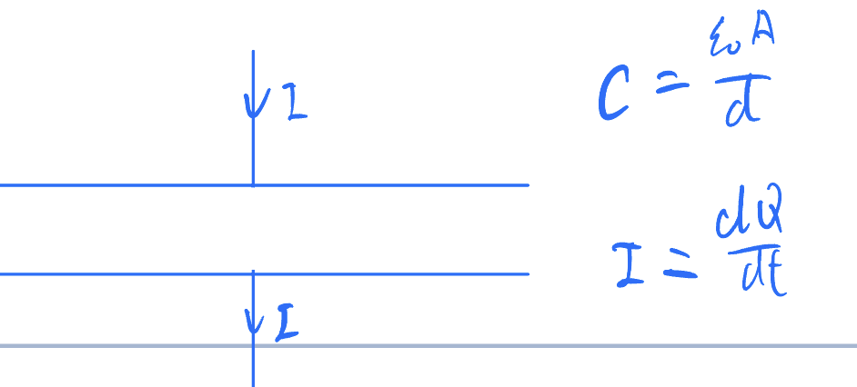

# Potential
## 01 拉普拉斯方程和他在笛卡尔坐标系下的解

### 拉普拉斯方程其人

开局先写一个假设什么东西都不动的麦克斯韦方程组

$\nabla E = \frac{\rho}{\epsilon_0}$

$\nabla B = 0$

$\nabla \times E = 0$

$\nabla \times B = \mu_0 J$

我们知道$E = -\nabla V$，把这个带入第一个式子就可以得到著名的泊松equation

$\nabla^2V = -\frac{\rho}{\epsilon_0}$

而如果在一个范围内没有任何电荷出现的话 那就可以得到另一个叫做Laplace's equation的东西

$\nabla^2 V = 0$

还挺*优雅*的 不是嘛

### 来解方程吧！用一个具体的例子！

这篇文章主要就是要在笛卡尔坐标系下解这个方程，在大二第一学期我们主要使用separation of variable来解，也就是说我们要假设这个V他是等于$X(x)Y(y)Z(z)$的。我们可以举一个具体的例子来熟悉这种方法

在x = $\pm$b时，$V = V_0$；然后y=0和a的那两个面是接地的。这也就是说Z(z)这一项没有什么用 不妨把他设成1.所以我们现在有

$V = X(x)Y(y)$

把他带入拉普拉斯方程中

$0=\frac{\partial^2V}{\partial x^2}+\frac{\partial^2V}{\partial y^2}$

就可以得到

$Y\frac{\partial^2 X}{\partial x^2}+X\frac{\partial^2 Y}{\partial y^2}=0$

两边同时除V

$\frac{1}{X}\frac{\partial^2 X}{\partial x^2}+\frac{1}{Y}\frac{\partial^2 Y}{\partial y^2}=0$

因为第一项只和x有关，第二项只和另一个有关，所以只有这俩都是常数的情况，而且偏微分可以写成全微分

先尝试**首项是负数**的情况

$\frac{1}{X}\frac{d^2 X}{d x^2}=-\frac{1}{Y}\frac{d^2 Y}{d y^2}=-k^2$

这个方程的解为$X(x) = A_1\cos (kx)+A_2\sin (kx)$和$Y(y)=B_1e^{ky}+B_2e^{-ky}$。我们有边界条件$Y(0)=Y(a)=0$，也就是说$B_1+B_2=B_1e^{ka}+B_2e^{-ka}=0$，也就是说$B_1(e^{ka}-e^{-ka})=0$，所以说$2B_1\sinh(ka)=0$，也就是说$B_1=B_2=0$ 这就是说所有地方的V都是0，这显然不是个解，也就是说我们要尝试一下**首项是正数的情况**

$\frac{1}{X}\frac{d^2 X}{d x^2}=-\frac{1}{Y}\frac{d^2 Y}{d y^2}=k^2$

解是$Y(y) = A_1\cos (ky)+A_2\sin (ky)$和$X(x)=B_1e^{kx}+B_2e^{-kx}$（没错我就换了一下xy，甚至连顺序都懒得换）我们有

$Y(0)=0$

也就是说$A_1=0$，所以$Y(a)=A_2 \sin(ka)=0$，$A_2$肯定不能等于0了，所以只能让$\sin(ka)=0$，所以说$ka=n\pi$，而$A_2$是随机常数。所以最终我们的解为

$V(x,y)=\overset{n}{\underset{n=0}{\sum}}C_n\cosh(\frac{n\pi x}{a})\sin(\frac{n\pi y}{a})$

好家伙 那$C_n$怎么搞？答案是用X(x)的边界条件

$V(b,y)=\overset{n}{\underset{i=0}{\sum}}C_n\cosh(\frac{n\pi x}{a})\sin(\frac{n\pi y}{a})=V_0$

我们把左右两边各乘一个$\sin(\frac{m\pi y}{a})$，再对y从0到a积分，可以得到

$V(b,y)=\overset{n}{\underset{i=0}{\sum}}C_n\cosh(\frac{n\pi x}{a})\overset{a}{\underset{0}{\int}}\sin(\frac{n\pi y}{a})\sin (\frac{m\pi y}{a})dy=V_0\overset{a}{\underset{0}{\int}}sin (\frac{m\pi y}{a})dy$

其中

$\sin \frac{n\pi y}{a}\sin \frac{m\pi y}{a}=\frac{1}{2}\left[\cos\frac{(n-m)\pi y}{a}-\cos\frac{(n+m)\pi y}{a}\right]$

所以我们知道只有在n=m时才不是0，其他的时候这个积分等于$\frac{a}{2}$。所以说我们可以得到再m是偶数时，$C_m=0$，其余时间$C_m=\frac{4V_0}{m\pi \cosh\left(\frac{m\pi b}{a}\right)}$

最终 我们的解就是一个特别恐怖的式子

$V(x,y)=\frac{4V_0}{\pi}\overset{n}{\underset{i=0}{\sum}}\frac{\cosh \frac{(2i+1)\pi x}{a}}{\cosh \frac{(2i+1)\pi b}{a}}{a}\sin(\frac{i\pi y}{a})$

结束！

## 02 拉普拉斯方程在球坐标下的解

我们上次介绍了非常*优雅*的拉普拉斯方程$\nabla^2V=0$并且算了算他在笛卡尔坐标系下的一个例子，这次来试一试球坐标

### 球坐标下的拉普拉斯方程

通过一些矢量微积分，我们可以知道

$\nabla^2V = \frac{1}{r^2}\frac{\partial}{\partial r}\left(r^2 \frac{\partial V}{\partial r}\right) + \frac{1}{r^2 \sin\theta}\frac{\partial}{\partial \theta}\left(\sin\theta \frac{\partial V}{\partial \theta}\right) + \frac{1}{r^2 \sin^2\theta}\frac{\partial^2 V}{\partial \phi^2} = 0$

> 嗯。。。以我现在的知识还是看不出来这有什么优雅的

### 解方程！

> 一杯茶，一包烟，一道积分算一天！（虽然我不抽烟）

还是分离变量，假设$\nabla^2=R(r)\Theta(\theta)\Phi(\phi)$

两边同时乘$\frac{r^2}{R\Theta\Phi}$，可以得到

$\frac{1}{R}\frac{\partial}{\partial r}\left(r^2 \frac{\partial R}{\partial r}\right) + \frac{1}{\Theta \sin\theta}\frac{\partial}{\partial \theta}\left(\sin\theta \frac{\partial \Theta}{\partial \theta}\right) + \frac{1}{\Phi \sin^2\theta}\frac{\partial^2 \Phi}{\partial \phi^2} = 0$

左右两边再同时乘一个$\sin^2\theta$的话，上面这个式子他的左边两项就会只和R和$\theta$有关，而最后一项就会只和$\phi$有关。所以我们可以说最后一个项乘个$\sin^2 \theta$是一个常数：

$\frac{1}{\Phi}\frac{d^2\Phi}{d^2\phi}=K$

如果说K>0的话，这个方程的解就是$e^{\pm\sqrt{K}\phi}$的线性叠加了，我们在这里其实还是想要一个周期性的解，毕竟$\phi$代表的是角度嘛，不能说$\phi=\phi_0+2n\pi$里面对于任何一个n$\phi$的解都不一样。所以我们不如去把K设成一个负数，把它叫做$-m^2$。这样子的话我们就可以得到

$\Phi(\phi)=Ce^{im\phi}$

其中的$\phi$可以是正数也可以是负数 但必须要是整数。求个导的话就是

$\frac{d^2\Phi}{d\phi^2}=-m^2\Phi$

整个的式子就变成了这样子

$\frac{1}{R}\frac{\partial}{\partial r}\left(r^2 \frac{\partial R}{\partial r}\right) + \frac{1}{\Theta \sin\theta}\frac{\partial}{\partial \theta}\left(\sin\theta \frac{\partial \Theta}{\partial \theta}\right) - \frac{m^2}{\sin^2\theta} = 0$

再找找有没有什么只和一个变量相关的东西？

（没错！）

（是第一项！）

（嘿嘿！）

那我们就可以把第一项设成常数了！

$\frac{1}{R}\frac{\partial}{\partial r}\left(r^2 \frac{\partial R}{\partial r}\right) =l(l+1)$

$\frac{1}{\Theta \sin\theta}\frac{\partial}{\partial \theta}\left(\sin\theta \frac{\partial \Theta}{\partial \theta}\right) - \frac{m^2}{\sin^2\theta} = l(l+1)$

至于为什么把常数设计得这么怪，你之后就知道啦

我们可以把$\cos\theta$设为x，那么下面的式子就变成了

$\frac{d}{dx}\left[(1-x^2)\frac{d\Theta(x)}{dx}\right]+\left[l(l+1)-\frac{m^2}{1-x^2}\right]\Theta(\theta)=0$

**苍天啊 大地啊 我都干什么啊！这玩意怎么越写越长啊**

别怕，这个方程在之后的数学物理方法中就可以学到 其实叫做Legendre equation。他的解叫做**associated Legendre polynomials**，可以写成这种形式

$\Theta(x)=P^m_l(x)$

其中的$l$是正整数，不然的话这个方程就又不是周期性的了，而且m也只能是从-l到+l

> 现在知道为啥把常数设成l(l+1)了吧

$\Theta$和$\Phi$的积还有一个名字，叫做球谐（**spherical harmonic**），用$Y^m_l$表示

$Y_l^m=CP_l^m(\cos\theta)e^{im\phi}$

然后就是这个式子了

$\frac{1}{R}\frac{\partial}{\partial r}\left(r^2 \frac{\partial R}{\partial r}\right) =l(l+1)$

求一下导

$l(l+1)=2\frac{r}{R}\frac{dR}{dr}+\frac{r^2}{R}\frac{d^2R}{dr^2}$

试一下$R=Cr^x$，也就是说

$l(l+1)=\frac{2}{Cr^{x-1}}Cxr^{x-1}+\frac{1}{Cr^{x-2}}Cx(x-1)r^{x-2}$

$l(l+1)=2x+x(x-1)$

$l(l+1)=x(x+1)$

所以说x等于$l$或者$-l-1$

所以说R就出来了

$R(r)=\alpha r^l+\frac{\beta}{r^{l+1}}$

把三个东西乘起来 就可以得到

$V(r,\theta,\phi)=\overset{\infty}{\underset{l=0}{\sum}}\overset{l}{\underset{m=-l}{\sum}}\left(\alpha r^l+\frac{\beta}{r^{l+1}}\right)Y^m_l(\theta,\phi)$

#### Legendre多项式的一个特点

P有一个很有用的特点，就是他们是正交的，也就是说我们有

$\int^1_{-1}P_n(x)P_m(x)dx=\frac{2}{2n+1}\delta_{m,n}$

这个东西可以让我们更简单地计算$\alpha$和$\beta$

### 一个对称的情况

> 例子 我喜欢例子 现在就让我算例子！！

通常情况下，我们做的题都和$\phi$没有关系，所以说我们可以把球谐给写成单独一个关于$\cos\theta$的Legendre多项式，也就是说整个的V可以写成

$V(r,\theta)=\overset{\infty}{\underset{l=0}{\sum}}\left(\alpha r^l+\frac{\beta}{r^{l+1}}\right)P_l(\cos \theta)$

我们可以举一个例子：在一个三维空间里面，存在着一个空心导体球在原点，他的半径是a。同时还存在一个沿着z轴向上的匀强电场E，求电势

首先啊，这是一个球，所以我们肯定会用球坐标来解这个方程

其次 我们看一下示意图

这个电势貌似和$\phi$没有什么关系！那我们就可以用那个简化版的拉普拉斯方程的解

$V(r,\theta)=\overset{\infty}{\underset{l=0}{\sum}}\left(\alpha r^l+\frac{\beta}{r^{l+1}}\right)P_l(\cos \theta)$

我们首先可以看一看他的end behavior，也就是当r趋近于无穷大时，V应当等于$-E\cos\theta$。我们看一下Legendre多项式的前几个方程：

$P_0(x)=1，P_1(x)=x，P_2(x)=\frac{1}{2}(3x^2-1)，P_3(x)=\frac{1}{2}(5x^3-3x)\cdots$

从中我们可以大概看出来，满足上面的end behavior的情况应该是只有l=1时$\alpha$和$\beta$才不等于0

所以说就可以得到

$V(r,\theta)=\left(-E r+\frac{\beta_1}{r^{2}}\right)\cos \theta$

还是一样的end behavior

就快要算出来了！

对于$\beta_1$，我们还有另外一个边界条件没有用，也就是r=a的情况:

$V(a,\theta)=(-Ea+\frac{\beta_1}{a^2})\cos\theta=0$

所以说$\beta_1=a^3E$

综上所述，我们能算出来

$V(r,\theta)=-Er\cos \theta+\frac{a^3E\cos\theta}{r^2}$

可以看出来 其中第一项对应的是电场对应的电势，而后面哪一项就是磁场对应的电势了

***<u>完事收工！</u>***

## Formal solution to Poisson's equation

Poisson's equation:

$${\nabla}^2V=-\frac{\rho}{\epsilon_0}$$
Has solution
$$V(\overrightarrow{r})=\frac{1}{4\pi\epsilon_0}\int\frac{\rho({\overrightarrow{r'}})}{|\overrightarrow{r'}-\overrightarrow{r}|}d\tau'$$

where $\tau'$ is the volume

This also happens in Magnetism, $\overrightarrow{B} = \overrightarrow{\nabla} \times \overrightarrow{A}$, and A is called *magnetic vector potential*

This is valid because the divergence of B is 0

$$\overrightarrow{\nabla}\times(\overrightarrow{\nabla}\times A)=\mu_0\overrightarrow{J}$$

$$\overrightarrow{\nabla}(\overrightarrow{\nabla}\cdot A)-\overrightarrow{\nabla}^2\overrightarrow{A}$$

it has gauge freedom that we can choose taht it is divergence free
choose $\overrightarrow{\nabla}\cdot A=0$

$$\Rightarrow{\nabla^2}\overrightarrow{A} = -\mu_0\overrightarrow{J}$$

it looks like three independent Poisson equations

$$\Rightarrow \overrightarrow{A}(\overrightarrow{r})=\frac{\mu_0}{4\pi}\int\frac{\overrightarrow{J}(\overrightarrow{r'})}{|\overrightarrow{r'}-\overrightarrow{r}|}d\tau'$$

**Example**: If we have a one dimentional current i.e. wire, this current will produce 

$$\overrightarrow{A}(\overrightarrow{r}) = \frac{\mu_0I}{4\pi}\int\frac{\overrightarrow{dl'}}{|\overrightarrow{r'}-\overrightarrow{r}|}$$
$$\overrightarrow{B}(\overrightarrow{r})=\overrightarrow{\nabla}\times\overrightarrow{A}=\frac{\mu_0}{4\pi}\int\frac{\overrightarrow{dl'}\times(\overrightarrow{r'}-\overrightarrow{r})}{|\overrightarrow{r'}-\overrightarrow{r}|^3}$$
Which is Biot-Savart law!

## Multipole expansion

Laplace with azimuthal symmetry:

$$V(r,\theta)=\sum_{l=0}^\infty[A_lr^l+\frac{B_l}{r^{l+1}}]P_l(cos\theta)$$

where $P_l$ is Legendre polynomial

Apply to a point charge at $\overrightarrow{r'}$

$$V(\overrightarrow{r})=\frac{1}{4\pi\epsilon_0}\frac{q}{|\overrightarrow{r}-\overrightarrow{r'}|}$$

(unit charge)

This has azimuthal symmetry, so we can use the above equation

If $\gamma$ is zero, then $cos\theta=1$, then $P_l(cos\theta)=1$, then 

$$V(r,\theta)=\frac{1}{4\pi\epsilon_0}\frac{q}{|\overrightarrow{r'}-\overrightarrow{r}|}=\sum^\infty_{l=0}A_lr^l+\frac{B_l}{r^{l+1}}$$

Because $P_l$(1)=1

The expansion would be 

$$\frac{1}{|\overrightarrow{r'}-\overrightarrow{r}|}=\left\{
    \begin{matrix}
    \frac{1}{r}\sum^\infty_{l=0}(\frac{r'}{r})^l & r>r'\\
    \\
    \frac{1}{r'}\sum^\infty_{l=0}(\frac{r}{r'})^l & r<r'
    \end{matrix}
    \right.$$

Choose the case $r'<r$

The general solutiuon would be 

$$V = \frac{1}{4\pi\epsilon_0}\frac{q}{r}\sum^\infty_{l=0}(\frac{r'}{r})^lP_l(cos\theta)$$

Thus the general solution for $\overrightarrow{r}$ outside a charge distribution is

$$V(\overrightarrow{r})=\frac{1}{4\pi\epsilon_0}\int_{l=0}^\infty(r')^lP_l(\cos(\gamma))\times\rho(\overrightarrow r')d\tau'$$

The leading term is the *monopole term* (l=0)

$$V(\overrightarrow{r})=\frac{1}{4\pi\epsilon_0}\int\rho(r')d\tau'=\frac{1}{4\pi\epsilon_0}\frac{Q}{r}$$

Which is proportional to $\frac{1}{r}$

Next is the *dipole term* (l=1)

$$V_1(\overrightarrow{r})=\frac{1}{4\pi\epsilon_0}\int(r')\cos(\gamma)\rho(r')d\tau'$$
$$=\frac{\overrightarrow p\cdot\overrightarrow r}{4\pi\epsilon_0r^3}$$

Which is proportional to $\frac{1}{r^2}$

Where $\overrightarrow p$ is the dipole moment $=\int\overrightarrow r'\rho(r')d\tau'$

and $\frac{\overrightarrow r\cdot\overrightarrow r'}{rr'}=\cos(\gamma)$

Then the *quadrupole term* (l=2)

$$V_2(\overrightarrow{r})=\frac{1}{4\pi\epsilon_0}\int(r')^2\frac{3\cos^2(\gamma)-1}{2}\rho(r')d\tau'$$

Now we can have a nice way of looking at field outside the charges using multipole expansion. 

# 2. Electric polarization

> Matter is not free space, it contains atoms

## 2.1 Bound charges

Electric field can induce a dipole moment in a neutral atom

And the electric moment is defined as $\mathbf p = \alpha \mathbf E$ where $\alpha$ is the **polarizability** of the atom. A list of polarizability can be seen from the handout.

If, for example, the outside E ~ $10^6$ V/m, then the displacement would be about $10^{-15}$ m, which is much less the size of an atom.

Also, there are polar molecules which already have a dipole moment, but they are randomized because of the present of inner energy $K_B T$

However, an E field can line them up

For a bok of aligned dipoles (per unit volume), define the polarization $\mathbf P$ as the dipole moment per unit volume as $\mathbf P = n\mathbf p$

If they are not aligned, then the polarization is zero.

> Question: what is the electric potential produced by a box of dipoles?

$$
\begin{align*}V(\mathbf R) &=\frac{1}{4\pi\epsilon_0}\int \frac{\mathbf P(\mathbf r)\cdot\mathbf R}{|R|^3}d^3\mathbf \tau'\\ &=\frac{1}{4\pi \epsilon_0}\int\mathbf{P(r)}\cdot\mathbf\nabla \frac{1}{R}d\tau'\\\nabla \frac{1}{R} &= -\frac{\mathbf R}{R^3}\\
\nabla\frac{1}{|r-r'|} &= -\frac{r-r'}{|r-r'|^3}\\
\nabla'\frac{1}{|r-r'|} &= \frac{r-r‘}{|r-r'|^3}\\
\end{align*}
$$

Note that $\mathbf\nabla\cdot (f\mathbf F)=f\mathbf\nabla\cdot\mathbf F+\mathbf F\cdot\mathbf\nabla f$

$$
\Rightarrow V(\mathbf r) = \frac{1}{4\pi\epsilon_0}\int \mathbf\nabla'\frac{\mathbf P(\mathbf r')}{|\mathbf R|}d\mathbf \tau' - \frac{1}{4\pi\epsilon_0}\int\frac{1}{R}\nabla\cdot\mathbf P(\mathbf r')d\mathbf \tau'
$$

$$
=\frac{1}{4\pi\epsilon_0}\int_{s'}\frac{\sigma_bdS'}{R}+\frac{1}{4\pi\epsilon_0}\int_{\tau'}\frac{\rho_bd\tau'}{R}
$$

where $\sigma_b = \mathbf P\cdot\mathbf n$ is the surface bounded charge density and $\rho_b = -\nabla\cdot\mathbf P$ is the volume bound charge density (the minus sign is because $\mathbf P$ is defined as the dipole moment per unit volume).

The derivation can be seen from Griffiths' book page 176.

Remember to drop primes!

In bulk, Gauss's Law is $\nabla\cdot\mathbf E = \frac{\rho}{\epsilon_0}$, but $\rho = \rho_{free} + \rho_{bound}$ remember that $\rho_{bound} = -\nabla\cdot\mathbf P$ and hence $\nabla\cdot\mathbf E = \frac{\rho_{free}}{\epsilon_0} - \frac{\nabla\cdot\mathbf P}{\epsilon_0}$

We define electric displacement

$$
\mathbf D = \epsilon_0\mathbf E + \mathbf P
$$

$$
\Rightarrow \mathbf\nabla\cdot\mathbf D = \rho_{free}
$$

That is much easier, since it only depends on free charges.

The integral form is

$$
\oint \mathbf D\cdot d\mathbf a = Q_{free}
$$

## Linear dielectrics

For a linear dielectric, $\mathbf P = \epsilon_0\chi_e\mathbf E$ where $\chi_e$ is the electric susceptibility, which is dimensionless.

$$
\Rightarrow \mathbf D =\epsilon_0\mathbf E + P = \epsilon_0(1+\chi_e)\mathbf E
$$

$(1+\chi_e)$ is the relative permitivity $\epsilon_r$ and it is dimensionless.

*Example:*

Field from a point charge in a linear dielectric:

$$
\int_s\mathbf D\cdot d\mathbf s = Q_{free}
$$

$$
\Rightarrow \mathbf D = \frac{Q_f}{4\pi r^2}\mathbf{\hat{r}}
$$

$$
\Rightarrow \mathbf E = \frac{Q_f}{4\pi\epsilon_0 r^2}\mathbf{\hat{r}}
$$

> Recap of lecture 5:
> Polarization: $\overrightarrow{P}=n\overrightarrow{p}$
> Bound charges: $\rho_b=-\nabla\cdot\overrightarrow{P}$, $\sigma_b=\overrightarrow{P}\cdot\hat{n}$
> Electric displacement: $\overrightarrow{D}=\epsilon_0\overrightarrow{E}+\overrightarrow{P}=\epsilon_0\epsilon_r\overrightarrow{E}$
> Maxwell: $\nabla\cdot\overrightarrow{D}=\rho_f$
> Linear dielectric: $\overrightarrow{P}=\epsilon_0\chi_e\overrightarrow{E}$
> Where $\chi_e$ is the electric susceptibility = $\epsilon_r-1$

*Question* Has D solved everything?
-- No. The div equation is easier, but...

> Reminder: $\overrightarrow{\nabla}\cdot\overrightarrow{E}=\frac{\rho_{tot}}{\epsilon_0}$
> $\overrightarrow{\nabla}\cdot\overrightarrow{D}=\rho_f$
> And the equation for $\overrightarrow{D}$ is $\epsilon_0\overrightarrow{E}+\overrightarrow{P}=\epsilon_0\epsilon_r\overrightarrow{E}$

$$
\overrightarrow\nabla\times\overrightarrow{E}=0
$$

$$
\overrightarrow\nabla\times\overrightarrow{D}=\epsilon\overrightarrow\nabla\times\overrightarrow E+\overrightarrow\nabla\times\overrightarrow P\ne 0
$$

## Boundrary conditions

$E_{//}$ is continuous

$$
\overrightarrow\nabla\times\overrightarrow E=0
$$

$$
\oint\overrightarrow E\cdot d\overrightarrow l=0
$$

But $D_{//}$ is not continuous (if $\nabla\times\overrightarrow P\ne0$ at interface)

*$D_\perp$* is continuous

$$
\nabla\cdot\overrightarrow D=\rho_f
$$

$$
\oint\overrightarrow D\cdot d\overrightarrow a=Q_f
$$

but $E_\perp$ may not be continuous if we have bound charges at the interface

*Example*

$$
\Rightarrow E_0//x
$$

$$
E_1=E_3=E_0
$$

$D_\perp$ is continuous

$$
\Rightarrow D_1=D_3=\epsilon_0E_0=D_2
$$

$D_2=\epsilon_0\epsilon_rE_2$

$$
\Rightarrow E_2=\frac{E_0}{\epsilon_r}
$$

So there is a smaller E field in the dielectric

$$
P_2=\epsilon_0(\epsilon_r-1)E_2\\
 = \frac{\epsilon_0}{\epsilon_r}(\epsilon_r-1)E_0
$$

$$(P_1=P_3=0)$$

Since $P_2$ is constant, $\nabla\times\overrightarrow P=0\Rightarrow \rho_b=0$

$$z = o,  \sigma_b = \mathbf P\cdot\mathbf n  = \frac{\epsilon_0}{\epsilon_r}(\epsilon_r-1)E_0$$
$$z = d, \sigma_b = \mathbf P\cdot\mathbf n = \frac{\epsilon_0}{\epsilon_r}(\epsilon_r-1)E_0$$

### Example: 

There is dielectric sphere, with radius a and relative permittiaty \epsilon_r. The sphere is in a uniform electric field $\mathbf{E_0}$. Find V.
> We got to use Laplace's equation 

General solution to Laplace's equation in spherical coordinates (with azimuthal symmetry) is 

$$V(r,\theta) = \sum^{\infty}_{l = 0}\left(A_lr^l+\frac{B_l}r^{l+1}\right)P_l(\cos\theta)$$

where $P_l$ is the Legendre polynomial.

Solve separatively for r > a and r < a

As $r\rightarrow\infty$, $V\rightarrow -E_0r\cos \theta$
As $r\rightarrow 0$, $V$ should be finite (not blow up)
$$\Rightarrow B_l = 0$$ for r<a

case r<a:
$$V = V_{in}\sum^{\infty}_{l = 0}A_lr^lP_l(\cos\theta)$$

And for r>a:
$$V = V_{out}=-E_0r\cos\theta+\sum^{\infty}_{l = 0}\frac{B_l}{r^{l+1}}P_l(\cos\theta)$$

As for r = a, $E_{//}, D_{\perp}, V$ are continuous

$$\sum_{l=0}^{\infty}A_lr^lP_l(\cos \theta) = -E_0 a \cos\theta+\sum_{l=0}^\infty\frac{B_l}{a^{l+1}}P_l(\cos\theta)$$

$$\Rightarrow A_l = \left\{ 
\begin{matrix}\frac{B_l}{a^{l+1}}&&l\ne 1\\
-E_0+\frac{B_1}{a^2} && l=1
\end{matrix}\right.$$

$E_0 = -\frac{1}{r}\frac{\partial V}{\partial \theta}$ is continuous

$\rightarrow$ generates same expressions

That is not terribly useful, so we will try another one

$D_{\perp} = -\epsilon_0\epsilon_r\frac{\partial V}{\partial r}$ is continuous

$$\Rightarrow -\epsilon_0\epsilon_r\frac{\partial V}{\partial r}|_{r=a} = -\epsilon_0\frac{\partial V_{out}}{\partial r}|_{r=a}$$

$$\epsilon_r\sum_{l=0}^\infty lA_la^{l-1}P_l(\cos\theta) = -E_0\cos\theta+\sum_{l=0}^\infty -(l+1)\frac{B_l}{a^{l+2}}P_l(\cos\theta)$$

$$A_l = \left\{\begin{matrix}-\frac{1}{\epsilon_r}\frac{l+1}{l}\frac{B_l}{a^{2l+1}} && l\ne 1 \\
\frac{1}{\epsilon_r}(-E_0-\frac{2B_l}{a^3})&&l=1\end{matrix}\right.$$

Hence, we got two expressions for A in terms of l. They cant both be right unless $A_l=B_l=0$ for $l\ne 1$ 

On the other hand, we have 

$$A_1 = \underbrace{-E_0+\frac{B_1}{a^3}}_①=\underbrace{\frac{1}{\epsilon_r}\left(-E_0-\frac{2B_0}{a^3}\right)}_②$$

$\epsilon_r(①-②) = 0$

Hence

$$(1-\epsilon_r)E_0+(\epsilon_r+2)\frac{B_1}{a^3}=0$$

$$\Rightarrow B_1 = a^3E_0\left(\frac{\epsilon_r-1}{\epsilon_r+2}\right)$$

$$\rightarrow A_1 = -\frac{3E_0}{\epsilon_r+2}$$

Now, put everything together

$$V = \left\{\begin{matrix}
\underbrace{\frac{3}{\epsilon_r+2}E_0r\cos\theta}_{\text{uniform field}} && r<a\\
\underbrace{-E_0r\cos\theta}_{\text{uniform field}}+\underbrace{\left(\frac{E_r-1}{E_r+2}\frac{E_0a^3\cos\theta}{r^2}\right)}_{\text{dipole field}}&&r>a\end{matrix}\right.$$

Interestingly, we all have uniform fields applied inside and outside. And if in vacuum, we will have uniform field outside (dipole field vanishes)

#### P inside sphere:

$$P = \epsilon_0(\epsilon_r-1)E_{in}$$

where $E_in$ is $\frac{3E_0}{\epsilon_r+2}$

#### Dipole moment of sphere

$$p= \frac{4}{3}\pi a^3P=\frac{4\pi a^3\epsilon_0(\epsilon_r-1)E_0}{\epsilon_r+2}$$

#### Polarizability 

$$\begin{align*}\alpha &= \frac{P}{E_0}\\
&=4\pi a^3\epsilon_0\frac{\epsilon_r-1}{\epsilon_r+2}\end{align*}$$

#### Bound charge on the surface

$$\begin{align*}\sigma_b&=\mathbf P\cdot\hat{\mathbf n}\\&=P\cos\theta\\*
&=\frac{3\epsilon_0(\epsilon_r-1)}{\epsilon_r+2}E_0\cos\theta\end{align*}$$

# 3 Magnetization

## 3.1 Current Loop

From the handout, we have the following vector identity:

$$\oint \mathbf{\hat{r}\cdot r'}d\mathbf{l'} = \left(\int d\mathbf{S'}\right )\times \mathbf{\hat{r}}$$

Start from Poisson's equation:

$$\nabla^2 A = \frac{-\mu_0}{4\pi} \int \left(\frac{\mathbf{J}(\mathbf{r'})}{|\mathbf{r}-\mathbf{r'}|}\right)d\mathbf{\tau'}$$

Current loop:

$$A(r) = \frac{\mu_0I}{4\pi} \oint \frac{1}{|\mathbf{r}-\mathbf{r'}|}d\mathbf{l'}$$

recall the expansion

$$\frac{1}{|\mathbf{r}-\mathbf{r'}|} = \frac{1}{r}\sum_{l=0}^{\infty}\left(\frac{r'}{r}\right)^l P_l(\cos\theta)$$

$$\Rightarrow A(r) = \frac{\mu_0I}{4\pi r}\sum_{l=0}^{\infty}\left(\frac{r'}{r}\right)^l \oint P_l(\cos\theta)d\mathbf{l'}$$

l = 0 term is zero

$$A_0(r) = \frac{\mu_0I}{4\pi r}\oint d\mathbf{l'} = 0$$

n = 1 term is the next most important term

$$A_1(r) = \frac{\mu_0I}{4\pi r}\left(\frac{1}{r}\right)\oint r' \cos\theta d\mathbf{l'}$$

and $r' \cos\theta = \mathbf r'\cdot\mathbf{\hat r}$
hence 

$$A_1(r) = \frac{\mu_0I}{4\pi r^2}\oint \mathbf r'\cdot\mathbf{\hat r} d\mathbf{l'}=\frac{\mu_0I}{4\pi r^2}\mathbf m\times\mathbf{\hat{r}}$$
    
where 
$$\begin{align*}\mathbf m &= I\int_sd\mathbf{S'} \\
 &= I\mathbf{S'}\end{align*}$$

 Is the magnetic dipole moment of the current loop.

 Lets stop the expansion before we get too complex  stuff. 

 And that looks like a dipole right?

 Put $\mathbf{m}\parallel z$ in spherical coordinates:

 $$\mathbf A_1(\mathbf r) = \frac{\mu_0}{4\pi r^2}  m\sin(\theta)\hat{\mathbf \phi}$$

$$\mathbf B(\mathbf r) = \nabla\times\mathbf A = \frac{\mu_0}{4\pi r^3}  m\sin(\theta)\hat{\mathbf r}-\frac{\mu_0}{4\pi r^2}  m\cos(\theta)\hat{\mathbf \theta}$$

which is same as electric dipole with $\frac{P}{4\pi\epsilon_0}\rightarrow\frac{\mu_0m}{4\pi}$

Field patterns look the same at large r, but at small r, the magnetic field is not singular.

## 3.2 Magnetic Properties

> In a field $\mathbf B$,a magnetic material will acquire a <u>magnetization</u> $\mathbf{M} = n\mathbf m$ where n is the number of magnetic dipole and $\mathbf m$ is the magnewtic moment of one atom

There are three main effects:
1. diamagnetism $\rightarrow \mathbf{M} ∝ -\mathbf B $ and that effect is very weak
> All materials exihibits it!

2. Para-magnetism $\rightarrow \mathbf{M} ∝ +\mathbf B$ and it's stronger
> That is often shown in materials with unpaired "spins"
> 
> ($\mathbf{M} ∝ \mathbf B$ but only at small B)
> Example: $CuSO_4\cdot5H_2O$

3. Ferromagnetism
> Very strong QM effect 
> E.g. Fe, Co, Ni
> It is a non-linear effect of M(B)

Recap to lecture 7:
>Current loop $A(\mathbf r) = \frac{\mu_0}{4\pi r^2}  \mathbf m\times\hat{\mathbf \phi}$
Magnet moment $\mathbf m = I\mathbf{S'}$ where S is the vector area of the loop
Magnetization $\mathbf M = n\mathbf m$ where n is the number of magnetic dipole and $\mathbf m$ is the magnewtic moment of one atom

## 3.3 Field due to a box of magnetic dipoles

When doing this, we start with some vector identities:

start with Divergence theorem:

$$\int_V \nabla\cdot\mathbf{u}d\tau = \oint_S \mathbf{u}\cdot d\mathbf{\tau}$$
set $\mathbf{u} = \mathbf v\times\mathbf c$ where $\mathbf c$ is a constant vector

LHS: $\int_s \mathbf v\times\mathbf c\cdot d\mathbf S = \mathbf c\cdot\int_s \mathbf v\times d\mathbf S = 0$ because $\mathbf v\times d\mathbf S$ is a vector perpendicular to $\mathbf c$

RHS: $\int_\tau\mathbf\nabla\cdot(\mathbf v\times\mathbf c)d\tau = \int_\tau\mathbf c\cdot(\nabla\times\mathbf v)d\tau - \int_\tau\mathbf v\cdot(\underbrace{\nabla\times\mathbf c}_0)d\tau$ 

Therefore, for any $\mathbf c$, 
$$\Rightarrow \int_S\mathbf v \times d \mathbf S = -\int_\tau\nabla\times\mathbf vd\tau$$

Assume there is a box of magnetic dipoles, and there is one dipole at position $\mathbf r'$

$$\mathbf A(\mathbf r) = \frac{\mu_0}{4\pi}\int \frac{\mathbf{M(r)}\times(\mathbf{r-r'})}{|\mathbf r-\mathbf r'|^3}d\tau'$$

which equals

$$\frac{mu_0}{4\pi}\int \mathbf{M(r)}\times\nabla\frac{1}{|r-r'|}d\tau'$$

We have 

$$\nabla'\times\left(\mathbf{\frac{M}{r-r'}}\right)=\left(\frac{1}{|r-r'|}\mathbf\nabla'\times\mathbf M - \mathbf M \times \mathbf \nabla'\frac{1}{|r-r'|}\right)$$

Hence

$$A(\mathbf r) = \frac{\mu_0}{4\pi}\int\frac{\nabla'\times\mathbf{M(r)}}{|\mathbf{r-r'}|}-\frac{\nabla'\times\mathbf{M(r)}}{|\mathbf{r-r'}|}d\tau'$$

The last term can be transformed into a surface integral:

$$\mathbf{A(r)} = \frac{\mu_0}{4\pi}\int\frac{\nabla'\times\mathbf{M(r)}}{|\mathbf{r-r'}|}d\tau' + \frac{\mu_0}{4\pi}\oint\frac{\mathbf{M(r)}\times d\mathbf{S'}}{|\mathbf{r-r'}|}$$

This looks like 
$$\frac{\mu_0}{4\pi}\int_\tau\frac{\mathbf{J(r)}}{|r-r'|}d\tau+\frac{\mu_0}{4\pi}\int_s\frac{\mathbf K_b(\mathbf r')}{|r-r'|}dS'$$

Where $\mathbf J = \nabla\times\mathbf M$ is the bulk bound current density and $\mathbf K_b = \mathbf M\times\mathbf{\hat n}$ is the surface bound current density.
> Remember to drop the prime! 

Having done this, we can fix up Amperes law:

Amperes law: $\nabla\times\mathbf B = \mu_0(\mathbf J_f+\mathbf J_b)$

Where $\mathbf J_f$ is the free current density where you can connect or do sth like that; and $\mathbf J_b$ is the bound current density, it can be written as the curl of M

Hence the expression for free current would be
$$\mathbf J_f = \nabla\times(\mathbf{\frac{B}{\mu_0}}-\mathbf M)$$

Stuff in the bracket is defined as the magnetic field H and hence the free current density has a simpler form

$$\mathbf J_f = \nabla\times\mathbf H$$

Its integral form is

$$\oint\mathbf H\cdot d\mathbf l = I_{f}$$

However, $\nabla\cdot B = 0$ becomes 
$$\nabla\cdot H = -\nabla\cdot M$$

The equtions to remember would be 

$$\mathbf D = \epsilon_0\mathbf E + \mathbf P$$
$$ B = \mu_0(\mathbf{H+M})$$

### Linear materials
M is proportional to B
$$\mathbf M = \chi_m\mathbf H$$
where $\chi_m$ is the magnetic susceptibility

$$\mathbf B = \mu_0(\mathbf H+\mathbf M) = \mu_0\underbrace{(1+\chi_m)}_{\mu_r}\mathbf H = \mu_0\mu_r\mathbf H$$

where $\mu_r = 1+\chi_m$ is the relative permeability

If willing to be strict, H would be called magnetic field strength and B would be called magnetic flux density

## 3.4 Boundary conditions

one is not changed:

$$\nabla\cdot\mathbf B = 0 \Rightarrow B_1^{\perp} = B_2^{\perp}$$

Making this cylinder flater and flater, we can see that the B field is continuous

However, $H_1^{\perp} = H_2^{\perp}$ is not true because the $\nabla \cdot H = -\nabla \cdot M$ 

$\nabla\times \mathbf H = \mathbf J_f \Rightarrow H_1^{\parallel} - H_2^{\parallel}$ (Assuming there is no surface free currents)

But $B^\parallel$ is not continuous because you can have bound surface currents at interface and $\nabla\times\mathbf B = \mu_0(\mathbf J_f+\mathbf J_b)$

$$\Rightarrow E^\parallel, D^\perp,H^\parallel, B^\perp \text{are continuous}$$

Assuming there is no surface free charges/currents

## 3.5 Magnetic scalar potential

If $\mathbf J_f = 0$ everywhere, then 

$$\nabla\times\mathbf H = 0 \Rightarrow \mathbf H = -\nabla\phi_m$$

where $\phi_m$ is the magnetic scalar potential

If, we are dealing wit linear material, 

$$\mathbf B = -\mu_0\mu_r\mathbf \nabla\phi_m$$

If, in addition, $\nabla\cdot H = 0$

Then we can use the Laplace equation to solve for $\phi_m$

## 3.6 Ferromagnetism

> One way to define  magnitization is  = $\lim_{\delta v\rightarrow 0}\frac{\sum_{i\in \delta v} m_i}{\delta v}$
> Microscopely, ferromagnet has M $\ne$ 0, even in B = 0
> The reason for ferromagnetism is the (what will be learnt next term), the *exchange interaction*
> Only in certain materials:
> Fe, Co, Ni, Gd

There is an energy cost due to the stray field of the magnetic dipoles. 

From the picture having stray field, it can be seen that on the tip and bottom of the field, there is a divergence of magnitization, leading to divergence in H. Meaning that field spreads out whenever you have magnetic moment going into the surface and not flowing out.  

The energy cost would be 

$$\int\frac{B^2}{2\mu_0}d\tau$$
$\Rightarrow$ It is energetic flavorable to form domains

This will cost low energy since there is no stray field and hence no divergence in H. (Average over the surface, M is zero)

When applying a B field, the correlated domain is expanded and finally they are all aligned.

So, the magnetization process involves moving domain walls.

$\Rightarrow$ The process is highly non-linear
$\Rightarrow$ hysterisis loop

States that is interesting
1. Saturation (right up)
2. Remanence (middle up)
3. Coercivity (left middle)
Better picture is in handout

The field which is positive but M is zero is called coercive field.

We can modle this as

$ M = (\mu_r-1)H$ only if $\mu_r = \mu_r(H)$

and $\mu_r(H)$ is a multivalued function (because it depends on histroy)

### Hard materials
$H_c$, $M_r$ are large
 - difficult to move domain walls
 - So it is hard to magnetize and demagnetize
 - so it is used for permanent magnets

### Soft materials
$H_c$, $M_r$ are small
 - easy to move domain walls
 - so it is used for transformers, motors, etc.

Example: Magnetization of a ring 
Iron ring, radius r, and current I with N terms used to magnetize the ring

Have a Ampere loop around the ring, then use
$$\oint\mathbf H\cdot d\mathbf l = NI$$
Since H only depends on the free current, it is favorable for us to use it.

Continue the calculation

$$\begin{align*} H\cdot 2\pi r&= NI\\
H &= \frac{NI}{2\pi r}\end{align*}$$

Hence B = $\mu_0\mu_rH = \mu_0\mu_r\frac{NI}{2\pi r}$

Now lets put a gap in the ring

The cutout, x, would much less than r

Lets use the same trick, ampere's law

$$\oint\mathbf H\cdot d\mathbf l = NI$$

$$H_{core}(2\pi r-x) + H_{gap}x = NI$$

$B_{\perp}$ Is continuous, $\Rightarrow$ $B_{core} = B_{gap}$
Substitute in the function
$$\frac{B_{core}}{\mu_0\mu_r}(2\pi r-x) + \frac{B_{gap}}{\mu_0}(x) = NI$$

Rearrange that
$$B_{gap} = \frac{\mu_0\mu_rNI}{(2\pi r - x)+\mu_r x}$$

If $\mu_r >> \frac{2\pi r}{x}$, then $B_{gap}$ becomes about $\frac{\mu_0NI}{x}$

Is could be very large if x is small. But for that condition to work, you need $\mu_rNI$ to be very large.

# 4 Electromagnetic waves in material

> Let's let everything move!

## 4.1 Displacement current

Conservation of charge

$$
\mathbf{\nabla\cdot J_s} = -\frac{\partial \rho_f}{\partial t}
$$

However, this is incompatible with

$$
\mathbf{\nabla\times H} = \mathbf J_f
$$

Lets take the divergence for both sides, we get

$$
\mathbf{\nabla\cdot(\nabla\times H)}=0= \mathbf{\nabla\cdot J}+\frac{\partial}{\partial t}\mathbf{\underbrace{\nabla\cdot D}_{\rho_f}}
$$

$\Rightarrow$ add an additional term to the current density $\mathbf{J_f} = \mathbf{\nabla\times H}$

$$
\Rightarrow \mathbf{\nabla\times H} = \mathbf{J_f}+\underbrace{\frac{\partial \mathbf{D}}{\partial t}}_{\text{displacement current}}
$$

LHS: $\mathbf{\nabla\times \left(\frac{B}{\mu_0}-M\right)}=\frac{1}{\mu_0}\mathbf{\nabla\times B-\underbrace{\nabla\times M}_{J_b}}$

Where $\mathbf{J_b}$ is the bound current density.

RHS $=\mathbf{J_s}+\frac{\partial \mathbf{D}}{\partial t}=\mathbf{J_s}+\frac{\partial \mathbf{P}}{\partial t}+\epsilon_0\frac{\partial \mathbf{E}}{\partial t}$

$\Rightarrow$ we could write $\mathbf{\nabla\times B}=\mu_0\left(\mathbf{J_f+J_b+J_p}\right)+\mu_0\epsilon_0\frac{\partial\mathbf E}{\partial t}$

where $J_p$ is the polarization current density. which equals $\frac{\partial\mathbf P}{\partial t}$

Note that $\mathbf{\nabla\cdot J_p} = -\frac{\partial \rho_p}{\partial t}$ from conservation of charge.

Thus the polarization current responds to changes to bound charge, and hence in $\mathbf P$

## 4.2 Maxwell's equations in insulating linear dielectrics

Since it is insulating linear dielectrics, we have $\mathbf J_f = 0$ and $\mathbf J_b = 0$

Hence, we could get Maxwell's equation

$$
\begin{matrix}
\mathbf{\nabla\cdot D} = 0 && \mathbf{\nabla\times E} = -\frac{\partial\mathbf B}{\partial t}\\
\\
\mathbf{\nabla\cdot B} = 0 && \mathbf{\nabla\times H} = \frac{\partial\mathbf D}{\partial t}
\end{matrix}
$$

remember, $\mathbf D = \epsilon_0\epsilon_r\mathbf E+\mathbf P$ and $\mathbf B = \mu_0\mu_r\mathbf H$

which gives

$$
\begin{matrix}
\mathbf{\nabla\cdot E} = 0 && \mathbf{\nabla\times E} = -\frac{\partial\mathbf B}{\partial t}\\
\\
\mathbf{\nabla\cdot B} = 0 && \mathbf{\nabla\times B} = \mu_0\mu_r\epsilon_0\epsilon_r\frac{\partial\mathbf E}{\partial t}
\end{matrix}
$$

Consider

$$
\mathbf{\nabla\times(\nabla\times E) = \mathbf{\nabla(\nabla\cdot E)-\nabla^2E}}=-\frac{\partial}{\partial t}\mathbf{\nabla\times B}
$$

$$
\Rightarrow \mathbf{\nabla^2E}=\underbrace{\mu_0\mu_r\epsilon_0\epsilon_r}_{\frac{1}{v^2}}\frac{\partial^2\mathbf E}{\partial t^2}
$$

which is wave equation.

$\Rightarrow v = \frac{c}{n}$ where c = $\frac{1}{\sqrt{\epsilon_0\mu_0}}$ and n = $\sqrt{\epsilon_r\mu_r}$ where n is also called *refractive index*

### Plane waves solutions

Lets choose propagation parallel to z, and hence 
$$\mathbf{\frac{\partial \Psi}{\partial x}} = \mathbf{\frac{\partial \Psi}{\partial y}} = 0$$

remember that $\mathbf{\nabla\cdot E}=0\Rightarrow \frac{\partial E_z}{\partial z} = 0$
similarly, $\mathbf{\nabla \cdot B}=0\Rightarrow\frac{\partial B_z}{\partial z} = 0$

we also have $\mathbf{\nabla\times E} = -\frac{\partial \mathbf B}{\partial t}\Rightarrow \frac{\partial B_z}{\partial t} = 0$

And $\mathbf{\nabla\times B} = \mu_0\mu_r\epsilon_0\epsilon_r\frac{\partial \mathbf E}{\partial t}\Rightarrow \frac{\partial E_z}{\partial t} = 0$

Hence, $E_z$ and $B_z$ are constant in z and t, they are not part of wave motion

now analyze the x,y components of curl:

$$
-\frac{\partial E_y}{\partial z} = -\frac{\partial B_x}{\partial t}, -\frac{\partial B_y}{\partial z} = \frac{1}{v^2}\frac{\partial E_x}{\partial t}
$$

$\Rightarrow E_x, B_y$ are solutions

Lets then take

$$
\frac{\partial^2 E_x}{\partial t^2} = \frac{1}{v^2}\frac{\partial^2E_x}{\partial t^2}
$$

$$
\Rightarrow E_x(z,t) = E_{x0}e^{i(\pm kz -\omega t)}\mathbf{\hat x}
$$

Then, we could have

$$
\Rightarrow B(z,t) = B_0e^{i(\pm kz-\omega t)}\mathbf{\hat y}
$$

And then we could get the wave travelling in $\pm \mathbf z$ direction

$$
\begin{align*}\Rightarrow \mp kE_0 &= -\omega B_0 \\
\text{and }\pm kB_0 &= \frac{\omega}{v^2}E_0 \\
\Rightarrow \frac{E_0}{B_0} &= \pm \frac{\omega}{k} = \pm v
\end{align*}
$$

Define Impedance Z as

$$
Z = \left|\frac{E_0}{H_0}\right| = \sqrt{\frac{\mu_0\mu_r}{\epsilon_0\epsilon_r}}
$$

remember that $H_0 = \frac{B_0}{\mu_0\mu_r}$

The motivation of doing so is that $v = -\int \mathbf E \cdot d\mathbf l$ and $I = \oint \mathbf H \cdot d\mathbf l$

So dimension would work

For free space, then, $\epsilon_r = \mu_r = 1$ and $Z = \sqrt{\frac{\mu_0}{\epsilon_0}} = 377\Omega$

Remember that $\mathbf{\nabla\times E = -\dot B}$, and use E, B $\propto e^{i(\mathbf{k\cdot r}-\omega t)}$, we could get

$$
\begin{align*}i\mathbf{k\times E} &= -(-i\omega)\mathbf B\\
&= i\omega\mu_0\mu_r\mathbf H\\
\Rightarrow Z &= \left|\frac{\mathbf E}{\mathbf H}\right| = \sqrt{\frac{\mu_0\mu_r\omega}{k}} 
\end{align*}
$$

Which gives the same answer because $v = \frac{c}{n} = \frac{\omega}{k} = \frac{1}{\sqrt{\epsilon_0\epsilon_r\mu_0\mu_r}}$

which is this wave

## 4.3 conductors

> Remember that
> $$\begin{align*}\mathbf{\nabla\cdot J_f} &= -\frac{\partial \rho_f}{\partial t}\\
> \mathbf{\nabla\cdot J_p} &= -\frac{\partial \rho_p}{\partial t}\\
> \mathbf{\nabla\cdot J_b} &= 0\end{align*}$$
> The last one is 0 because $\mathbf{\nabla\cdot(\nabla\times M)} = 0$

For conductors, we have

$\rho_f = 0$ since there are no free charges in equilibrium
$\mathbf J_f = \sigma \mathbf E$ from Ohm's law where $\sigma$ is the conductivity
$\mathbf D = \epsilon_0\epsilon_r\mathbf E$ and $\mathbf B = \mu_0\mu_r\mathbf H$ from linearity

Then we could get Maxwell's equation in conductors

$$\begin{matrix}
\mathbf{\nabla\cdot E} = 0 && \mathbf{\nabla\times E} = -\frac{\partial\mathbf B}{\partial t}\\
\mathbf{\nabla\cdot B} = 0 &&\textcolor{brown}{\mathbf{\nabla\times B} =  \underbrace{\mu_0\mu_r\sigma\mathbf{E}}_{\text{conduction } \mathbf J} + \underbrace{\mu_0\mu_r\sigma_0\sigma_r\frac{\partial \mathbf E}{\partial t}}_{\text{dispalcement }\mathbf J}}
\end{matrix}$$

Free charge will decay to zero in a short time $\tau$, and it is easy to prove (said Blundell)

$$ \mathbf\nabla\cdot\mathbf J = \frac{\partial \rho}{\partial t}$$

Where $ \mathbf\nabla\cdot\mathbf J$ is equal to $\sigma\cdot\mathbf{\nabla\cdot E}$ from Ohm's law

and $\mathbf{\nabla\cdot E}$ is equal to $\frac{\rho}{\epsilon_0\epsilon_r}$ from Gauss's law

$$\Rightarrow \rho(f) = \rho(0)e^{-\frac{t}{\tau}}$$

Where $\tau = \frac{\epsilon_0\epsilon_r}{\sigma}$

If the metal has great conductivity, then $\tau$ is very small, and hence $\rho(f)$ is very small.

Let's consider the electromagnetic wave having frequency $\omega$, so we would like to compare $\frac{1}{\omega}$ with $\tau$:

| Condition | Conductor Type | Charge Response  | Conductivity |
|-----------|----------------|----------------|--------------|
| $\omega\tau\ll 1$ | Good conductor | Charges respond very quickly |  $\sigma\gg \epsilon_0\epsilon_r\omega$ Conduction current dominates|
| $\omega\tau\gg 1$ | Bad conductor | Charges respond very slowly |  $\sigma\ll \epsilon_0\epsilon_r\omega$ Displacement current dominates |

Take real life examples

||$\sigma(\Omega m)$|$\epsilon_r$|$\frac{\sigma}{\epsilon_0\epsilon_r} (S^{-1})$|
|---|---|---|---|
|metal| $10^7$ | 1 |$10^{19}$ |
|Silicon| $4\cdot 10^{-4}$ | 11.7 |$10^{7}$ |
|Glass| $10^{-10}$ | 5 |$10$ |

Note that visible light would have frequency ~ $5\cdot 10^{14}$ Hz

Let's now do some electromagnetism

$$\begin{align*}\mathbf{\nabla\times(\nabla\times E)} &= \underbrace{\mathbf{\nabla(\nabla\cdot E)}}_{0} - \nabla^2\mathbf E\\
& = -\frac{\partial}{\partial t}\mathbf{\nabla\times B}\\
\nabla^2 \mathbf E &= \mu_0\mu_r\sigma\frac{\partial \mathbf E}{\partial t} + \mu_0\mu_r\sigma_0\sigma_r\frac{\partial^2 \mathbf E}{\partial t^2}
\end{align*}$$

Again, this would yield transverse plane waves with $\mathbf{E,B}\perp$ to each others

$$\Rightarrow \mathbf E = \mathbf E_0\hat{\mathbf{x}}e^{i(\mathbf{\widetilde k\cdot z}-\omega t)}$$

with $\mathbf{\widetilde k = k}+i{\mathbf\kappa}$

$$\Rightarrow \widetilde k^2 = i\underbrace{\mu_0\mu_r\sigma\omega}_\mu + \underbrace{\mu_0\mu_r}_\mu\underbrace{\epsilon_0\epsilon_r}_{\epsilon}\omega^2$$

$$\begin{align*}
(k+i\kappa)^2 &= k^2-\kappa^2+2ik\kappa\\
k^2-\kappa^2 &= \mu_0\epsilon_0\omega^2\\
2k\kappa &= \mu\sigma\omega\Rightarrow k = \frac{\mu\sigma\omega}{2\kappa}\\
0 &= \left(\frac{\mu\sigma\omega}{2}\right)^2\frac{1}{\kappa^2} - \kappa^2 - \mu\epsilon_0\omega^2\\
0 &= (\kappa^2)^2 + \mu\epsilon\omega^2(\kappa^2)-\left(\frac{\mu\sigma\omega}{2}\right)^2\\
\kappa^2 &= -\frac{\mu\epsilon\omega^2}{2}\pm\sqrt{\left(\frac{\mu\epsilon\omega^2}{2}\right)^2+\left(\frac{\mu\sigma\omega}{2}\right)^2}\\
\kappa^2 &= \frac{\mu\epsilon\omega^2}{2}\left[\pm\sqrt{1+\left(\frac{\sigma}{\epsilon\omega}\right)^2}-1\right]
\end{align*}$$

Taking the positive root
$$\Rightarrow \kappa = \sqrt{\frac{\mu\epsilon}{2}}\omega\sqrt{\sqrt{1+\left(\frac{\sigma}{\epsilon\omega}\right)^2}-1}$$

Sub into original equation

$$k = \frac{\mu\sigma\omega}{2\kappa} = \sqrt{\frac{\mu\epsilon}{2}}\omega\sqrt{\sqrt{1+\left(\frac{\sigma}{\epsilon\omega}\right)^2}+1}$$
$$\Rightarrow \mathbf E = \mathbf E_0\hat{\mathbf{x}}\underbrace{e^{-\kappa z}}_{e^{-\frac{z}{\delta}}}e^{i(\mathbf{k\cdot r}-\omega t)}$$

Where $\delta = \frac{1}{\kappa}$ is the *skin depth* 

*Reminder*: Good conductors have $\sigma \gg \epsilon\omega$

$$k = \kappa = \sqrt{\frac{\mu\epsilon}{2}}\omega\sqrt{\frac{\sigma}{\epsilon\omega}} = \sqrt{\frac{\mu\omega\sigma}{2}}$$

We could therefore have 

$$\nabla^2\mathbf E = \mu\sigma\frac{\partial \mathbf E}{\partial t} + \mu\epsilon\frac{\partial^2 \mathbf E}{\partial t^2}$$

We could also neglect the last term, since $\frac{\partial^2 \mathbf E}{\partial t^2} \ll \frac{\partial \mathbf E}{\partial t}$

$$\begin{align*}&\Rightarrow\widetilde k^2 = i\mu\sigma\omega\\
&\Rightarrow \widetilde k = \frac{1+i}{\sqrt{2}}\sqrt{\mu\sigma\omega}\\
&\Rightarrow \widetilde k = \kappa = \sqrt{\frac{\mu\sigma\omega}{2}}\\
\end{align*}$$

Hence, we could have

$$\delta = \frac{1}{k} = \sqrt{\frac{2}{\mu\sigma\omega}}$$

For a typical metal, $\delta$ is

$$\left\{\begin{matrix}
\text{few nm - visible light} \\
\text{few} \mu m\text{ - microwave} \\
\text{few mm - radio waves}
    \end{matrix}\right.$$

Lets go to poor conductors

Poor conductors has $\sigma \ll \epsilon\omega$, hence

$$k \approx \sqrt{\frac{\mu\epsilon}{2}}\omega\sqrt{2} = \sqrt{\mu\epsilon}\omega$$
$$\kappa = \sqrt{\frac{\mu\epsilon}{2}}\omega\left(1+\frac{1}{2}\left(\frac{\sigma}{\epsilon\omega}\right)^2+\cdots-1\right)^{\frac{1}{2}}$$

which equals to $\frac{\sigma}{2}\sqrt{\frac{\mu}{\epsilon}}$ which is independent to $\omega$

In an insulating dielectric, $\sigma = 0$, hence $\kappa = 0$, and hence $k = \frac{\omega}{v}$ as expected.

Lets return to previous equation

Lets consider the curl equation in the conductor

$$\begin{align*}\frac{\partial\mathbf E_x}{\partial z} &= \frac{\partial B_y}{\partial t}\\
i(k+k)\mathbf E_0 &= i\omega\mathbf B_0\\
z = \frac{\mu E_0}{B_0} = \frac{\mu\omega}{k+i\kappa}\\
\widetilde k = \frac{\mu\omega}{\sqrt{k^2+\kappa^2}}e^{i\phi}\end{align*}$$

If we expand, $\phi$ would be

$$\phi = \tan^{-1}\left(\frac{\sqrt{1+(Q/\epsilon\omega)^2}-1}{\sqrt{1+(Q/\epsilon\omega)^2}+1}\right)^{\frac{1}{2}}$$

For a good conductor, $\sigma \gg \epsilon\omega$, hence $\phi \rightarrow \tan^{-1} 1 = \frac{\pi}{4}$

So this means that B lags behind E in a metal

## 4.4 Poynting vectors

Work done on charge

$$\delta q = \rho=\delta \tau$$

$$\begin{align*}\mathbf\delta F &= \delta q(\mathbf{E +v\times B})\\
\mathbf{\delta F\cdot d l} &= \delta q(\mathbf{E+v\times B})\cdot \mathbf v\delta t\\
&= \mathbf{E\cdot J_f}\delta\tau\delta t\end{align*}$$

where $\mathbf J_f$ eaquals to $\rho\mathbf v$

Rate of work on charges 
$$\begin{align*}\mathbf F &= \frac{dw}{dt} \\
&= \mathbf{E\cdot J_f}d\tau\\
&= \frac{d}{d t}\int \underbrace{u_{mech}}_{\text{Energy density}}d\tau\end{align*}$$

From Maxwell's equation:
$$\mathbf J_f = \mathbf{\nabla\times H} - \frac{\partial \mathbf D}{\partial t}$$
We have

$$\mathbf{E\cdot J_f} = \mathbf{E\cdot\nabla\times H} - \mathbf{E\cdot\frac{\partial D}{\partial t}}$$

By dotting everything, and then

$$\mathbf{\nabla\cdot(E\times H)} = \mathbf{H\cdot\nabla\times E} - \mathbf{E\cdot\nabla\times H}$$
$$\mathbf{E\cdot J_f = H\cdot\underbrace{\nabla\times E}_{-\frac{\partial \mathbf B}{\partial t}} - E\cdot}\frac{\partial\mathbf D}{\partial t} - \mathbf{\nabla\cdot(E\times H)}$$

Where we call $\mathbf{H\cdot\underbrace{\nabla\times E}_{-\frac{\partial \mathbf B}{\partial t}} - E\cdot}\frac{\partial\mathbf D}{\partial t}$ "$\frac{\partial}{\partial t}u_{EM}$" (remember that $u_{EM} = \frac{1}{2}(\mathbf{B\cdot H+E\cdot D})$ which equals to energy stored in EM field per unit volume) and $\mathbf{\nabla\cdot(E\times H)}$ as "$\mathbf{S = E\times H}$" or Poynting vector. 

> How is this working?

Assume that we are using a linear media:
$$\begin{align*}
\mathbf E\cdot\frac{\partial \mathbf D}{\partial t} &= \frac{1}{2}\cdot\frac{\partial (\mathbf{E\cdot D})}{\partial t}\\
\mathbf H\cdot\frac{\partial \mathbf B}{\partial t} &= \frac{1}{2}\cdot\frac{\partial (\mathbf{B\cdot H})}{\partial t}\\
\end{align*}$$
Remember that
$$\left.\begin{align*} \frac{1}{2}\epsilon_0E^2 &= \frac{1}{2}DE \\
\frac{B^2}{2\mu_0} &= \frac{1}{2}BH\end{align*}\right\}\text{In free space}$$

Bringing everything together, we could get
$$\Rightarrow \frac{d}{dt}(u_{\text{mech}}+u_{\text{EM}}) + \mathbf{\nabla\cdot S} = 0$$

Where $\mathbf S$ is the poyting vector, or equiviantly,

$$\frac{d}{dt}\int(u_{\text{mech}}+u_{\text{EM}})d\tau + \oint \mathbf S\cdot d\mathbf a = 0$$

We could say that, therefore $\mathbf S$ is the energy flux density, or the rate of flow of energy per unit area in the direction of S.

Example: a capacitor

The stored energy increase at rate 

$$\dot{U} = \frac{Q}{C}\frac{dQ}{dt} \quad U = \frac{Q^2}{2C}$$

also:

Hence, we have 

$$\dot{U} = S\cdot 2\pi r d = \frac{Q}{c}\frac{dQ}{dt}$$

where $S = EH = \frac{Q}{dc}\frac{\frac{dQ}{dt}}{2\pi r}$

There is another example

$$\begin{align*}H \cdot S\pi a &= I\\
E &= \frac{V}{l}\\
\Rightarrow S &= \frac{V}{l}\frac{I}{2\pi a}\\
\int\mathbf{S\cdot da} &= -IV = -I^2R\end{align*}$$

## 4.5 Radiation pressure

EM waves are made up of photons, and hecne they have momentum

$$ E = pc$$

$\Rightarrow$ Transport of energy is appoinated by transport of momentum

$$P_{rad} = \frac{<S>}{c}$$

For a perfect absorber, where $P_{rad}$ is the radiation pressure

**Example** For a plane EM wave in free space, we have 

$$\begin{align*}U &= \frac{1}{2}\epsilon_0E^2+\frac{1}{2}\frac{B^2}{\mu_0}\\
\text{but } E &= cB\\
\Rightarrow U &= \epsilon_0E^2\\
\mathbf E &= \frac{1}{2}E_0\cos(kz-\omega t)\mathbf{\hat{x}}\\
&= E_0\cos^2(kz-\omega t)\\
<E^2> &= \frac{1}{2}E_0^2\\
\Rightarrow <u>&=\frac{1}{2}\epsilon_0E_0^2\\
<S> &= \frac{1}{2}\epsilon_0E_0^2c = I\end{align*}$$
Where I is the intensity of wave
$$\Rightarrow P_{rad} = \left\{
\begin{matrix}\frac{1}{2}\epsilon_0E_0^2&& \text{perfect absorber}\\
\epsilon_0E_0^2 &&\text{perfect reflector}\end{matrix}
\right.$$

Sunlight: I~$1kWm^{-2}$
$\Rightarrow P_{rad} = 10^{-5}Pa$
FYI, $P_{atm} = 10^5Pa$

**Example** Consider a star which is growing by accretion

i.e. matter is falling onto it uniformly  in all directions

The star has luminosity L (e.g. $L_{sun} = 4\times 10^{26}$w)

Energy flux = $\frac{L}{4\pi R^2}[Wm^{-2}]$

Radiation pressure: $\frac{L}{4\pi R^2C}$

Outward:

Force/unit mass = $k\frac{L}{4\pi R^2 C}$ where k is the opacity, which is area/unit mass, which is a constant

Inward: Force due to gravity/unit mass = $\frac{GM}{R^2}$

Since they balance, we have

$$\Rightarrow L = \frac{4\pi CGM}{k}$$

which is called Eddington Limit (Upper limit of luminosity of stars that accrete (isotopically))

## 4.6 EM waves - reflection and refraction 

Left: 
$$E_ie^{i(k_1z - \omega t)}+ E_re^{i(-k_1z-\omega t)}$$

Right: 
$$E_te^{i(k_2z-\omega t)}$$

Using electromagnetic boundary conditions, we could get

$E^\parallel$ is continuous
$$E^\parallel_i + E^\parallel_r = E^\parallel_t$$

$H^\parallel$ is continuous
$$\frac{E_i}{Z_1} - \frac{E_r}{Z_1} = \frac{E_t}{Z_2}$$

Putting two equations together

$$\frac{E_r}{E_i} = \frac{Z_2-Z_1}{Z_2+Z_1}\quad \frac{E_t}{E_i} = \frac{2Z_2}{Z_2+Z_1}$$

Where $Z = \sqrt{\frac{\mu}{\epsilon}}$

|Poyting vector| $= S = |\mathbf{E\times H}| = \frac{E^2}{Z}$

We expect $S_\text{incident} = S_\text{reflected} + S_\text{transmitted}$

Where they equal to 

$\frac{E_i^2}{Z_1}+\frac{E_r^2}{Z_1}=\frac{E_t^2}{Z_2}$

separately

Lets now have angles
$\mathbf E_re^{i(\mathbf{k_r\cdot r}-\omega t)}$

$$\mathbf{E_i}e^{i(\mathbf{k_i\cdot r}-\omega t)}$$

$$\mathbf E_te^{i(\mathbf{k_t\cdot r}-\omega t)}$$

Choose $\mathbf k_i$ in x-z plane

At z = 0, $E_\parallel$ is continuous and this holds for all x y and t
$\Rightarrow$ $\omega$ must be the same

$\Rightarrow \mathbf{k_i\cdot r = k_r\cdot r = k_t\cdot r}$ for all x, y at z=0

Take $\mathbf r = (0,y,0)$

$\Rightarrow \mathbf{k_i, k_r}$ and $\mathbf k_t$ all lie in the xz plane (*the plane of incidence*)

Take $\mathbf r = (x,0,0)$ so $\mathbf{k_i\cdot r} = k\sin \theta_x$

$$\begin{align*}|\mathbf{k_i|=|k_r|}&=k_1\\
|\mathbf{k_t}| &= k_2\\
\Rightarrow \underbrace{k_1\sin\theta_i = k_1\sin\theta_r}_{\theta_i = \theta_r\text{, law of reflection}} &= k_2\sin\theta_t\end{align*}$$

Remember that $\frac{\omega}{k}=\frac{c}{n}$, And the last two would lead to 

$$\frac{\sin\theta_t}{\sin\theta_i} = \frac{k_1}{k_2} = \frac{n_2}{n_1}\quad\text{law of refraction, or snell's law}$$

Where $n = \sqrt{\epsilon_r\mu_r}$

**Fresnel equations**

Worring about polarization directions

We work in those steps

1. $\mathbf E$ **in the plane of incidence**
> "parallel-like" = parallel

Remind that $\mathbf{E,H}$ and $\mathbf k$ form a right-handed system

|  | incident | reflected  | transmitted |
|-----------|----------------|----------------|--------------|
| $E_x$ | $E_i\cos\theta_i$ | $E_r\cos\theta_r$ | $E_t\cos\theta_t$ |
| $E_z$ | $-E_i\sin\theta_i$ | $E_r\cos\theta_r$ | $-E_t\sin\theta_t$ |
| $H_y$ | $\frac{E_i}{Z_1}$ | $-\frac{E_r}{Z_1}$ | $\frac{E_t}{Z_2}$ |

$E_\parallel$ continuous $\Rightarrow E_x$ continuous $\Rightarrow E_i\cos\theta_i + E_r\cos\theta_i = E_t\cos\theta_t$

$$\begin{align*}\frac{E_r}{E_i} &= \frac{Z_2\cos\theta_i-Z_1\cos\theta_i}{Z_2\cos\theta_1 + Z_1\cos\theta_i}\\
\frac{E_t}{E_i} &= \frac{2Z_2\cos\theta_i}{Z_2\cos\theta_i + Z_1\cos\theta_i}\end{align*}$$

Now look for Fresnel equations for p-polarizations

2. $\mathbf E$ **perpendicular to the plane of incidence**
> "s-like" s = senkrecht = perpendicular

|  | incident | reflected  | transmitted |
|-----------|----------------|----------------|--------------|
|$E_y$|$E_i$|$E_r$|$E_t$|
|$H_x$|$-\frac{E_i}{Z_1}\cos\theta_i$|$\frac{E_r}{Z_1}\cos\theta_r$|$-\frac{E_t}{Z_2}\cos\theta_t$|
|$H_z$|$\frac{E_i}{Z_1}\sin\theta_i$|$\frac{E_r}{Z_1}\sin\theta_r$|$\frac{E_t}{Z_2}\sin\theta_t$|

$E_\parallel$ continuous
$$\Rightarrow E_y\text{continuous} \quad E_i+E_r = E_t$$
$H_\parallel$ continuous
$$\Rightarrow H_x \text{continuous} \quad -\frac{E_i}{Z_1}\cos\theta_i + \frac{E_r}{Z_1}\cos\theta_r = -\frac{E_t}{Z_2}\cos\theta_t$$

Remember that 

$$Z = \sqrt{\frac{\mu_r\mu_0}{\epsilon_r\epsilon_0}} = \frac{Z_0}{n}\quad n = \sqrt{\epsilon_r}\text{while } \mu_r = 1$$

Let's set $\mu_r = 1$
Then, $Z = \sqrt{\frac{\mu_r\mu_0}{\epsilon_r\epsilon_0}} = \frac{Z_0}{n}\quad n = \sqrt{\epsilon_r}$

So we can replace $Z_i$ with $\frac{1}{n_i}$ in expressions involving ratios of Z's. 

**e.g. Fresnel equations for p-polarization**

$$r = \frac{E_r}{E_i} = \frac{\frac{1}{n_2}\cos\theta_t - \frac{1}{n_1}\cos\theta_i}{\frac{1}{n_2}\cos\theta_t+\frac{1}{n_1}\cos\theta_i}$$
$$ = \frac{n_1\cos\theta_t-n_2\cos_theta_i}{n_1\cos\theta_t+n_2\cos\theta_i}$$

Use Snell's law
$$n_1\sin\theta_i = n_2\sin\theta_t$$
$$\begin{align*}
\Rightarrow r = \frac{\sin 2\theta_t - \sin 2\theta_i}{\sin 2\theta_t + \sin 2\theta_i} \\
t = \frac{4\sin_theta_t\cos\theta_i}{\sin 2\theta_t + \sin 2\theta_i} \end{align*}$$

For s-polarization, we have

$$\begin{align*}
r = \frac{\sin(\theta_t-\theta_i)}{\sin(\theta_t+\theta_i)}\\
t = \frac{2\sin\theta_t\cos\theta_i}{\sin(\theta_t+\theta_i)}
\end{align*}$$

We also have

$$\begin{align*}n_1\sin\theta_i &= n_2\sin\theta_t\\
\sin\theta_t &= \frac{n_1}{n_2}\sin\theta_i\\
\cos\theta_t &= \sqrt{1-\sin^2\theta_t} = \sqrt{1-\frac{n_1^2}{n_2^2}\sin^2\theta_i}\\
\end{align*}$$

Fresnel equations: 

 $n_1\cos\theta_i$ on top and bottom 

$$\begin{align*}\alpha &=\frac{\cos\theta_t}{\cos\theta_i} = \frac{1}{\cos\theta_i}\sqrt{1-(\frac{n_1}{n_2}\sin\theta_i)^2}\\
\beta&=\frac{n_2}{n_1}
\end{align*}$$

||$E^\parallel$(p)| $E^\perp$(s)|
|---|---|---|
| $r$ | $\frac{\alpha-\beta}{\alpha+\beta}$ | $\frac{1-\alpha\beta}{1+\alpha\beta}$ |
| $t$ | $\frac{2\alpha}{\alpha+\beta}$ | $\frac{2}{1+\alpha\beta}$ |

Remember, EM waves have an energy flux given by 

$$S = |\mathbf{E\times H}| = \frac{E^2}{Z}$$

Intensity coefficients

$$R = \frac{I_r}{I_i} = |r|^2 = \left\{\begin{matrix}
(\frac{\alpha-\beta}{\alpha+\beta})^2 \quad (p)\\
(\frac{1-\alpha\beta}{1+\alpha\beta})^2 \quad (s)
\end{matrix}\right.$$

$$T = \frac{I_t}{I_i} = |t|^2\frac{n_2}{n_1}\frac{\cos\theta_t}{cos\theta_i}$$

where $\frac{n_2}{n_1}$ is due to waves at ifferent speeds. And $\frac{\cos\theta_t}{\cos\theta_i}$ is due to the wavesfronts at different angles. 

$$T = |t|^2\alpha\beta = \left\{\begin{matrix}
\alpha\beta(\frac{2}{\alpha+\beta})^2 \quad (p)\\
\alpha\beta(\frac{2}{1+\alpha\beta})^2 \quad (s)
\end{matrix}\right.$$

Lets check in certain cases

 - $\theta_i = 0 \Rightarrow \alpha = 1$

$$\begin{align*}r_s = r_p = \frac{1-\beta}{1+\beta} = \frac{n_1-n_2}{n_1+n_2}\\
t_s = t_p = \frac{2}{1+\beta} = \frac{2n_1}{n_1+n_2}\\
R_s = R_p = (\frac{n_1-n_2}{n_1+n_2})^2\\
T_s = T_p - \frac{n_2}{n_1}\frac{4n_1^2}{(n_1+n_2)^2} = \frac{4n_1n_2}{(n_1+n_2)^2}\end{align*}$$

**Example: air/glass interface**

$$\begin{align*}n_1 = 1\quad n_2 &= 1.5\\
r_s = r_p &= -0.2\\
T_s = T_p &= 0.8\\
R_s = R_p &= 0.04\\
T_s = T_p &= 0.96\end{align*}$$
$\Rightarrow$ 4% of light is reflected, 96% is transmitted

[If $n_2$, for example,  = 1.75, $R_s = R_p = 0.074$, which is sa problem]

Lets take another go at differnet angle

 - $\theta_i = 90^\circ$, and set $\beta >1$

 $\sin\theta_i = 1\quad \cos\theta_i = 0$
 $\Rightarrow \alpha \rightarrow \infty$
$$\begin{align*}r_p &= 1\quad r_s = -1\\
t_p &= 0 \quad t_s = 0\end{align*}$$

 - now consider $\beta<1$, we cna have total interal reflection for $\theta_i>\theta_c$ where $\theta_c$ is the critical angle = $\beta = \frac{n_2}{n_1}$

 At $\theta_c = \sin^{-1}\beta$, $\alpha = \frac{1}{\cos\theta_c}\sqrt{1-(\frac{\sin\theta_c}{\beta})^2} = 0$

 Hence, we have 
$r_p = -1\quad r_s = 1$
$t_p = \frac{2}{\beta}\quad t_s = 2$

$$\sin\theta_c = \beta$$

$r_p$ vanishes at the certain angle called **"Brewster's angle"** $\theta_B$
$r_p = \frac{\alpha-\beta}{\alpha+\beta} = 0$ when $\alpha=\beta = \frac{n_2}{n_1}$
$$\begin{align*}
\frac{1}{cos\theta_B}\sqrt{1-(\frac{\sin\theta_B}{\beta})^2} &= \beta\\
\text{square both sides:}\\
\sec^2\theta_B - \frac{1}{\beta^2}\tan^2\theta_B &= \beta^2\\
(1-\frac{1}{\beta^2})\tan^2\theta_B &= \beta^2-1\\
\frac{(\beta^2-1)}{\beta^2}\tan^2\theta_B &= (\beta^2-1)\\
\Rightarrow \tan\theta_B &= \beta\end{align*}$$

**Method of producing polarized light**

Reflectted light polarized with $\mathbf E$ perpendicular to the plane of incidence

Polarizing sunglasses with transmission axis vertical reduce glare because reflected light is mainly horizontally polarized.

**Total internal reflection**

$$\begin{align*}
n_1\sin\theta_i = n_2\sin\theta_t\\
\sin\theta_t = \frac{\sin\theta_i}{n_2/n_1}\\
\end{align*}$$

Since $n_2<n_1$, there will be total internal reflection when $\sin\theta_t>1$

For transmitted wave, its like
 - $e^{i(\mathbf{k\cdot r}-\omega t)}$ in medium 
   = $e^{i(k_2[x\sin\theta_t+z\cos\theta_t]-\omega t)}$
   since $z\cos\theta t = 1-\sin^2 \theta_t$ = $\underbrace{e^{i(k_2x\sin\theta_t-\omega_t)}}_{wave}\underbrace{e^{-(\sin^2\theta_t-1)^{\frac{1}{2}}k_2z}}_{e^{-z/\delta}}$ where $\delta = \frac{\lambda_2}{2\pi}\frac{1}{(\sin^2\theta_t-1)^{\frac{1}{2}}}$
    This is called an *evanescent wave*

Lets now consider the **Plane travelling wave**
$$\begin{align*}E_x &= E_0e^{i(kz-\omega t)}\\
\mathbf{\nabla\times E} &= -\mathbf{\dot{B}} = i\omega B\\
\mathbf B &= \frac{1}{i\omega}\left|\begin{matrix}\mathbf{\hat{i}}&&\mathbf{\hat{j}}&&\mathbf{\hat{k}}\\
\partial x&&\partial y&&\partial z\\
E_x &&0&&0\end{matrix}\right|\\
&=\frac{1}{i\omega}\left(\begin{matrix}0\\\partial_z E_x\\-\partial_yE_x\end{matrix}\right)\\
&= \frac{1}{i\omega}\left(\begin{matrix}0\\ikE_x\\0\end{matrix}\right)\\
&= \frac{E_x}{\omega/k}\mathbf{\hat{y}}\\
&= \frac{E_x}{c}\mathbf{\hat{y}}\end{align*}$$

For s-polarization, $\theta_i>\theta_c$, we have

$$\begin{align*}
\sin\theta_t = \frac{\sin\theta_i}{n_2/n_1}>1\\
\cos\theta_t = i\sqrt{\sin^2\theta_t-1}\\
r_s = \frac{n_1\cos\theta_i-n_2\cos\theta_t}{n_1\cos\theta_i+n_2\cos\theta_t}\\
 = \frac{A - iB}{A+iB}\\
 \Rightarrow R_s = |r_s|^2 = \frac{A^2+B^2}{A^2+B^2} = 1\\
t_s = \frac{2n_1\cos\theta_i}{n_1\cos\theta_i+n_2\cos\theta_t} = \frac{2A}{A+iB}\end{align*}$$

So is complex
$$\Rightarrow \mathbf E_t = \mathbf{\hat{y}}t_sE_ie^{i(k_2[x\sin\theta_t-\omega t])}e^{-z/\delta}$$

where $\delta = \frac{\lambda_2}{2\pi}\frac{1}{(\sin^2\theta_t-1)^{\frac{1}{2}}}$
$$\begin{align*}\mathbf{\nabla\times E} &= -\dot{\mathbf{B}} = i\omega\mathbf B\\
\mathbf B &= \frac{1}{i\omega}\left|\begin{matrix}\mathbf{\hat{i}}&&\mathbf{\hat{j}}&&\mathbf{\hat{k}}\\\partial_x&&\partial_y&&\partial_z\\0&&E_t&&0\end{matrix}\right|\\
&=\frac{1}{i\omega}\left(\begin{matrix}-\partial_zE_t\\ 0 \\ \partial_xE_t\end{matrix}\right)\\
&=\left(\begin{matrix}\frac{iE_t}{\omega\delta}\\0\\k_2\sin\theta_tE_t/\omega\end{matrix}\right)\end{align*}$$

$\Rightarrow B_z$ is in phase with $E_y$ 
    $\Rightarrow$ transport of energy along x
    $B_x$ is out of phase with $E_y$
    $\Rightarrow$ no transport of energy along z
    $$<\mathbf S> = <\mathbf{E\times H^*}>$$
    $\mathbf H^*$ is the complex conjugate of H

**Reminder on conductors**
$$\begin{align*}\mathbf{\nabla\times(\nabla\times E) = \nabla(\nabla\cdot E)-\nabla^2E} - \frac{\partial}{\partial t}\mathbf{\nabla\times B}\\
\mu_0\mu_r\sigma\mathbf E + \mu_0\mu_r\sigma_0\sigma_r\frac{\partial \mathbf E}{\partial t} = 0\quad\text{if good conductor}\\
\nabla^2\mathbf E = \mu_0\sigma\frac{\partial \mathbf E}{\partial t}\\
-\tilde k^{2} = i\omega\mu_0\sigma\\
\Rightarrow \tilde k = k+i\kappa\quad k = \kappa = \sqrt{\frac{\mu_0\sigma\omega}{2}}\\
\mathbf{\nabla\times E = -\mathbf{\dot{B}}}\\
-\frac{\partial B_y}{\partial t} = (\mathbf{\nabla\times E})_y =\frac{\partial E_x}{\partial z}\\
i\omega B_0= = i(k+i\kappa)E_0\\
Z = \frac{E_0}{H_0} = \frac{E_0}{B_0/\mu_0} = \frac{\mu_0\omega}{k+i\kappa}\\
 = \sqrt{\frac{2\mu_0\omega}{\sigma}}\frac{1}{1+i}\\
\Rightarrow Z = \sqrt{\frac{\mu_0\omega}{2\sigma}}(1-i)\end{align*}$$

**Reflection from a meatal surface**

|air|metal|
|---|---|
|$Z_1 = \sqrt{\frac{\mu_0}{\epsilon_0}}$|$Z_2 = \sqrt{\frac{\mu_0\omega}{2\sigma}}(1-i)$|

$|z_2|\ll |Z_1|$ for a good conductor because $\sigma \gg \epsilon_0\epsilon_r\omega$

write $\alpha = \frac{\sqrt{\frac{\mu_0\omega}{2\sigma}}}{\sqrt{\frac{\mu_0}{\epsilon_0}}} = \sqrt{\frac{\omega\epsilon_0}{2\sigma}}\ll1$

$$\begin{align*}
r &= \frac{E_r}{E_i}\quad\text{normal incidence}\\
&=\frac{Z_2-Z_1}{Z_2+Z_1} \\
&= \frac{Z_2/Z_1-1}{Z_2/Z-1+1}\\
&= \frac{\alpha(1-i)-1}{\alpha(1-i)+1}\\
&\approx \frac{1-2\alpha + \cdot\cdot\cdot}{1+2\alpha+\cdot\cdot\cdot}\\
&= 1-4\alpha+O(\alpha^2)\\
&= 1-\frac{2\omega\delta}{c}+O(\alpha^2)\\
&= 1-\frac{4\pi\delta}{\lambda}+O(\alpha^2)\end{align*}$$

where $\delta =  \sqrt{\frac{2}{\omega\mu_0\sigma}}$ is the skin depth
$\Rightarrow$ most of the EM wave intensity is reflected
$\Rightarrow$ metals are shiny!

## 4.7 Plasmas

Plasmas are neutral gas of charged particles, such as ions and free electrons (like metals)

**Examples: where you can find plasma**

- metal
- ionosphere
- stars
- fusion reactor
- interstellar gas /intergalactic medium
- supernova remnants
- radio galaxies / quasars
- lightening
- aurorae
- fire
- plasma displays

Its density varies from $10^2 - 10^{35}kg/m^3$, temperature is $10^0-10^{13}k$

we would only focus on cold plasma

Lets consider a slab of plasma

having number density n

the positive ions are fixed in place, and now lets move electrons by distance $\xi$

$\rightarrow$ E field: $E = \frac{\sigma}{\epsilon_0}$ and $\sigma = ne\xi$

$$\begin{align*}m\ddot{\xi}& = -eE\quad\text{where} E = \frac{ne\xi}{\epsilon_0}\\
\Rightarrow \ddot{\xi}+\omega_p^2\xi&=0\quad\text{which is SHM}\\
\text{where } \omega_p^2&=\frac{ne^2}{\epsilon_0m}\end{align*}$$

This is the SHM at the <u>plasma frequency $\omega_p$</u> 

Now, lets drive charges with EM wave $\mathbf Ee^{-i\omega t}$ (we could ignore B if $v\ll c$)

Hence, we could get $\mathbf\xi = \mathbf\xi_0e^{-i\omega t}$

$-m\omega^2\mathbf \xi_0 = -e\mathbf E$
$$\begin{align*}\mathbf P &= -ne\mathbf\xi_0=-\frac{ne^2}{m\omega^2}\mathbf E\\
&= (\epsilon_r-1)\epsilon_0\mathbf E\\
\Rightarrow \underbrace{\epsilon_r}_{\tilde n^2} &= 1-\frac{\omega_p^2}{\omega^2}\end{align*}$$

where $\tilde n^2$ is the refractive index, and that can be imaginary 

we could plot the relation between $\omega$ and $\epsilon_r$

at $\omega>\omega_p$, $\tilde n$ is real, hence EM waves can propagate

at $\omega<\omega_p$, $\tilde n$ is imaginary, hence EM waves cant propagate 

For example, metals are shiny, but only at optical frequencies. They will transport if it is going to much shorter wavelengths.

e.g. ionosphere

AM radios would be refracted + reflected (~ 1 MHz)

FM radio and TV radios would escape (~100MHz)

Lets look at the dispersion relation again 

$$\frac{\omega}{k} = \frac{c}{n}$$

we could get

$$\begin{align*}\tilde n&= 1-\frac{\omega_p^2}{\omega^2} = \frac{c^2k^2}{\omega^2}\\
\Rightarrow \omega&=c^2k^2+\omega_p^2\end{align*}$$

The dispersion relationship would be like

Hence, we could conclude that 

- waves are dispersive in plasma
- there are no propagating waves for $\omega<\omega_p$
- waves with $\omega\approx \omega_p$ are slow
    $v_g = \frac{d\omega}{dk}\rightarrow0$ as $\omega\rightarrow \omega_p$

We have $2\omega d\omega = 2c^2kdk$

$\Rightarrow \frac{d\omega}{dk} = \frac{c^2k}{\omega} = c\sqrt{1-\frac{\omega_p^2}{\omega^2}}$

We could have end behaviors:

$$\begin{align*}v_g\rightarrow0\quad\text{as}\quad\omega\rightarrow\omega_p\\
v_g\rightarrow c \quad\text{as}\quad\omega\rightarrow \infty\end{align*}$$

Let's then take

$$\mathbf E = \mathbf E_0e^{i(\mathbf{k\cdot r}-\omega t)}$$

Choose $\mathbf k$ to be $(0,0,k)$, we have

$$\mathbf P = \frac{-ne^2}{m\epsilon_0\omega^2}(\epsilon_0\mathbf E) = -\left(\frac{\omega_p}{\omega}\right)^2\epsilon_0\mathbf E$$

We could hence get Maxwell's equation

$$\begin{align*}\mathbf{\nabla\times H} &= \frac{\partial\mathbf{\dot{D}}}{\partial t}\quad \mathbf{\nabla\times E} =-\frac{\partial \mathbf B}{\partial t} = -\mu_0\frac{\partial \mathbf H}{\partial t}\\
\mathbf{\nabla\times(\nabla\times E)} &= -\mu_0\frac{\partial}{\partial t}\mathbf{\nabla\times H}\\
&= 0\mu_0\frac{\partial^2}{\partial t^2}\mathbf D\\
\textcolor{brown}{\text{LHS} = \mathbf{\nabla(\nabla\cdot E) - \nabla^2 E}}&= -\mu_0\frac{\partial ^2}{\partial t^2}(\epsilon_0\mathbf{E+P})\end{align*}$$

For the wave, we have 

$\mathbf{\nabla\rightarrow}i\mathbf k$
$\frac{\partial }{\partial t}\rightarrow -\omega^2\mathbf E$
$\Rightarrow k^2\mathbf E -\underbrace{\mathbf{k(k\cdot E)}}_{k^2E_z\mathbf{\hat{z}}} = \frac{\omega^2-\omega_p^2}{c^2}\mathbf{E}$

Transverse solutions:$\left(\begin{matrix}1\\0\\0\end{matrix}\right)$ $\left(\begin{matrix}0\\1\\0\end{matrix}\right)$ we have $\omega^2=\omega_p^2+c^2k^2$

As for longitudinal solutions, we have $\left(\begin{matrix}0\\0\\1\end{matrix}\right)$, we have, hence, $\omega^2=\omega_p^2$

We can therefore classify waves in the $\omega$ k graph

## 4.8 Dispersion
> Refractive index changes with frequency

 - classical theory of dispersion:

model electrons as a classical damped oscillator
$$m\ddot{x} + m\gamma\dot{x}+ m\omega_0^2x = qE_0e^{-i\omega t}$$

Assume that $x = x_0e^{-i\omega t}$
$$\begin{align*}(-\omega^2-i\omega\gamma+\omega_0^2)x_0 &= \frac{qE_0}{m}\\
P &= nqx_0 = \frac{nq^2}{m}E_0\frac{1}{\omega_0^2-\omega^2-i\omega\gamma}\\
&= \epsilon_0(\tilde \epsilon_r-1)E_0\\
\tilde{\epsilon_r}&= 1+\frac{nq^2E_0}{\epsilon_0m}\frac{1}{\omega_0^2-\omega-i\omega\gamma}\\
\tilde n^2&=\tilde\epsilon_r\\
\text{For a gas, } \tilde{\epsilon} &= 1+ \text{small quantity}\\
\tilde\epsilon^{\frac{1}{2}}&=1+\frac{1}{2}\text{small quantities}+\cdots\\
Re(\tilde n)&=1+\frac{nq^2}{2\epsilon_0m}\frac{\omega_0^2-\omega^2}{(\omega_0^2-\omega^2)^2+\omega^2\gamma^2}\\
Im(\tilde n)&=\frac{nq^2}{2\epsilon_0m}\frac{\gamma\omega}{(\omega_0^2-\omega^2)^2+\omega^2\gamma^2}\end{align*}$$

As $\omega\rightarrow 0$, $Re(\tilde n)\rightarrow 1+\frac{nq^2}{2q_0\omega_0^2}$, $Im(\tilde n)\rightarrow 0$
As $\omega\rightarrow \infty$, $Re(\tilde n)\rightarrow 1$, we could get a better illustration, therefore, for the real part and imaginary part of $\tilde n$

We can also conclude that $Im(\tilde n)$ corresponds to the absorption of light, and $Re(\tilde n)$ corresponds to the refraction of light and generally increases with frequency

The sharp drop in the real part of $\tilde n$ in the real part of $\tilde n$ near $\omega_0$ is called <u>anomalous dispersion</u>

# 5. Confined EM waves

## 5.1 Transmission lines

> An example of guided wave

Lets think in a super long circuit

If the time for signal to transverse the circuit is not $\ll\frac{1}{\omega}$, we need to consider the wave behavior of the signal.

We could have 

> Remember: we are defining capacitance as C ==per unit length==, and inductance L ==per unit length==

$$\begin{align*}
Q &= (C\delta z)v\\
\frac{dQ}{dt}&= C\delta z\frac{\partial v}{\partial t}\\
&=I(z,t)-I(z+dz,t)\\
&=\delta z\left(\frac{-\partial I}{\partial z}\right)\\
\Rightarrow\frac{\partial I}{\partial z}&=-C\frac{\partial v}{\partial t}\quad\text{ equation 1}\\
\Phi&=(L\delta z)I\\
\frac{d\Phi}{dt}&=L\delta z\frac{\partial I}{\partial t}\\
&=V(z,t)-V(z+\delta z,t)\\
&=\delta z\left(-\frac{\partial V}{\partial z}\right)\\
\Rightarrow \frac{\partial V}{\partial z}&=-L\frac{\partial I}{\partial t}\quad\text{equation 2}
\end{align*}$$

If we plug equation 1 into equation 2, we get

$$\frac{\partial^2 V}{\partial t^2}=\frac{1}{LC}\frac{\partial^2 V}{\partial z^2}$$

For wavelike situations, we have 

$$V(z,t) = f(z-vt)+g(z+vt)$$

where $f$ and $g$ are arbitrary functions, and $v$ is the wave velocity which is $\frac{1}{\sqrt{LC}}$.

> Note: the wave velocity is not the speed of light, but the speed of the wave in the circuit.

From equation 1, wee could have 
$$\frac{d V}{d I} = \frac{1}{C\frac{d z}{d t}} = \frac{1}{C\frac{1}{\sqrt{LC}}} = \frac{1}{\sqrt{\frac{L}{C}}}$$
The impedance would be, then $Z = \pm\sqrt{\frac{L}{C}}$ where thr $\pm$ is the direction of the wave.

Instantaneous power

$$\begin{align*} &= V\underbrace{(\frac{1}{2}LI^2+\frac{1}{2}CV^2)}_{\text{energy stored/length}}\\
&= \frac{1}{2}I^2z+\frac{1}{2}\frac{V^2}{z} = I^2z = \frac{LC}{z} = IV\end{align*}$$

<u>Example</u>

We have coaxial transmission line, which has 

$$C = \frac{Q}{V}$$
> Remember: $C$ is per unit length

We would have 

$$E\cdot 2\pi rl = \frac{Q}{\epsilon_r\epsilon_0}$$

Hence, we have

$$\begin{align*}
V &= -\int_b^a\frac{Q}{2\pi\epsilon_0\epsilon_r}dr = \frac{Q}{2\pi\epsilon_0\epsilon_r}\ln\frac{b}{a}\\
\Rightarrow C &= \frac{2\pi\epsilon_r\epsilon_0}{\ln\frac{b}{a}}\\
B\cdot2\pi r&=\mu_r\mu_0I\\
\Phi &= frac{\Phi}{I} = \frac{\mu_r\mu_0}{2\pi}\ln\frac{b}{a}\\
\end{align*}$$

Where, remember, $\Phi$ is the flux per unit length

$$\begin{align*}\Rightarrow \sigma &= \frac{1}{\sqrt{LC}} = \underbrace{\frac{1}{\sqrt{\mu_r\mu_0\epsilon_r\epsilon_0}}}_{\text{Speed of light in dielectric}}\\
Z&=\sqrt{\frac{L}{C}} = \sqrt{\frac{\mu_r\mu_0}{\epsilon_0\epsilon_r}}\frac{\ln\frac{b}{a}}{2\pi}\end{align*}$$

Then, a common type of transmission line:

<u>Example</u>: Strip transmission line

$a\gg d$ so we could ignore edge effect

